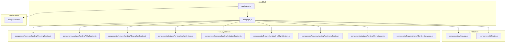
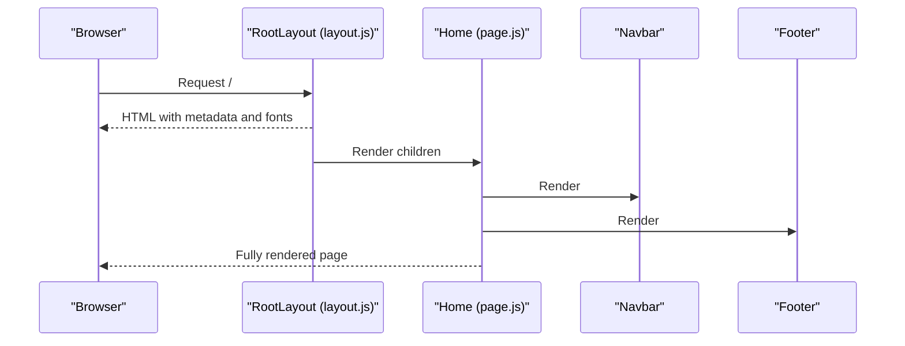
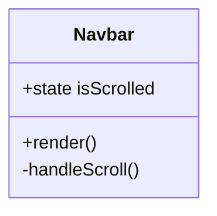
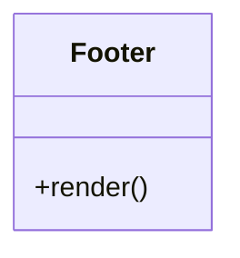
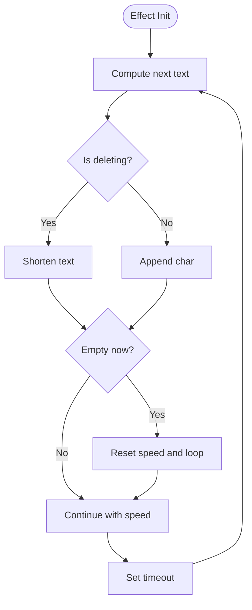
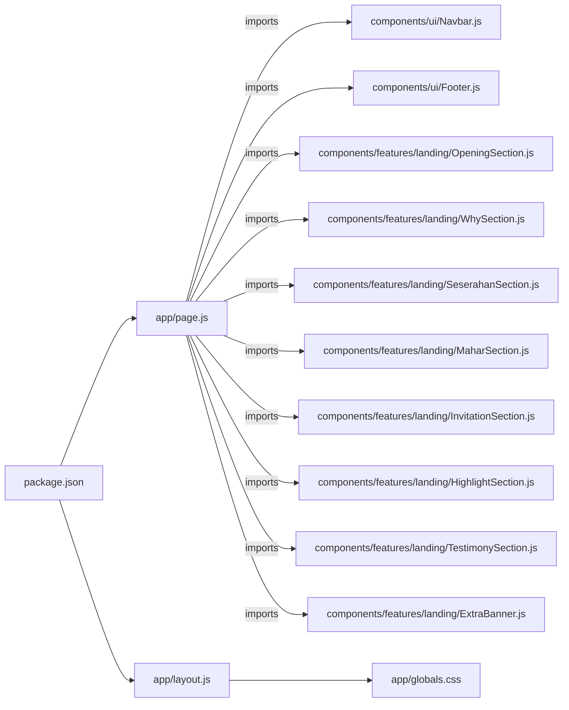

# Component Architecture

<cite>
**Referenced Files in This Document**
- [app/layout.js](file://app/layout.js)
- [app/page.js](file://app/page.js)
- [components/ui/Navbar.js](file://components/ui/Navbar.js)
- [components/ui/Footer.js](file://components/ui/Footer.js)
- [components/features/landing/OpeningSection.js](file://components/features/landing/OpeningSection.js)
- [components/features/landing/WhySection.js](file://components/features/landing/WhySection.js)
- [components/features/landing/SeserahanSection.js](file://components/features/landing/SeserahanSection.js)
- [components/features/landing/MaharSection.js](file://components/features/landing/MaharSection.js)
- [components/features/landing/InvitationSection.js](file://components/features/landing/InvitationSection.js)
- [components/features/landing/HighlightSection.js](file://components/features/landing/HighlightSection.js)
- [components/features/landing/TestimonySection.js](file://components/features/landing/TestimonySection.js)
- [components/features/landing/ExtraBanner.js](file://components/features/landing/ExtraBanner.js)
- [components/features/home/ServiceShowcase.js](file://components/features/home/ServiceShowcase.js)
- [app/globals.css](file://app/globals.css)
- [package.json](file://package.json)
- [jsconfig.json](file://jsconfig.json)
</cite>

## Table of Contents
1. [Introduction](#introduction)
2. [Project Structure](#project-structure)
3. [Core Components](#core-components)
4. [Architecture Overview](#architecture-overview)
5. [Detailed Component Analysis](#detailed-component-analysis)
6. [Dependency Analysis](#dependency-analysis)
7. [Performance Considerations](#performance-considerations)
8. [Troubleshooting Guide](#troubleshooting-guide)
9. [Conclusion](#conclusion)
10. [Appendices](#appendices)

## Introduction
This document describes the component architecture of the Momento Client Frontend built with Next.js App Router. It explains the root layout and page composition, the separation between UI primitives (Navbar, Footer) and feature sections, component composition patterns, prop passing strategies, and state management approaches. It also details the relationship between layout.js and page.js, component dependency chains, reusability patterns, and extension points for adding new features.

## Project Structure
The frontend follows a clear file-based routing and component organization:
- app/: Application shell and pages
  - layout.js: Root HTML and global metadata provider
  - page.js: Home page composition of UI and feature components
- components/: Reusable building blocks
  - ui/: Presentational UI primitives (Navbar, Footer)
  - features/: Feature-specific sections composing the landing page
- public/: Static assets (images, icons)
- app/globals.css: Global Tailwind theme and utilities
- package.json and jsconfig.json: Dependencies and path aliases

**Diagram sources**
- [app/layout.js:1-35](file://app/layout.js#L1-L35)
- [app/page.js:1-42](file://app/page.js#L1-L42)
- [components/ui/Navbar.js:1-86](file://components/ui/Navbar.js#L1-L86)
- [components/ui/Footer.js:1-51](file://components/ui/Footer.js#L1-L51)
- [components/features/landing/OpeningSection.js:1-100](file://components/features/landing/OpeningSection.js#L1-L100)
- [components/features/landing/WhySection.js:1-53](file://components/features/landing/WhySection.js#L1-L53)
- [components/features/landing/SeserahanSection.js:1-45](file://components/features/landing/SeserahanSection.js#L1-L45)
- [components/features/landing/MaharSection.js:1-55](file://components/features/landing/MaharSection.js#L1-L55)
- [components/features/landing/InvitationSection.js:1-82](file://components/features/landing/InvitationSection.js#L1-L82)
- [components/features/landing/HighlightSection.js:1-81](file://components/features/landing/HighlightSection.js#L1-L81)
- [components/features/landing/TestimonySection.js:1-184](file://components/features/landing/TestimonySection.js#L1-L184)
- [components/features/landing/ExtraBanner.js:1-30](file://components/features/landing/ExtraBanner.js#L1-L30)
- [components/features/home/ServiceShowcase.js:1-77](file://components/features/home/ServiceShowcase.js#L1-L77)
- [app/globals.css:1-118](file://app/globals.css#L1-L118)

**Section sources**
- [app/layout.js:1-35](file://app/layout.js#L1-L35)
- [app/page.js:1-42](file://app/page.js#L1-L42)
- [app/globals.css:1-118](file://app/globals.css#L1-L118)
- [jsconfig.json:1-8](file://jsconfig.json#L1-L8)

## Core Components
- Root Layout (layout.js): Provides global metadata, fonts, and wraps children with html/body. It sets up the base theme and typography tokens.
- Home Page (page.js): Composes the landing page by importing UI primitives and feature sections and rendering them in order.
- UI Primitives:
  - Navbar: Client-side scroll-aware navigation with logo, links, and action button. Uses path awareness and responsive mobile toggle.
  - Footer: Static footer with site identity, links, and legal info.
- Feature Sections: Self-contained, presentational sections for content and product showcases. Many are client components for animations and interactive effects.

Key composition patterns:
- Composition via import and render: page.js imports UI and feature components and renders them in a fixed order.
- Minimal props: Components receive no props; they rely on global styles, static assets, and Next.js primitives (e.g., Image, Link).
- State management:
  - Navbar manages local scroll state to adjust appearance.
  - Several feature components manage local animation timers and state machines (e.g., typewriter effect, marquee loops).

**Section sources**
- [app/layout.js:20-35](file://app/layout.js#L20-L35)
- [app/page.js:3-41](file://app/page.js#L3-L41)
- [components/ui/Navbar.js:17-86](file://components/ui/Navbar.js#L17-L86)
- [components/ui/Footer.js:3-51](file://components/ui/Footer.js#L3-L51)
- [components/features/landing/OpeningSection.js:6-38](file://components/features/landing/OpeningSection.js#L6-L38)
- [components/features/landing/InvitationSection.js:6-20](file://components/features/landing/InvitationSection.js#L6-L20)
- [components/features/landing/TestimonySection.js:6-14](file://components/features/landing/TestimonySection.js#L6-L14)

## Architecture Overview
The architecture is a flat, declarative composition driven by Next.js App Router. The root layout defines the global environment; the home page composes UI and feature components in a single JSX tree. There is no centralized state container; state is kept local to components where needed.

**Diagram sources**
- [app/layout.js:25-35](file://app/layout.js#L25-L35)
- [app/page.js:14-41](file://app/page.js#L14-L41)
- [components/ui/Navbar.js:17-86](file://components/ui/Navbar.js#L17-L86)
- [components/ui/Footer.js:3-51](file://components/ui/Footer.js#L3-L51)

## Detailed Component Analysis

### Root Layout and Page Relationship
- RootLayout (layout.js):
  - Defines metadata for SEO.
  - Loads Google Fonts and applies CSS variables for theme tokens.
  - Wraps children with html/body and applies base classes for typography and background.
- Home (page.js):
  - Declares client directive for interactivity.
  - Imports UI and feature components.
  - Renders Navbar, feature sections, and Footer in a single tree.
  - Uses Tailwind utilities for layout and theming.

Composition and dependency chain:
- page.js depends on UI primitives and feature sections.
- layout.js depends on globals.css for theme and animations.

**Section sources**
- [app/layout.js:20-35](file://app/layout.js#L20-L35)
- [app/page.js:14-41](file://app/page.js#L14-L41)
- [app/globals.css:30-55](file://app/globals.css#L30-L55)

### UI Primitives

#### Navbar
- Responsibilities:
  - Fixed positioning and responsive layout.
  - Scroll-aware background and underline indicator.
  - Navigation links and a call-to-action button.
- State management:
  - Tracks scroll position via useEffect and window events.
  - Uses path awareness to highlight active link.
- Props and customization:
  - navLinks array is the primary customization point for menu entries.
  - Styling relies on Tailwind utilities and CSS variables from globals.css.

**Diagram sources**
- [components/ui/Navbar.js:17-86](file://components/ui/Navbar.js#L17-L86)

**Section sources**
- [components/ui/Navbar.js:8-27](file://components/ui/Navbar.js#L8-L27)
- [components/ui/Navbar.js:21-27](file://components/ui/Navbar.js#L21-L27)

#### Footer
- Responsibilities:
  - Corporate identity and navigation columns.
  - Legal links and copyright notice.
- Props and customization:
  - No props; content is static. Columns and links can be adjusted by editing the component.

**Diagram sources**
- [components/ui/Footer.js:3-51](file://components/ui/Footer.js#L3-L51)

**Section sources**
- [components/ui/Footer.js:3-51](file://components/ui/Footer.js#L3-L51)

### Feature Components

#### OpeningSection
- Purpose: Hero section with animated typewriter text and floating CTA.
- State management:
  - Manages text state, deletion loop, and typing speed with useEffect and timers.
- Props and customization:
  - Animation timing constants are internal; can be tuned here.
  - Assets are imported statically.

**Diagram sources**
- [components/features/landing/OpeningSection.js:14-37](file://components/features/landing/OpeningSection.js#L14-L37)

**Section sources**
- [components/features/landing/OpeningSection.js:6-38](file://components/features/landing/OpeningSection.js#L6-L38)

#### WhySection
- Purpose: Feature cards highlighting brand values.
- Props and customization:
  - Cards are static; content can be edited here.

**Section sources**
- [components/features/landing/WhySection.js:3-53](file://components/features/landing/WhySection.js#L3-L53)

#### SeserahanSection
- Purpose: Product showcase for rental packages with horizontal marquee.
- Props and customization:
  - Image assets are hardcoded; update paths to change visuals.

**Section sources**
- [components/features/landing/SeserahanSection.js:4-45](file://components/features/landing/SeserahanSection.js#L4-L45)

#### MaharSection
- Purpose: Product showcase for frame items with gradient overlays.
- Props and customization:
  - Image assets are hardcoded; update paths to change visuals.

**Section sources**
- [components/features/landing/MaharSection.js:4-55](file://components/features/landing/MaharSection.js#L4-L55)

#### InvitationSection
- Purpose: Product showcase for digital invitations with vertical marquees.
- State management:
  - Uses client directive; relies on CSS animations for marquee behavior.
- Props and customization:
  - Image arrays are static; update to change visuals.

**Section sources**
- [components/features/landing/InvitationSection.js:1-82](file://components/features/landing/InvitationSection.js#L1-L82)

#### HighlightSection
- Purpose: Additional extras showcase with grid layout.
- Props and customization:
  - Items list is static; edit to add or remove extras.

**Section sources**
- [components/features/landing/HighlightSection.js:4-81](file://components/features/landing/HighlightSection.js#L4-L81)

#### TestimonySection
- Purpose: Customer testimonials with statistics and vertical marquee.
- State management:
  - Uses client directive; relies on CSS animations for marquee behavior.
- Props and customization:
  - Testimonial and stat lists are static; edit to update content.

**Section sources**
- [components/features/landing/TestimonySection.js:6-184](file://components/features/landing/TestimonySection.js#L6-L184)

#### ExtraBanner
- Purpose: Call-to-action banner with gradient background.
- Props and customization:
  - Text and button are static; adjust copy and link here.

**Section sources**
- [components/features/landing/ExtraBanner.js:4-30](file://components/features/landing/ExtraBanner.js#L4-L30)

#### ServiceShowcase (home feature)
- Purpose: Service presentation with alternating layouts and hover effects.
- Props and customization:
  - Services list is static; edit to add or modify services.

**Section sources**
- [components/features/home/ServiceShowcase.js:30-77](file://components/features/home/ServiceShowcase.js#L30-L77)

### Component Composition Patterns
- Declarative composition: page.js imports and renders components in a single tree.
- Minimal props: Components do not accept external props; they rely on static assets and Tailwind utilities.
- Local state: Components manage their own state when needed (e.g., Navbar scroll, Typewriter).
- CSS-driven animations: Marquee effects and gradients are implemented via Tailwind utilities and keyframes.

**Section sources**
- [app/page.js:14-41](file://app/page.js#L14-L41)
- [components/features/landing/OpeningSection.js:6-38](file://components/features/landing/OpeningSection.js#L6-L38)
- [components/ui/Navbar.js:17-86](file://components/ui/Navbar.js#L17-L86)

## Dependency Analysis
- External dependencies:
  - next, react, react-dom for framework runtime.
  - lucide-react for icons.
- Internal dependencies:
  - page.js depends on UI and feature components.
  - layout.js depends on globals.css for theme tokens and animations.
  - Components depend on Next.js primitives (Image, Link, usePathname) and Tailwind utilities.

**Diagram sources**
- [package.json:11-16](file://package.json#L11-L16)
- [app/page.js:3-12](file://app/page.js#L3-L12)
- [app/layout.js:1-35](file://app/layout.js#L1-L35)
- [app/globals.css:1-118](file://app/globals.css#L1-L118)

**Section sources**
- [package.json:11-16](file://package.json#L11-L16)
- [app/page.js:3-12](file://app/page.js#L3-L12)

## Performance Considerations
- Client directives: Used selectively in components requiring client-side interactivity (e.g., Navbar scroll, Typewriter, Invitation/Testimony marquees). Prefer server rendering for static sections to reduce initial payload.
- Asset optimization: Next/Image is used for all images; ensure proper sizing and compression for optimal loading.
- CSS animations: Marquee animations rely on keyframes; keep the number of animated elements reasonable to avoid layout thrashing.
- Font loading: Google Fonts are preloaded via CSS variables; ensure minimal font variations to reduce CLS.

[No sources needed since this section provides general guidance]

## Troubleshooting Guide
- Navbar not responding to scroll:
  - Verify client directive is present and scroll event listeners are attached.
  - Confirm usePathname is available in the environment.
- Typewriter animation not updating:
  - Ensure useEffect cleanup removes previous timeouts.
  - Check typingSpeed updates and loop resets.
- Marquee not animating:
  - Verify CSS keyframes and animation classes are applied.
  - Confirm Tailwind utilities are included and not purged.
- Missing assets:
  - Validate asset paths under public/images and public/icons.
  - Ensure Image fills and sizes are correct.

**Section sources**
- [components/ui/Navbar.js:17-27](file://components/ui/Navbar.js#L17-L27)
- [components/features/landing/OpeningSection.js:14-37](file://components/features/landing/OpeningSection.js#L14-L37)
- [app/globals.css:81-118](file://app/globals.css#L81-L118)

## Conclusion
The Momento Client Frontend employs a clean, declarative component architecture centered on Next.js App Router. The root layout establishes global theme and fonts, while the home page composes UI primitives and feature sections in a single, readable tree. State is localized to components that require it, and styling is enforced through Tailwind utilities and global CSS. This structure supports easy customization and extension for new features.

[No sources needed since this section summarizes without analyzing specific files]

## Appendices

### Extension Points and Customization Options
- Adding a new feature section:
  - Create a new component under components/features/landing with a descriptive name.
  - Import and render it in app/page.js in the desired order.
  - Customize content and styling using existing Tailwind utilities and globals.css.
- Modifying navigation:
  - Edit the navLinks array in Navbar to add, remove, or rename menu items.
  - Adjust active link logic if needed.
- Theming and typography:
  - Update CSS variables in globals.css to change accent colors, fonts, and spacing.
  - Add new utilities or components in the appropriate layers.

**Section sources**
- [app/page.js:14-41](file://app/page.js#L14-L41)
- [components/ui/Navbar.js:8-15](file://components/ui/Navbar.js#L8-L15)
- [app/globals.css:3-16](file://app/globals.css#L3-L16)