# Feature Components

<cite>
**Referenced Files in This Document**
- [OpeningSection.js](file://components/features/landing/OpeningSection.js)
- [WhySection.js](file://components/features/landing/WhySection.js)
- [ServiceShowcase.js](file://components/features/home/ServiceShowcase.js)
- [SeserahanSection.js](file://components/features/landing/SeserahanSection.js)
- [MaharSection.js](file://components/features/landing/MaharSection.js)
- [InvitationSection.js](file://components/features/landing/InvitationSection.js)
- [HighlightSection.js](file://components/features/landing/HighlightSection.js)
- [TestimonySection.js](file://components/features/landing/TestimonySection.js)
- [ExtraBanner.js](file://components/features/landing/ExtraBanner.js)
- [Testimonials.js](file://components/features/home/Testimonials.js)
- [ExtrasGrid.js](file://components/features/home/ExtrasGrid.js)
- [globals.css](file://app/globals.css)
- [page.js](file://app/page.js)
- [Navbar.js](file://components/ui/Navbar.js)
- [Footer.js](file://components/ui/Footer.js)
</cite>

## Table of Contents
1. [Introduction](#introduction)
2. [Project Structure](#project-structure)
3. [Core Components](#core-components)
4. [Architecture Overview](#architecture-overview)
5. [Detailed Component Analysis](#detailed-component-analysis)
6. [Dependency Analysis](#dependency-analysis)
7. [Performance Considerations](#performance-considerations)
8. [Troubleshooting Guide](#troubleshooting-guide)
9. [Conclusion](#conclusion)

## Introduction
This document provides a comprehensive guide to the feature components that implement the core services and landing page functionality. It covers the dynamic typing animation in OpeningSection, the WhySection feature cards, service showcase components for Seserahan and Mahar, digital invitation section, highlight/portfolio-style section, testimonials display, and promotional banner. For each component, we explain purpose, props interface, state management, styling and customization approaches, and integration patterns. We also include diagrams to illustrate component composition, data flow, and reusability strategies.

## Project Structure
The landing page is composed of multiple feature components organized under components/features/landing and components/features/home. The main page orchestrates these components and integrates shared UI elements like Navbar and Footer.

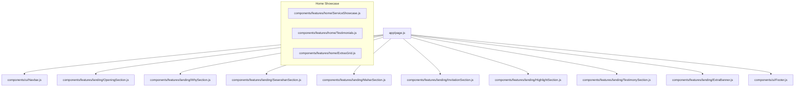

**Diagram sources**
- [page.js:14-41](file://app/page.js#L14-L41)
- [Navbar.js:17-85](file://components/ui/Navbar.js#L17-L85)
- [Footer.js:3-50](file://components/ui/Footer.js#L3-L50)
- [OpeningSection.js:6-99](file://components/features/landing/OpeningSection.js#L6-L99)
- [WhySection.js:3-52](file://components/features/landing/WhySection.js#L3-L52)
- [SeserahanSection.js:4-44](file://components/features/landing/SeserahanSection.js#L4-L44)
- [MaharSection.js:4-54](file://components/features/landing/MaharSection.js#L4-L54)
- [InvitationSection.js:6-81](file://components/features/landing/InvitationSection.js#L6-L81)
- [HighlightSection.js:4-79](file://components/features/landing/HighlightSection.js#L4-L79)
- [TestimonySection.js:6-183](file://components/features/landing/TestimonySection.js#L6-L183)
- [ExtraBanner.js:4-29](file://components/features/landing/ExtraBanner.js#L4-L29)
- [ServiceShowcase.js:30-76](file://components/features/home/ServiceShowcase.js#L30-L76)
- [Testimonials.js:1-39](file://components/features/home/Testimonials.js#L1-L39)
- [ExtrasGrid.js:12-37](file://components/features/home/ExtrasGrid.js#L12-L37)

**Section sources**
- [page.js:14-41](file://app/page.js#L14-L41)

## Core Components
This section summarizes each component’s purpose, props interface, state management, styling, and integration patterns.

- OpeningSection
  - Purpose: Hero section with animated typing effect and floating CTA.
  - Props: None.
  - State: Manages text buffer, deletion mode, loop count, and typing speed.
  - Animation: Uses a timer to simulate typing/deleting with variable speeds.
  - Styling: Tailwind utilities and gradient gold accents; includes a floating WhatsApp button.
  - Integration: Rendered at the top of the page inside app/page.js.

- WhySection
  - Purpose: Feature cards highlighting brand values.
  - Props: None.
  - State: None.
  - Styling: Uses a gold gradient background and feature-card utility class.
  - Integration: Appears after OpeningSection.

- ServiceShowcase
  - Purpose: Present three premium services with image/text layout and hover effects.
  - Props: None.
  - State: None.
  - Data: Static array of service objects with id, title, description, image, alt, reverse.
  - Styling: Responsive flex layout, glass-card, and hover transitions.
  - Integration: Used in home context; not part of the main landing page flow.

- SeserahanSection
  - Purpose: Promote rental of Seserahan with a horizontal marquee of images.
  - Props: None.
  - State: None.
  - Animation: Horizontal marquee using CSS keyframes.
  - Styling: Dark background, centered content, responsive grid of images.
  - Integration: Part of the main landing page.

- MaharSection
  - Purpose: Showcase custom Frame Mahar with a collage image grid and text.
  - Props: None.
  - State: None.
  - Styling: Gradient overlays, grid layout, and responsive breakpoints.
  - Integration: Part of the main landing page.

- InvitationSection
  - Purpose: Present Digital Invitations with vertical marquees of invitation samples.
  - Props: None.
  - State: None.
  - Animation: Two vertical marquees (up/down) using CSS keyframes.
  - Styling: Split layout with gradient overlays and card borders.
  - Integration: Part of the main landing page.

- HighlightSection
  - Purpose: Portfolio-style highlights of extra services with hover animations.
  - Props: None.
  - State: None.
  - Styling: Gradient text and backgrounds, grid layout, and hover transforms.
  - Integration: Part of the main landing page.

- TestimonySection
  - Purpose: Display statistics and a vertical marquee of customer testimonials.
  - Props: None.
  - State: None.
  - Animation: Vertical marquee for testimonials.
  - Styling: Dual-column stats, testimonial cards, wave decoration.
  - Integration: Part of the main landing page.

- ExtraBanner
  - Purpose: Promotional banner encouraging consultation.
  - Props: None.
  - State: None.
  - Styling: Gold gradient background with centered CTA.
  - Integration: Below TestimonySection.

- Testimonials (home)
  - Purpose: Home page testimonials with stats and quote.
  - Props: None.
  - State: None.
  - Styling: Grid stats, quote SVG, avatar layout.
  - Integration: Home page showcase.

- ExtrasGrid (home)
  - Purpose: Grid of additional service categories.
  - Props: None.
  - State: None.
  - Styling: Responsive grid, hover transforms, iconography.
  - Integration: Home page showcase.

**Section sources**
- [OpeningSection.js:6-99](file://components/features/landing/OpeningSection.js#L6-L99)
- [WhySection.js:3-52](file://components/features/landing/WhySection.js#L3-L52)
- [ServiceShowcase.js:30-76](file://components/features/home/ServiceShowcase.js#L30-L76)
- [SeserahanSection.js:4-44](file://components/features/landing/SeserahanSection.js#L4-L44)
- [MaharSection.js:4-54](file://components/features/landing/MaharSection.js#L4-L54)
- [InvitationSection.js:6-81](file://components/features/landing/InvitationSection.js#L6-L81)
- [HighlightSection.js:4-79](file://components/features/landing/HighlightSection.js#L4-L79)
- [TestimonySection.js:6-183](file://components/features/landing/TestimonySection.js#L6-L183)
- [ExtraBanner.js:4-29](file://components/features/landing/ExtraBanner.js#L4-L29)
- [Testimonials.js:1-39](file://components/features/home/Testimonials.js#L1-L39)
- [ExtrasGrid.js:12-37](file://components/features/home/ExtrasGrid.js#L12-L37)

## Architecture Overview
The landing page composes feature components in a linear flow. Shared UI elements (Navbar and Footer) wrap the feature sections. Styling relies on Tailwind utilities and global CSS utilities for animations and gradients.

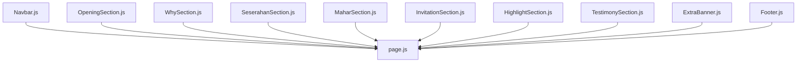

**Diagram sources**
- [page.js:14-41](file://app/page.js#L14-L41)
- [Navbar.js:17-85](file://components/ui/Navbar.js#L17-L85)
- [Footer.js:3-50](file://components/ui/Footer.js#L3-L50)
- [OpeningSection.js:6-99](file://components/features/landing/OpeningSection.js#L6-L99)
- [WhySection.js:3-52](file://components/features/landing/WhySection.js#L3-L52)
- [SeserahanSection.js:4-44](file://components/features/landing/SeserahanSection.js#L4-L44)
- [MaharSection.js:4-54](file://components/features/landing/MaharSection.js#L4-L54)
- [InvitationSection.js:6-81](file://components/features/landing/InvitationSection.js#L6-L81)
- [HighlightSection.js:4-79](file://components/features/landing/HighlightSection.js#L4-L79)
- [TestimonySection.js:6-183](file://components/features/landing/TestimonySection.js#L6-L183)
- [ExtraBanner.js:4-29](file://components/features/landing/ExtraBanner.js#L4-L29)

## Detailed Component Analysis

### OpeningSection
- Purpose: Hero section with animated typing text and floating CTA.
- State Management:
  - text: Current visible text buffer.
  - isDeleting: Direction flag for typing/deleting.
  - loopNum: Loop counter for animation cycles.
  - typingSpeed: Dynamic speed for typing/deleting.
- Animation Logic:
  - Uses a timer to append/remove characters based on isDeleting.
  - Adjusts typingSpeed to pause at full text, then delete and restart.
- Styling and Customization:
  - Uses gradient gold utilities and Tailwind utilities for layout and typography.
  - Floating WhatsApp button with hover effects.
- Reusability:
  - Can be adapted for other hero sections by injecting fullText and speed parameters externally.

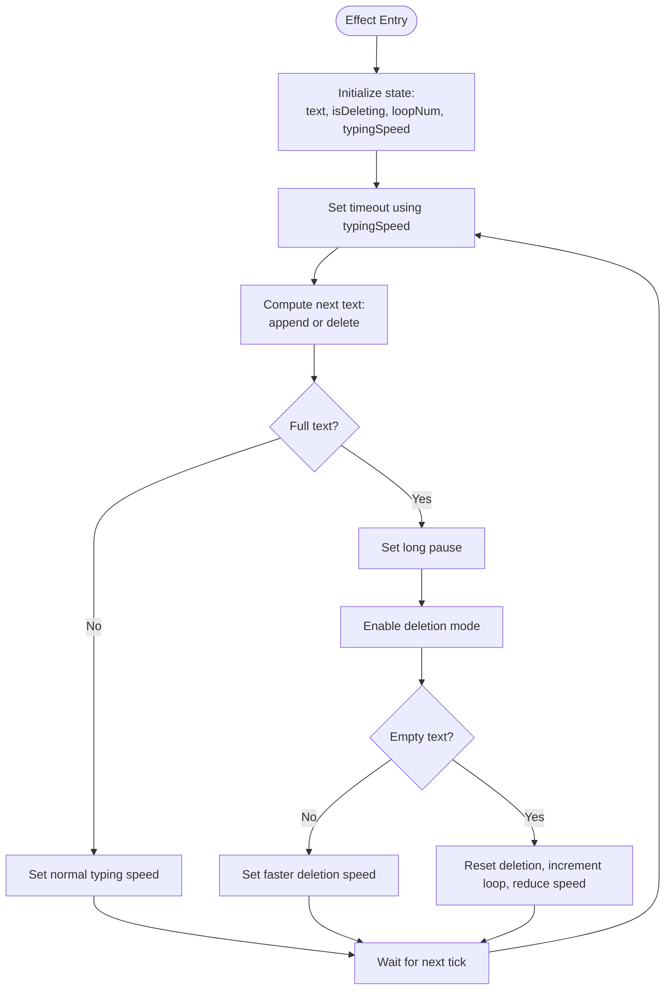

**Diagram sources**
- [OpeningSection.js:14-37](file://components/features/landing/OpeningSection.js#L14-L37)

**Section sources**
- [OpeningSection.js:6-99](file://components/features/landing/OpeningSection.js#L6-L99)

### WhySection
- Purpose: Feature cards communicating brand values.
- Props: None.
- Layout: Two rows of centered feature cards using a utility class for consistent sizing.
- Styling: Gold gradient background and feature-card class for uniformity.

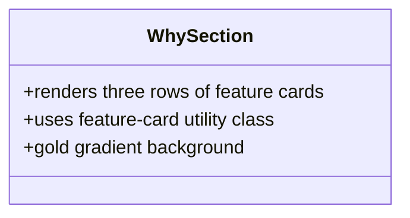

**Diagram sources**
- [WhySection.js:3-52](file://components/features/landing/WhySection.js#L3-L52)
- [globals.css:44-49](file://app/globals.css#L44-L49)

**Section sources**
- [WhySection.js:3-52](file://components/features/landing/WhySection.js#L3-L52)
- [globals.css:44-49](file://app/globals.css#L44-L49)

### ServiceShowcase
- Purpose: Present three premium services with image and text content.
- Data Model: Array of service objects with id, title, description, image, alt, reverse.
- Layout: Responsive flex layout; reverse toggles image/text order on larger screens.
- Interactions: Hover scaling and grayscale transitions on images.

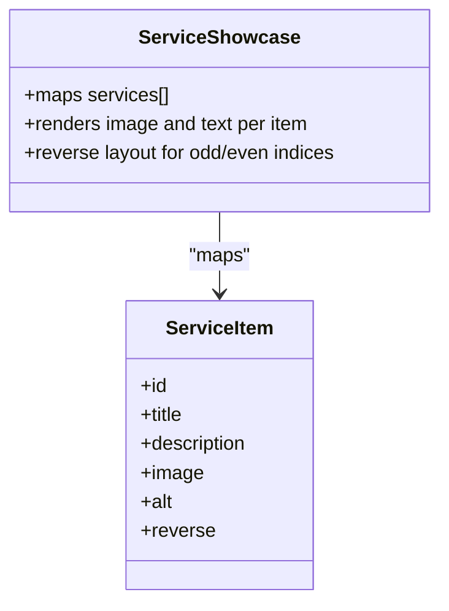

**Diagram sources**
- [ServiceShowcase.js:30-76](file://components/features/home/ServiceShowcase.js#L30-L76)

**Section sources**
- [ServiceShowcase.js:30-76](file://components/features/home/ServiceShowcase.js#L30-L76)

### SeserahanSection
- Purpose: Promote Seserahan rentals with a horizontal marquee of images.
- Animation: Uses CSS marquee animation class applied to repeated groups of images.
- Styling: Dark background, centered headline, and responsive image grid.

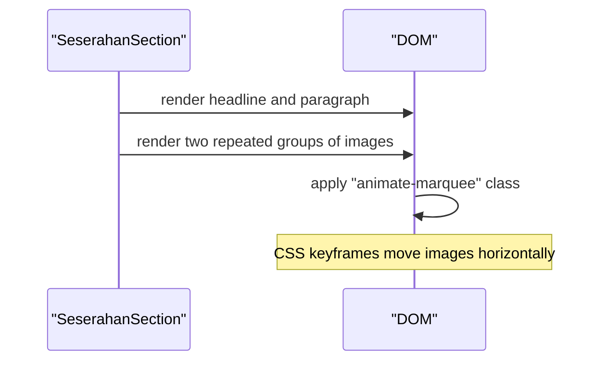

**Diagram sources**
- [SeserahanSection.js:4-44](file://components/features/landing/SeserahanSection.js#L4-L44)
- [globals.css:74-79](file://app/globals.css#L74-L79)

**Section sources**
- [SeserahanSection.js:4-44](file://components/features/landing/SeserahanSection.js#L4-L44)
- [globals.css:74-79](file://app/globals.css#L74-L79)

### MaharSection
- Purpose: Showcase custom Frame Mahar with a collage image grid and text.
- Layout: Responsive split layout with gradient overlays and a grid of images.
- Styling: Uses absolute gradient overlays for blending with background.

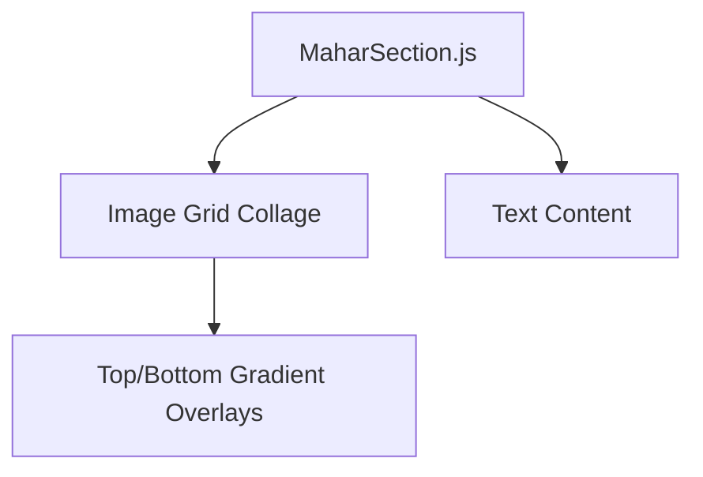

**Diagram sources**
- [MaharSection.js:4-54](file://components/features/landing/MaharSection.js#L4-L54)

**Section sources**
- [MaharSection.js:4-54](file://components/features/landing/MaharSection.js#L4-L54)

### InvitationSection
- Purpose: Present Digital Invitations with vertical marquees of invitation samples.
- Animation: Two vertical marquees moving in opposite directions using dedicated keyframes.
- Layout: Split layout with text content and two columns of invitation cards.

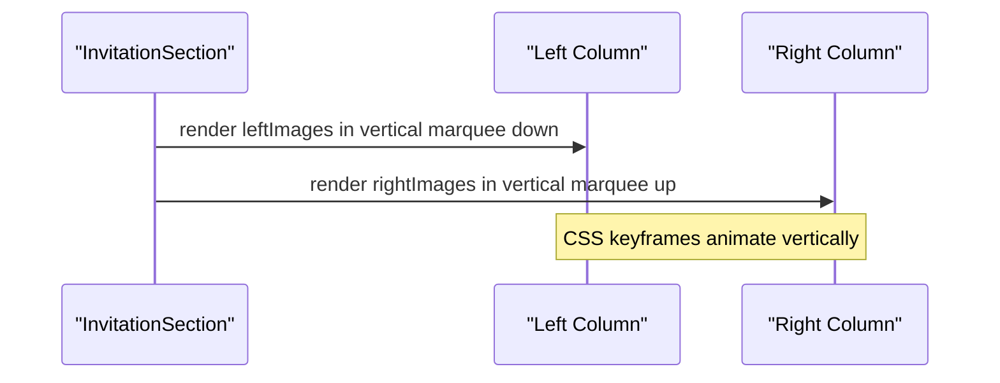

**Diagram sources**
- [InvitationSection.js:6-81](file://components/features/landing/InvitationSection.js#L6-L81)
- [globals.css:88-110](file://app/globals.css#L88-L110)

**Section sources**
- [InvitationSection.js:6-81](file://components/features/landing/InvitationSection.js#L6-L81)
- [globals.css:88-110](file://app/globals.css#L88-L110)

### HighlightSection
- Purpose: Portfolio-style highlights of extra services with hover animations.
- Layout: Grid of four items with gradient text and background overlays.
- Interactions: Hover lift and border accent.

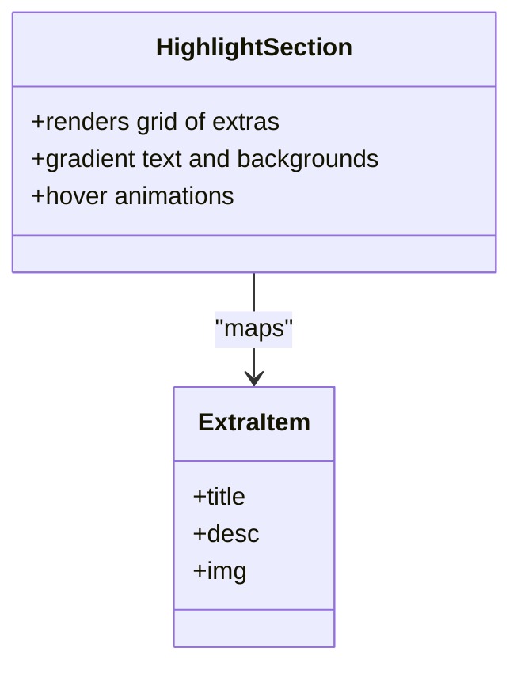

**Diagram sources**
- [HighlightSection.js:4-79](file://components/features/landing/HighlightSection.js#L4-L79)

**Section sources**
- [HighlightSection.js:4-79](file://components/features/landing/HighlightSection.js#L4-L79)

### TestimonySection
- Purpose: Display statistics and a vertical marquee of customer testimonials.
- Layout: Two-column stats on the left and a vertical marquee of testimonials on the right.
- Animation: Dedicated vertical marquee keyframe for testimonials.

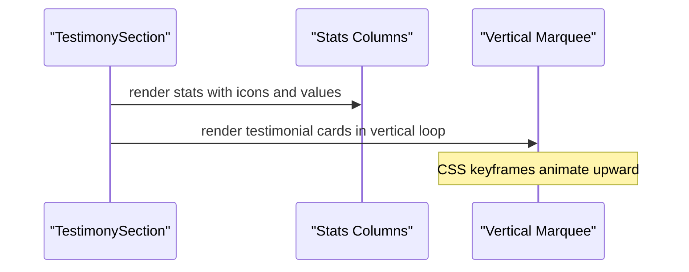

**Diagram sources**
- [TestimonySection.js:6-183](file://components/features/landing/TestimonySection.js#L6-L183)
- [globals.css:112-117](file://app/globals.css#L112-L117)

**Section sources**
- [TestimonySection.js:6-183](file://components/features/landing/TestimonySection.js#L6-L183)
- [globals.css:112-117](file://app/globals.css#L112-L117)

### ExtraBanner
- Purpose: Promote consultation with a prominent CTA.
- Styling: Gold gradient background with centered text and button.

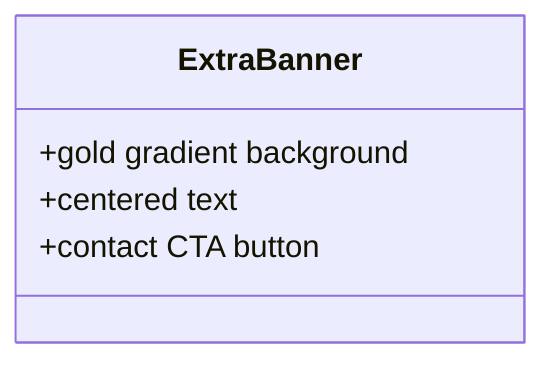

**Diagram sources**
- [ExtraBanner.js:4-29](file://components/features/landing/ExtraBanner.js#L4-L29)

**Section sources**
- [ExtraBanner.js:4-29](file://components/features/landing/ExtraBanner.js#L4-L29)

### Testimonials (home)
- Purpose: Home page testimonials with stats and quote.
- Layout: Stats grid, quote SVG, and avatar layout.

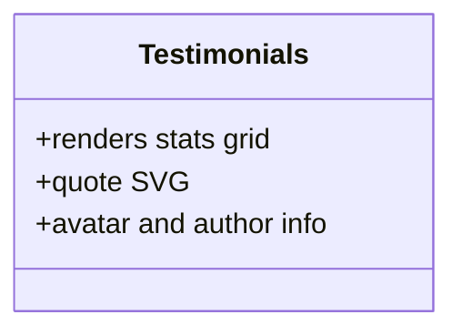

**Diagram sources**
- [Testimonials.js:1-39](file://components/features/home/Testimonials.js#L1-L39)

**Section sources**
- [Testimonials.js:1-39](file://components/features/home/Testimonials.js#L1-L39)

### ExtrasGrid (home)
- Purpose: Grid of additional service categories.
- Layout: Responsive grid with hover transforms and iconography.

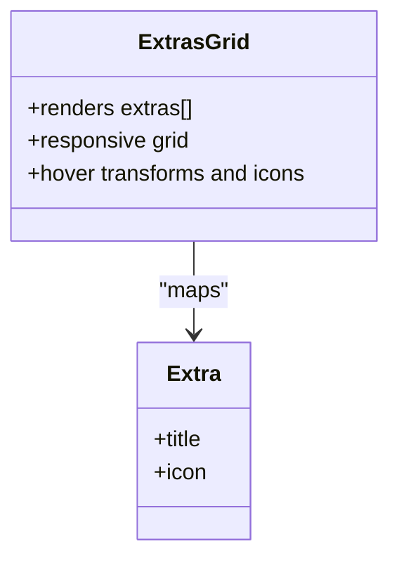

**Diagram sources**
- [ExtrasGrid.js:12-37](file://components/features/home/ExtrasGrid.js#L12-L37)

**Section sources**
- [ExtrasGrid.js:12-37](file://components/features/home/ExtrasGrid.js#L12-L37)

## Dependency Analysis
- Composition: app/page.js composes all landing components and wraps them with Navbar and Footer.
- Styling: globals.css defines reusable utilities (buttons, cards, gradients, marquee animations) consumed by components.
- Navigation: Navbar provides scroll-aware styling and links to sections on the page.

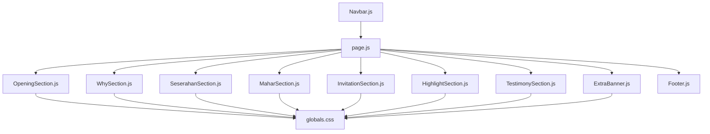

**Diagram sources**
- [page.js:14-41](file://app/page.js#L14-L41)
- [globals.css:30-117](file://app/globals.css#L30-L117)
- [Navbar.js:17-85](file://components/ui/Navbar.js#L17-L85)

**Section sources**
- [page.js:14-41](file://app/page.js#L14-L41)
- [globals.css:30-117](file://app/globals.css#L30-L117)
- [Navbar.js:17-85](file://components/ui/Navbar.js#L17-L85)

## Performance Considerations
- Animations:
  - Use CSS keyframes for marquee effects to avoid heavy JavaScript loops.
  - The will-change transform hint is applied to animated containers to improve GPU acceleration.
- Images:
  - Prefer Next.js Image with fill and appropriate aspect ratios to minimize layout shifts.
  - Use priority on hero images to improve Largest Contentful Paint (LCP).
- State:
  - OpeningSection uses a minimal timer-based state machine; keep timers cleared on unmount.
- Rendering:
  - Keep static arrays local to components to avoid prop drilling.
  - Use responsive breakpoints to reduce unnecessary rendering on small screens.

[No sources needed since this section provides general guidance]

## Troubleshooting Guide
- Typing animation not restarting:
  - Verify loopNum increments and deletion mode resets when text becomes empty.
  - Ensure typingSpeed is reset appropriately during deletion and pause states.
- Marquee not animating:
  - Confirm CSS keyframes are present and classes are applied.
  - Check container overflow and height constraints.
- Gradient overlays not visible:
  - Ensure absolute positioning and z-index stacking context.
- Button hover effects:
  - Verify button utility classes are defined and not overridden by local styles.

**Section sources**
- [OpeningSection.js:14-37](file://components/features/landing/OpeningSection.js#L14-L37)
- [globals.css:74-117](file://app/globals.css#L74-L117)

## Conclusion
The feature components collectively deliver a polished, performance-conscious landing experience. They leverage reusable utilities, consistent animations, and responsive layouts. By understanding each component’s state, styling, and integration patterns, teams can customize and extend the feature set while maintaining visual and performance standards.