# Page Composition

<cite>
**Referenced Files in This Document**
- [app/layout.js](file://app/layout.js)
- [app/page.js](file://app/page.js)
- [app/globals.css](file://app/globals.css)
- [components/ui/Navbar.js](file://components/ui/Navbar.js)
- [components/ui/Footer.js](file://components/ui/Footer.js)
- [components/features/landing/OpeningSection.js](file://components/features/landing/OpeningSection.js)
- [components/features/landing/WhySection.js](file://components/features/landing/WhySection.js)
- [components/features/landing/SeserahanSection.js](file://components/features/landing/SeserahanSection.js)
- [components/features/landing/MaharSection.js](file://components/features/landing/MaharSection.js)
- [components/features/landing/InvitationSection.js](file://components/features/landing/InvitationSection.js)
- [components/features/landing/HighlightSection.js](file://components/features/landing/HighlightSection.js)
- [components/features/landing/TestimonySection.js](file://components/features/landing/TestimonySection.js)
- [components/features/landing/ExtraBanner.js](file://components/features/landing/ExtraBanner.js)
- [package.json](file://package.json)
- [next.config.mjs](file://next.config.mjs)
- [jsconfig.json](file://jsconfig.json)
- [postcss.config.mjs](file://postcss.config.mjs)
</cite>

## Table of Contents
1. [Introduction](#introduction)
2. [Project Structure](#project-structure)
3. [Core Components](#core-components)
4. [Architecture Overview](#architecture-overview)
5. [Detailed Component Analysis](#detailed-component-analysis)
6. [Dependency Analysis](#dependency-analysis)
7. [Performance Considerations](#performance-considerations)
8. [Troubleshooting Guide](#troubleshooting-guide)
9. [Conclusion](#conclusion)

## Introduction
This document explains the page composition architecture for the Next.js landing page. It focuses on how the root layout establishes global styles, fonts, and metadata, and how the main page orchestrates feature components into a cohesive landing experience. It also documents the component hierarchy, prop passing strategies, conditional rendering patterns, and performance optimizations used across the page.

## Project Structure
The landing page is organized under the Next.js app directory with a single page and a root layout. Feature components are grouped under a dedicated folder for landing pages, and shared UI elements live under a separate ui folder. Global styling is centralized in a Tailwind-based stylesheet.

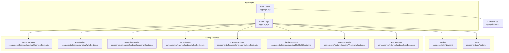

**Diagram sources**
- [app/layout.js:1-35](file://app/layout.js#L1-L35)
- [app/page.js:1-42](file://app/page.js#L1-L42)
- [app/globals.css:1-118](file://app/globals.css#L1-L118)
- [components/ui/Navbar.js:1-86](file://components/ui/Navbar.js#L1-L86)
- [components/ui/Footer.js:1-51](file://components/ui/Footer.js#L1-L51)
- [components/features/landing/OpeningSection.js:1-100](file://components/features/landing/OpeningSection.js#L1-L100)
- [components/features/landing/WhySection.js:1-53](file://components/features/landing/WhySection.js#L1-L53)
- [components/features/landing/SeserahanSection.js:1-45](file://components/features/landing/SeserahanSection.js#L1-L45)
- [components/features/landing/MaharSection.js:1-55](file://components/features/landing/MaharSection.js#L1-L55)
- [components/features/landing/InvitationSection.js:1-82](file://components/features/landing/InvitationSection.js#L1-L82)
- [components/features/landing/HighlightSection.js:1-81](file://components/features/landing/HighlightSection.js#L1-L81)
- [components/features/landing/TestimonySection.js:1-184](file://components/features/landing/TestimonySection.js#L1-L184)
- [components/features/landing/ExtraBanner.js:1-30](file://components/features/landing/ExtraBanner.js#L1-L30)

**Section sources**
- [app/layout.js:1-35](file://app/layout.js#L1-L35)
- [app/page.js:1-42](file://app/page.js#L1-L42)
- [app/globals.css:1-118](file://app/globals.css#L1-L118)

## Core Components
- Root layout: Defines global metadata, font variables, and base HTML/body classes. It wraps the page with the children prop.
- Home page: Declares the landing page composition, imports and renders all feature sections, and passes no props to child components.
- Shared UI: Navbar and Footer are rendered at the top and bottom of the page respectively.
- Landing features: Each feature is a self-contained component responsible for its own content, styling, and animations.

Key characteristics:
- The page is client-side enabled to support interactive features such as scroll effects and typewriter animations.
- Components are composed in a strict order to ensure visual continuity and layered backgrounds.
- Global CSS defines theme tokens and reusable utilities used across components.

**Section sources**
- [app/layout.js:20-35](file://app/layout.js#L20-L35)
- [app/page.js:14-41](file://app/page.js#L14-L41)
- [components/ui/Navbar.js:17-85](file://components/ui/Navbar.js#L17-L85)
- [components/ui/Footer.js:3-50](file://components/ui/Footer.js#L3-L50)
- [app/globals.css:3-55](file://app/globals.css#L3-L55)

## Architecture Overview
The architecture follows Next.js App Router conventions:
- Root layout sets global metadata and fonts, and applies base styles to the html and body.
- The page component composes feature sections and shared UI into a single visual flow.
- Each feature component encapsulates its content and presentation, relying on global CSS for consistent theming.

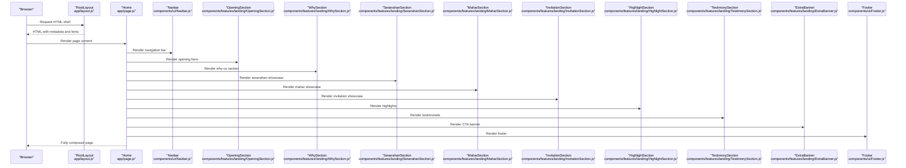

**Diagram sources**
- [app/layout.js:25-34](file://app/layout.js#L25-L34)
- [app/page.js:14-41](file://app/page.js#L14-L41)
- [components/ui/Navbar.js:29-83](file://components/ui/Navbar.js#L29-L83)
- [components/features/landing/OpeningSection.js:39-98](file://components/features/landing/OpeningSection.js#L39-L98)
- [components/features/landing/WhySection.js:4-51](file://components/features/landing/WhySection.js#L4-L51)
- [components/features/landing/SeserahanSection.js:5-44](file://components/features/landing/SeserahanSection.js#L5-L44)
- [components/features/landing/MaharSection.js:4-54](file://components/features/landing/MaharSection.js#L4-L54)
- [components/features/landing/InvitationSection.js:6-81](file://components/features/landing/InvitationSection.js#L6-L81)
- [components/features/landing/HighlightSection.js:4-80](file://components/features/landing/HighlightSection.js#L4-L80)
- [components/features/landing/TestimonySection.js:6-183](file://components/features/landing/TestimonySection.js#L6-L183)
- [components/features/landing/ExtraBanner.js:4-29](file://components/features/landing/ExtraBanner.js#L4-L29)
- [components/ui/Footer.js:3-50](file://components/ui/Footer.js#L3-L50)

## Detailed Component Analysis

### Root Layout and Global Styles
- Metadata: Title and description are defined at the root level for SEO and social previews.
- Fonts: Three Google fonts are configured and exposed as CSS variables for consistent typography across the app.
- Base HTML/body classes: Apply font families, minimum height, and layout behaviors.

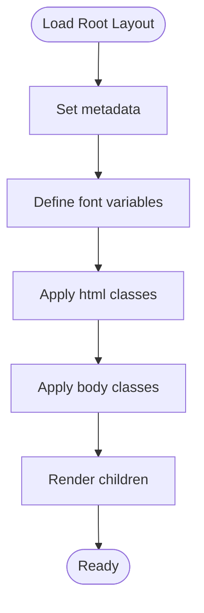

**Diagram sources**
- [app/layout.js:20-35](file://app/layout.js#L20-L35)

**Section sources**
- [app/layout.js:1-35](file://app/layout.js#L1-L35)
- [app/globals.css:3-28](file://app/globals.css#L3-L28)

### Home Page Composition
- Client directive enables client-side interactivity.
- Imports shared UI and feature sections.
- Renders Navbar at the top, followed by feature sections in a logical order, then Footer.
- Uses a wrapper section around the main content blocks to unify background and z-index stacking.

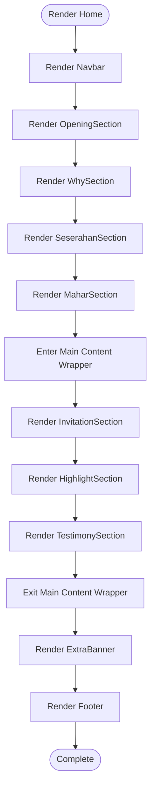

**Diagram sources**
- [app/page.js:14-41](file://app/page.js#L14-L41)

**Section sources**
- [app/page.js:1-42](file://app/page.js#L1-L42)

### Navbar
- Client component with scroll effect to adjust appearance on scroll.
- Uses path awareness to highlight active link.
- Integrates logo, navigation links, and a call-to-action button.

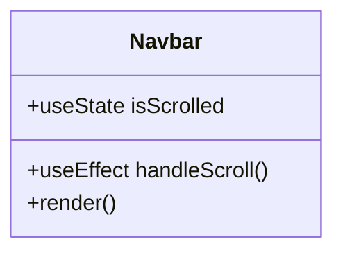

**Diagram sources**
- [components/ui/Navbar.js:17-85](file://components/ui/Navbar.js#L17-L85)

**Section sources**
- [components/ui/Navbar.js:1-86](file://components/ui/Navbar.js#L1-L86)

### Footer
- Static component providing branding, service links, company info, contact details, and legal links.

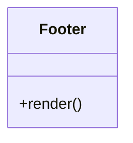

**Diagram sources**
- [components/ui/Footer.js:3-50](file://components/ui/Footer.js#L3-L50)

**Section sources**
- [components/ui/Footer.js:1-51](file://components/ui/Footer.js#L1-L51)

### OpeningSection
- Client component with typewriter animation using state and timers.
- Floating action element and decorative imagery for engagement.

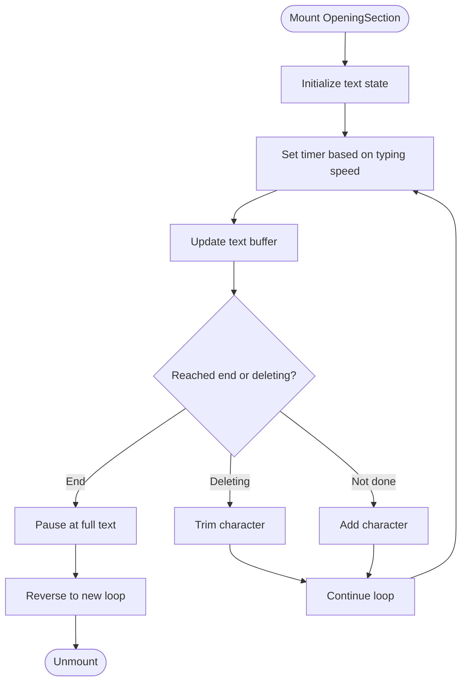

**Diagram sources**
- [components/features/landing/OpeningSection.js:6-37](file://components/features/landing/OpeningSection.js#L6-L37)

**Section sources**
- [components/features/landing/OpeningSection.js:1-100](file://components/features/landing/OpeningSection.js#L1-L100)

### WhySection
- Displays feature cards with icons and descriptions.
- Uses gradient background to emphasize the section.

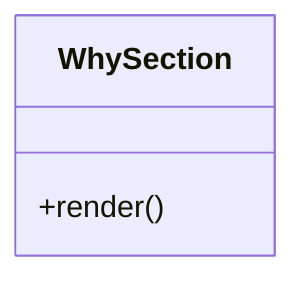

**Diagram sources**
- [components/features/landing/WhySection.js:3-52](file://components/features/landing/WhySection.js#L3-L52)

**Section sources**
- [components/features/landing/WhySection.js:1-53](file://components/features/landing/WhySection.js#L1-L53)

### SeserahanSection
- Horizontal marquee of product images with continuous animation.
- Provides a call-to-action button.

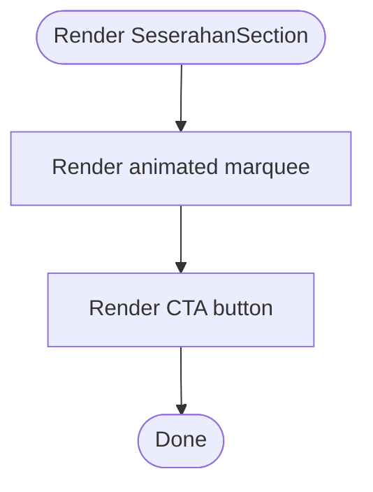

**Diagram sources**
- [components/features/landing/SeserahanSection.js:4-44](file://components/features/landing/SeserahanSection.js#L4-L44)

**Section sources**
- [components/features/landing/SeserahanSection.js:1-45](file://components/features/landing/SeserahanSection.js#L1-L45)

### MaharSection
- Dual-column layout with image collage and descriptive text.
- Uses blend gradients for seamless transitions.

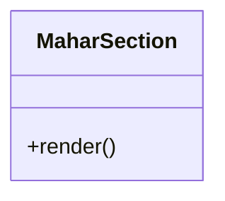

**Diagram sources**
- [components/features/landing/MaharSection.js:4-54](file://components/features/landing/MaharSection.js#L4-L54)

**Section sources**
- [components/features/landing/MaharSection.js:1-55](file://components/features/landing/MaharSection.js#L1-L55)

### InvitationSection
- Two-column layout with text on the left and animated vertical marquee on the right.
- Uses directional animations for visual interest.

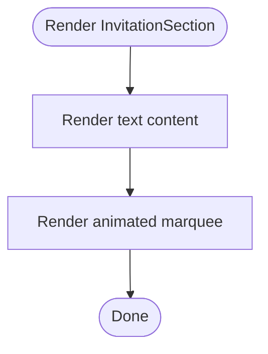

**Diagram sources**
- [components/features/landing/InvitationSection.js:6-81](file://components/features/landing/InvitationSection.js#L6-L81)

**Section sources**
- [components/features/landing/InvitationSection.js:1-82](file://components/features/landing/InvitationSection.js#L1-L82)

### HighlightSection
- Grid of extra offerings with hover effects and gradient accents.
- Includes a call-to-action button.

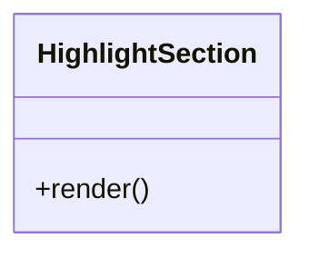

**Diagram sources**
- [components/features/landing/HighlightSection.js:4-80](file://components/features/landing/HighlightSection.js#L4-L80)

**Section sources**
- [components/features/landing/HighlightSection.js:1-81](file://components/features/landing/HighlightSection.js#L1-L81)

### TestimonySection
- Statistics and a long vertical marquee of testimonials.
- Uses layered gradients and decorative assets.

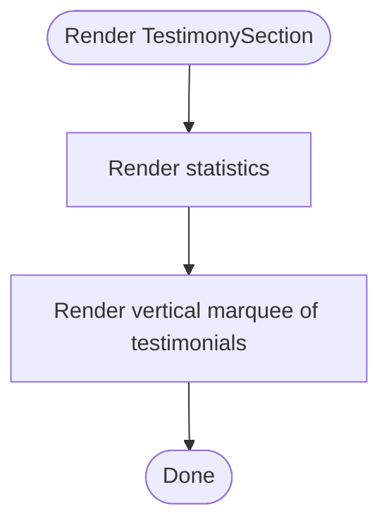

**Diagram sources**
- [components/features/landing/TestimonySection.js:6-183](file://components/features/landing/TestimonySection.js#L6-L183)

**Section sources**
- [components/features/landing/TestimonySection.js:1-184](file://components/features/landing/TestimonySection.js#L1-L184)

### ExtraBanner
- Full-width banner with gradient background and a prominent CTA.

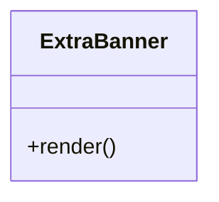

**Diagram sources**
- [components/features/landing/ExtraBanner.js:4-29](file://components/features/landing/ExtraBanner.js#L4-L29)

**Section sources**
- [components/features/landing/ExtraBanner.js:1-30](file://components/features/landing/ExtraBanner.js#L1-L30)

## Dependency Analysis
- The page depends on shared UI components and feature components.
- Feature components depend on Next’s runtime primitives (Image, Link) and external libraries (Lucide icons).
- Global CSS defines theme tokens and utilities consumed by all components.

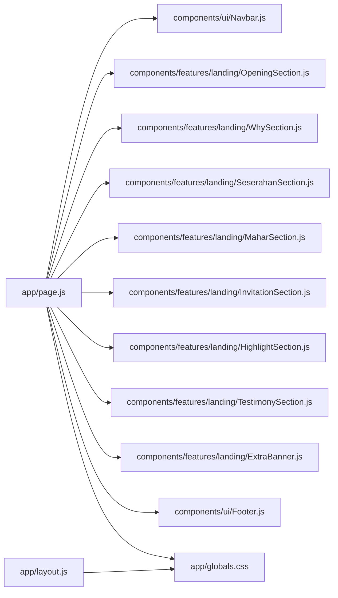

**Diagram sources**
- [app/page.js:3-12](file://app/page.js#L3-L12)
- [app/layout.js:1-2](file://app/layout.js#L1-L2)
- [app/globals.css:1-16](file://app/globals.css#L1-L16)

**Section sources**
- [app/page.js:1-42](file://app/page.js#L1-L42)
- [app/layout.js:1-35](file://app/layout.js#L1-L35)
- [app/globals.css:1-118](file://app/globals.css#L1-L118)

## Performance Considerations
- Client directives: Used selectively in interactive components (e.g., Navbar scroll effect, OpeningSection typewriter) to minimize unnecessary client-side hydration.
- Image optimization: Next/Image is used across components for automatic optimization and lazy loading.
- Animations: CSS-based animations and transforms leverage GPU acceleration; marquee animations use will-change hints.
- Asset delivery: Remote image pattern is configured for external images; local assets are optimized by Next.js.
- Build-time compiler: React Compiler is enabled to optimize component rendering.

Recommendations:
- Defer non-critical interactive features to reduce initial client payload.
- Consider code-splitting for heavy feature sections if the page grows further.
- Monitor Largest Contentful Paint (LCP) by ensuring hero images are sized appropriately and preloaded where beneficial.

**Section sources**
- [components/ui/Navbar.js:17-27](file://components/ui/Navbar.js#L17-L27)
- [components/features/landing/OpeningSection.js:6-37](file://components/features/landing/OpeningSection.js#L6-L37)
- [next.config.mjs:4-12](file://next.config.mjs#L4-L12)
- [package.json:11-23](file://package.json#L11-L23)

## Troubleshooting Guide
Common issues and resolutions:
- Fonts not applied: Verify font variables are included in html/body classes and that the CSS variables are defined in the global stylesheet.
- Scroll effects not working: Ensure the client directive is present and event listeners are cleaned up on unmount.
- Marquee animations stuttering: Confirm CSS keyframes and will-change usage; avoid excessive DOM nesting inside animated containers.
- Image sizing: Use Next/Image with fill and appropriate aspect ratios to prevent layout shifts.
- Build errors: Check PostCSS/Tailwind configuration and module resolution paths.

**Section sources**
- [app/layout.js:25-34](file://app/layout.js#L25-L34)
- [app/globals.css:3-28](file://app/globals.css#L3-L28)
- [components/ui/Navbar.js:17-27](file://components/ui/Navbar.js#L17-L27)
- [components/features/landing/OpeningSection.js:39-98](file://components/features/landing/OpeningSection.js#L39-L98)
- [postcss.config.mjs:1-8](file://postcss.config.mjs#L1-L8)
- [jsconfig.json:1-8](file://jsconfig.json#L1-L8)

## Conclusion
The page composition leverages Next.js conventions to deliver a structured, visually coherent landing experience. The root layout establishes a consistent foundation, while the home page orchestrates feature components in a deliberate order. Shared UI elements provide continuity, and global styles ensure a unified theme. Interactive components are strategically marked for client-side behavior, and performance is addressed through optimized images, CSS-driven animations, and build-time enhancements.