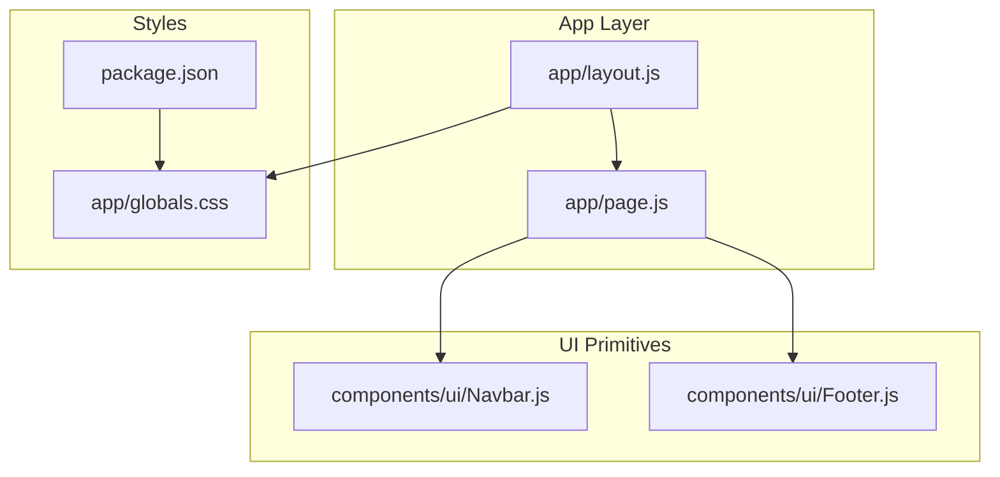
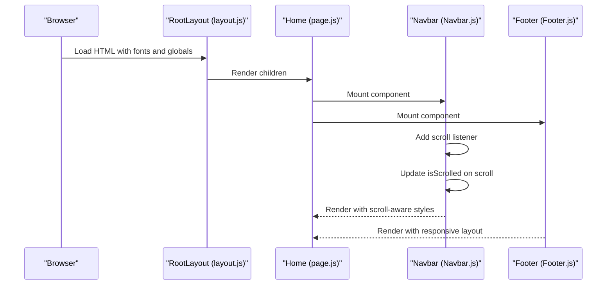
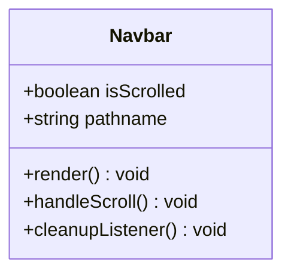
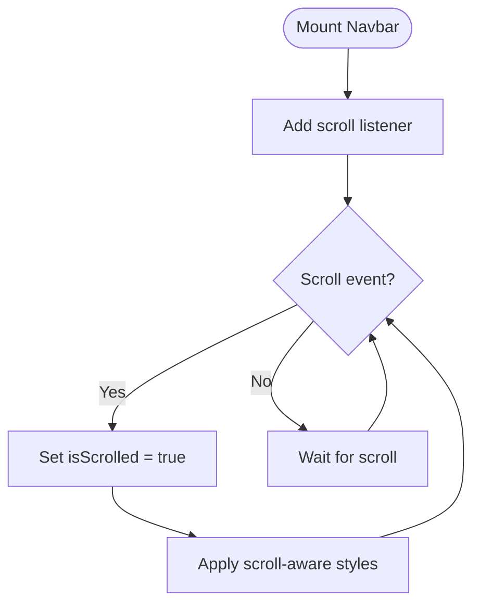
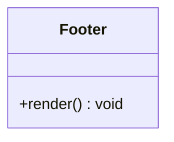
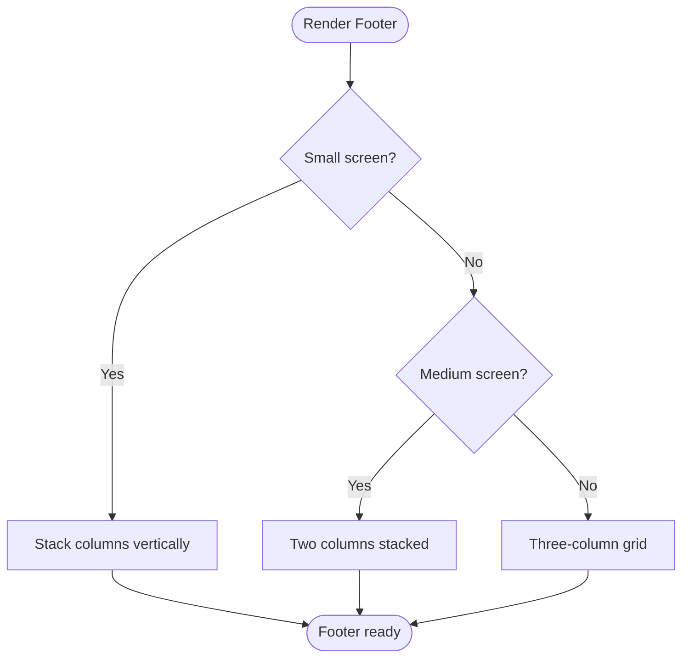
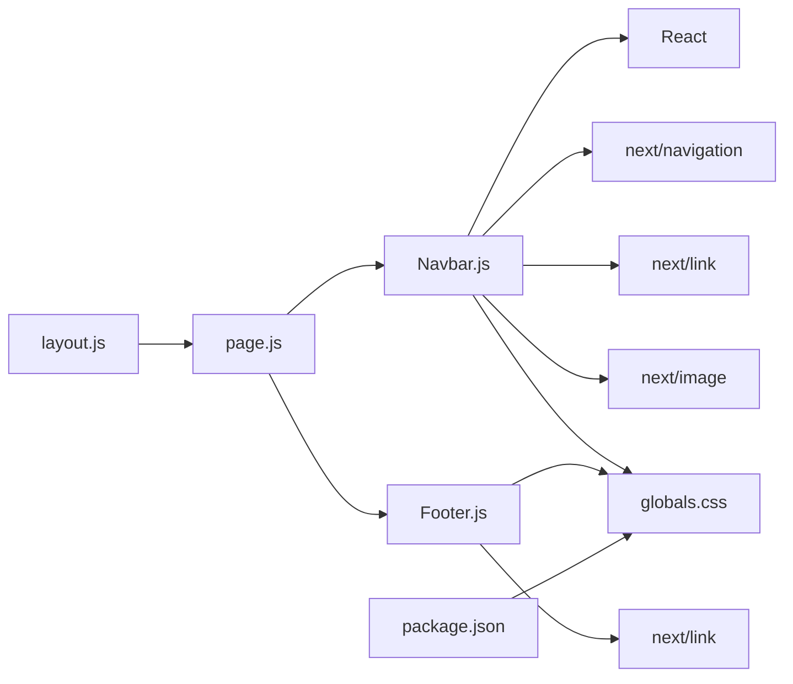

# UI Primitives

<cite>
**Referenced Files in This Document**
- [Navbar.js](file://components/ui/Navbar.js)
- [Footer.js](file://components/ui/Footer.js)
- [layout.js](file://app/layout.js)
- [page.js](file://app/page.js)
- [globals.css](file://app/globals.css)
- [package.json](file://package.json)
</cite>

## Table of Contents
1. [Introduction](#introduction)
2. [Project Structure](#project-structure)
3. [Core Components](#core-components)
4. [Architecture Overview](#architecture-overview)
5. [Detailed Component Analysis](#detailed-component-analysis)
6. [Dependency Analysis](#dependency-analysis)
7. [Performance Considerations](#performance-considerations)
8. [Troubleshooting Guide](#troubleshooting-guide)
9. [Conclusion](#conclusion)

## Introduction
This document describes the UI primitive components that form the foundational layout of the Momento Client Frontend. It focuses on the Navbar and Footer components, detailing their fixed positioning, scroll-aware styling effects, mobile-responsive hamburger menu implementation, multi-column layout, contact information display, and information architecture. It also explains component props, state management, event handlers, styling approaches, customization options, accessibility features, integration patterns with the overall layout system, and responsive design considerations.

## Project Structure
The UI primitives live under the components/ui directory and are integrated into the application’s root layout and pages. The global styles define theme tokens and Tailwind utilities that inform the visual design system.

**Diagram sources**
- [layout.js:25-34](file://app/layout.js#L25-L34)
- [page.js:14-41](file://app/page.js#L14-L41)
- [Navbar.js:17-85](file://components/ui/Navbar.js#L17-L85)
- [Footer.js:3-50](file://components/ui/Footer.js#L3-L50)
- [globals.css:1-118](file://app/globals.css#L1-L118)
- [package.json:11-23](file://package.json#L11-L23)

**Section sources**
- [layout.js:25-34](file://app/layout.js#L25-L34)
- [page.js:14-41](file://app/page.js#L14-L41)
- [globals.css:1-118](file://app/globals.css#L1-L118)
- [package.json:11-23](file://package.json#L11-L23)

## Core Components
- Navbar: Fixed header with scroll-aware background and blur effect, centered navigation links, and a prominent CTA button. Includes a mobile hamburger toggle placeholder.
- Footer: Multi-column information architecture with brand identity, services, company links, contact details, and legal notices.

Key characteristics:
- Fixed positioning ensures the Navbar remains visible during vertical scrolling.
- Scroll-aware styling adjusts background opacity and applies backdrop blur for depth.
- Mobile responsiveness uses Tailwind breakpoints to hide desktop navigation and show a mobile toggle.
- Footer uses a responsive two-row layout on small screens and a three-column grid on medium and larger screens.

**Section sources**
- [Navbar.js:17-85](file://components/ui/Navbar.js#L17-L85)
- [Footer.js:3-50](file://components/ui/Footer.js#L3-L50)

## Architecture Overview
The Navbar and Footer are integrated into the application’s root layout and page composition. The global stylesheet defines theme tokens and Tailwind utilities that inform the visual design system.

**Diagram sources**
- [layout.js:25-34](file://app/layout.js#L25-L34)
- [page.js:14-41](file://app/page.js#L14-L41)
- [Navbar.js:17-27](file://components/ui/Navbar.js#L17-L27)
- [Footer.js:3-50](file://components/ui/Footer.js#L3-L50)

## Detailed Component Analysis

### Navbar Component
- Purpose: Primary navigation header with branding, navigation links, and a call-to-action button. Provides a fixed position and scroll-aware styling.
- Fixed Positioning: The component is fixed at the top of the viewport and spans the full width, with a high z-index to remain above content.
- Scroll-Aware Styling Effects:
  - Background opacity and border change when scrolled.
  - Backdrop blur is applied on scroll to visually separate the navbar from content below.
  - Transition durations ensure smooth visual updates.
- Mobile-Responsive Hamburger Menu:
  - Desktop navigation is hidden on small screens using a breakpoint.
  - A mobile toggle icon is present for future expansion.
- Props and State:
  - State: isScrolled toggles based on scroll position.
  - Pathname: Used to derive active navigation state (currently simplified to “Home”).
- Event Handlers:
  - Scroll listener updates state on scroll events.
  - Cleanup removes the listener on unmount.
- Styling Approach:
  - Uses Tailwind utility classes for layout, spacing, typography, and transitions.
  - Theme tokens and font families are defined globally and consumed here.
- Accessibility:
  - Links are keyboard focusable and styled appropriately.
  - SVG icon is present for mobile toggle; ensure semantic markup and ARIA attributes are added when implemented.
- Integration Patterns:
  - Mounted at the top of the page and rendered above all content sections.
  - Works with the page’s overflow and stacking context.

Customization Options:
- Adjust background opacity and blur intensity by modifying the scroll-aware classes.
- Change active underline gradient colors to align with brand guidelines.
- Modify breakpoint thresholds to control when the mobile toggle appears.
- Extend the mobile toggle to open a collapsible menu with animated transitions.

Cross-Browser Compatibility:
- Backdrop blur is widely supported in modern browsers; consider fallbacks for older environments.
- Scroll listeners are standard; ensure passive listeners are used for performance.

**Section sources**
- [Navbar.js:17-85](file://components/ui/Navbar.js#L17-L85)
- [layout.js:25-34](file://app/layout.js#L25-L34)
- [globals.css:1-118](file://app/globals.css#L1-L118)

#### Navbar Class Diagram

**Diagram sources**
- [Navbar.js:17-27](file://components/ui/Navbar.js#L17-L27)

#### Navbar Scroll Effect Flow

**Diagram sources**
- [Navbar.js:21-27](file://components/ui/Navbar.js#L21-L27)
- [Navbar.js:30-33](file://components/ui/Navbar.js#L30-L33)

### Footer Component
- Purpose: Information architecture footer with brand identity, services, company links, contact details, and legal notices.
- Multi-Column Layout:
  - Single column on small screens.
  - Two-column layout on medium screens.
  - Three-column grid on larger screens.
- Contact Information Display:
  - Brand name and tagline in the first column.
  - Services, Company, and Contact sections in subsequent columns.
- Information Architecture:
  - Services: Seserahan, Mahar, Undangan.
  - Company: About, Portfolio, Contact.
  - Contact: Email and phone number.
  - Legal: Privacy Policy and Terms & Conditions.
- Styling Approach:
  - Uses Tailwind utilities for responsive layout and typography.
  - Global theme tokens define accent colors and typography families.
- Accessibility:
  - Links are keyboard focusable; ensure focus outlines are visible.
  - Consider adding skip links for screen reader users.
- Integration Patterns:
  - Mounted at the bottom of the page to provide consistent footer across sections.
  - Works with the page’s background and content stacking.

Customization Options:
- Modify column counts and spacing to fit content density.
- Adjust typography scales and letter-spacing to match brand voice.
- Add social media links or newsletter signup in the footer.

Cross-Browser Compatibility:
- Grid layouts and flexbox are broadly supported; ensure fallbacks for older browsers if necessary.

**Section sources**
- [Footer.js:3-50](file://components/ui/Footer.js#L3-L50)
- [globals.css:1-118](file://app/globals.css#L1-L118)

#### Footer Class Diagram

**Diagram sources**
- [Footer.js:3-50](file://components/ui/Footer.js#L3-L50)

#### Footer Responsive Layout Flow

**Diagram sources**
- [Footer.js:5-40](file://components/ui/Footer.js#L5-L40)

## Dependency Analysis
- Navbar depends on React hooks for state and effects, Next.js routing for pathname, and Next.js Image for logo rendering.
- Footer depends on Next.js Link for navigation and Tailwind utilities for responsive layout.
- Both components rely on the global stylesheet for theme tokens and typography.
- The page composes Navbar and Footer alongside feature sections.

**Diagram sources**
- [page.js:3-4](file://app/page.js#L3-L4)
- [Navbar.js:3-6](file://components/ui/Navbar.js#L3-L6)
- [Footer.js:1](file://components/ui/Footer.js#L1)
- [layout.js:25-34](file://app/layout.js#L25-L34)
- [globals.css:1-118](file://app/globals.css#L1-L118)
- [package.json:11-23](file://package.json#L11-L23)

**Section sources**
- [page.js:3-4](file://app/page.js#L3-L4)
- [Navbar.js:3-6](file://components/ui/Navbar.js#L3-L6)
- [Footer.js:1](file://components/ui/Footer.js#L1)
- [layout.js:25-34](file://app/layout.js#L25-L34)
- [globals.css:1-118](file://app/globals.css#L1-L118)
- [package.json:11-23](file://package.json#L11-L23)

## Performance Considerations
- Navbar scroll listener: Ensure passive listeners and throttle scroll events for smoother performance on low-end devices.
- Backdrop blur: While visually appealing, excessive blur can impact performance on older devices; consider disabling on lower-tier hardware.
- Image optimization: Next.js Image handles optimization automatically; ensure correct sizing and aspect ratios.
- CSS transitions: Keep transition durations reasonable to avoid jank on slower devices.

## Troubleshooting Guide
- Navbar not fixed or overlapping content:
  - Verify z-index and stacking context in the page composition.
  - Confirm the page container does not introduce conflicting positioning.
- Scroll effect not triggering:
  - Ensure the scroll listener is attached and removed on unmount.
  - Check for scroll container overrides (e.g., custom scroll containers).
- Footer layout issues:
  - Validate Tailwind breakpoints and ensure responsive variants are enabled.
  - Confirm grid and flex utilities are applied correctly across screen sizes.
- Accessibility concerns:
  - Add ARIA roles and labels for the mobile toggle and navigation links.
  - Ensure keyboard navigation and focus management are handled.

**Section sources**
- [Navbar.js:21-27](file://components/ui/Navbar.js#L21-L27)
- [Footer.js:5-40](file://components/ui/Footer.js#L5-L40)

## Conclusion
The Navbar and Footer components establish a strong foundation for the Momento Client Frontend’s layout system. The Navbar’s fixed positioning and scroll-aware styling create a cohesive header experience, while the Footer’s responsive multi-column layout communicates information architecture effectively. Together with the global styling system, these primitives enable consistent design and easy customization across the application.