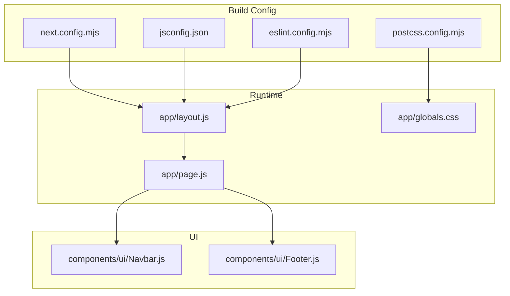
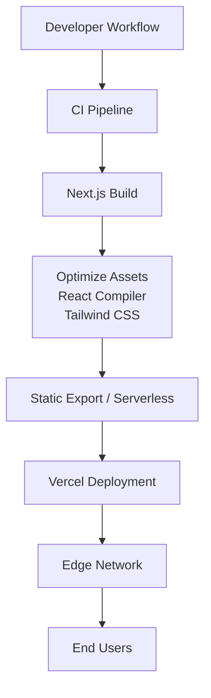
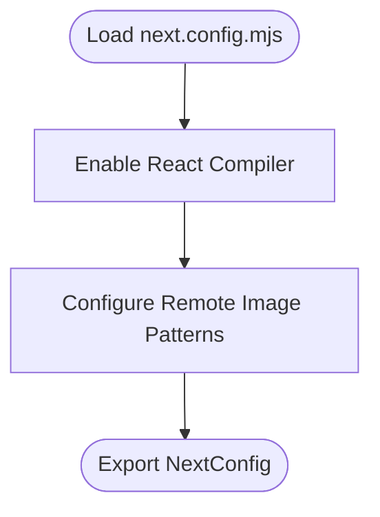
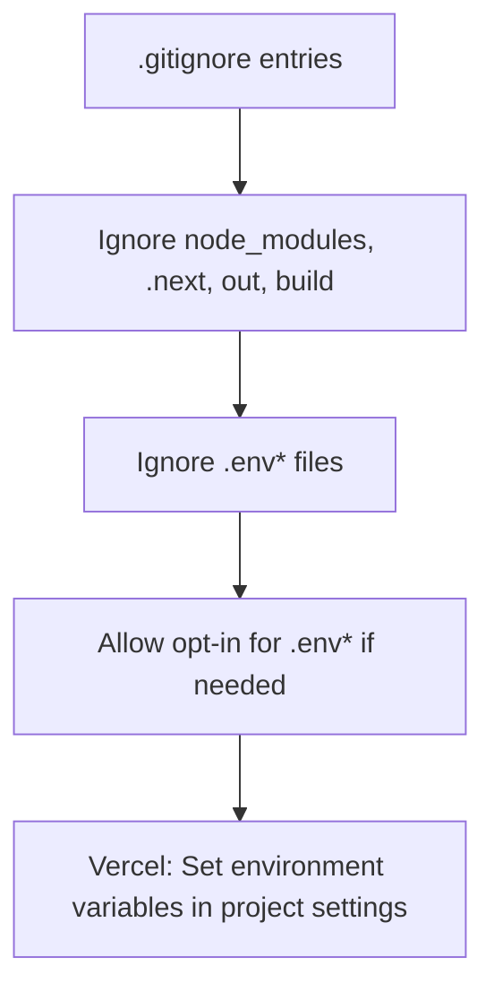
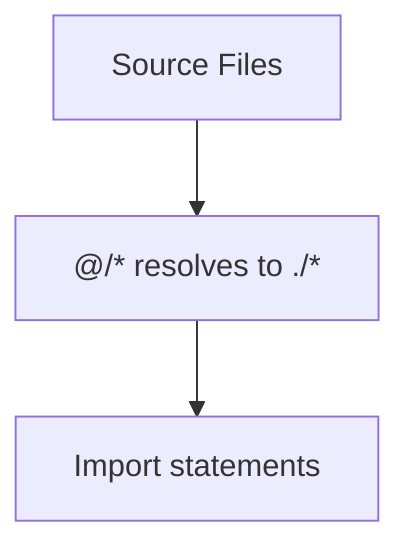
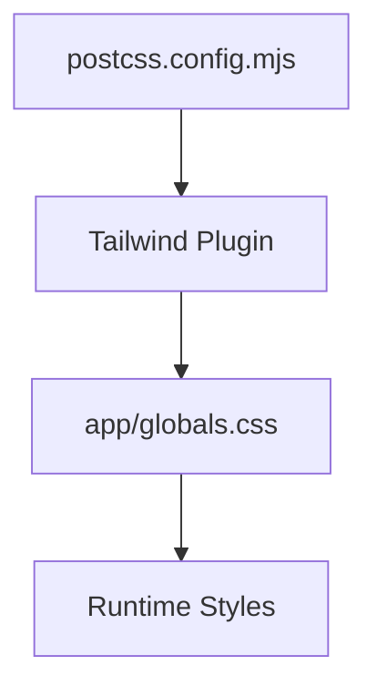
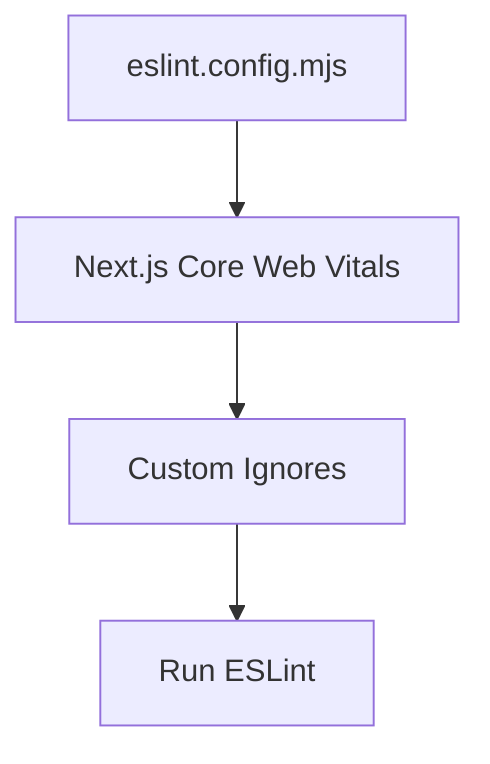
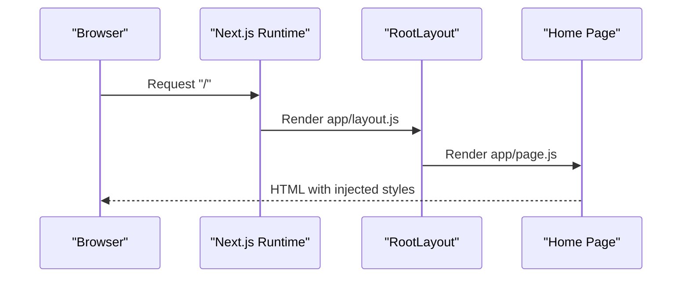
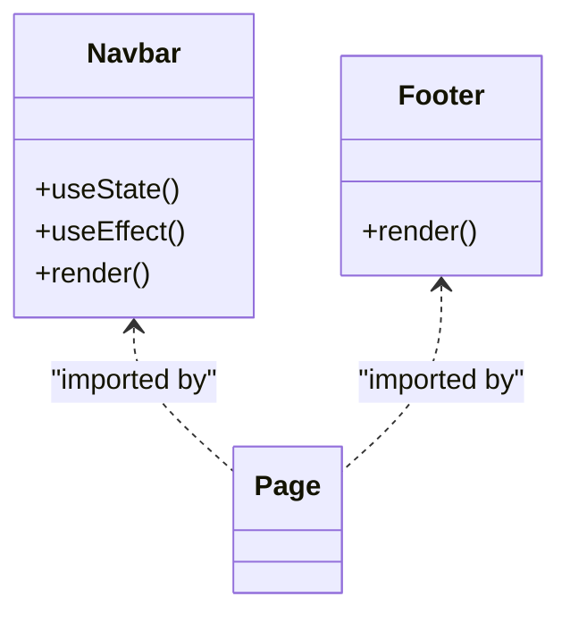
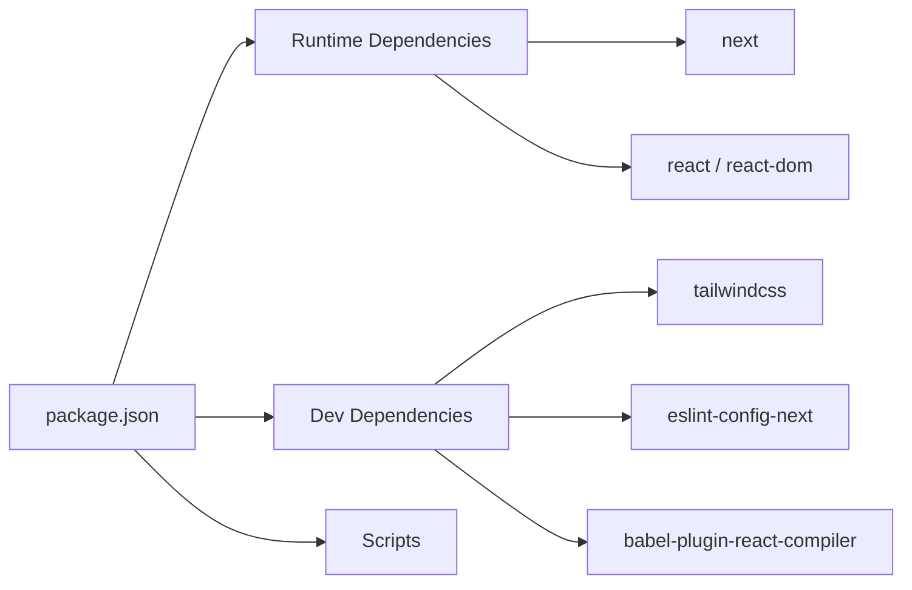

# Deployment & Production

<cite>
**Referenced Files in This Document**
- [next.config.mjs](file://next.config.mjs)
- [package.json](file://package.json)
- [jsconfig.json](file://jsconfig.json)
- [postcss.config.mjs](file://postcss.config.mjs)
- [eslint.config.mjs](file://eslint.config.mjs)
- [README.md](file://README.md)
- [.gitignore](file://.gitignore)
- [app/layout.js](file://app/layout.js)
- [app/page.js](file://app/page.js)
- [app/globals.css](file://app/globals.css)
- [components/ui/Navbar.js](file://components/ui/Navbar.js)
- [components/ui/Footer.js](file://components/ui/Footer.js)
</cite>

## Table of Contents
1. [Introduction](#introduction)
2. [Project Structure](#project-structure)
3. [Core Components](#core-components)
4. [Architecture Overview](#architecture-overview)
5. [Detailed Component Analysis](#detailed-component-analysis)
6. [Dependency Analysis](#dependency-analysis)
7. [Performance Considerations](#performance-considerations)
8. [Troubleshooting Guide](#troubleshooting-guide)
9. [Conclusion](#conclusion)
10. [Appendices](#appendices)

## Introduction
This document provides comprehensive deployment and production guidance for the Momento Client Frontend built with Next.js. It covers build configuration, production optimization, environment variables management, deployment strategies using Vercel, CI/CD considerations, monitoring, performance monitoring, error tracking, scaling, security, troubleshooting, rollback procedures, and emergency response protocols.

## Project Structure
The project follows a modern Next.js App Router structure with a small set of UI components and global styles. Key configuration files define build behavior, linting, Tailwind integration, and image optimization.

**Diagram sources**
- [next.config.mjs:1-16](file://next.config.mjs#L1-L16)
- [jsconfig.json:1-8](file://jsconfig.json#L1-L8)
- [postcss.config.mjs:1-8](file://postcss.config.mjs#L1-L8)
- [eslint.config.mjs:1-17](file://eslint.config.mjs#L1-L17)
- [app/layout.js:1-35](file://app/layout.js#L1-L35)
- [app/page.js:1-42](file://app/page.js#L1-L42)
- [app/globals.css:1-118](file://app/globals.css#L1-L118)
- [components/ui/Navbar.js:1-86](file://components/ui/Navbar.js#L1-L86)
- [components/ui/Footer.js:1-51](file://components/ui/Footer.js#L1-L51)

**Section sources**
- [next.config.mjs:1-16](file://next.config.mjs#L1-L16)
- [package.json:1-25](file://package.json#L1-L25)
- [jsconfig.json:1-8](file://jsconfig.json#L1-L8)
- [postcss.config.mjs:1-8](file://postcss.config.mjs#L1-L8)
- [eslint.config.mjs:1-17](file://eslint.config.mjs#L1-L17)
- [README.md:1-37](file://README.md#L1-L37)
- [.gitignore:1-41](file://.gitignore#L1-L41)

## Core Components
- Next.js configuration enables React Compiler and restricts remote images to a single approved domain pattern.
- Build scripts and runtime commands are defined in package.json for local development, building, and production serving.
- Path aliasing is configured via jsconfig.json to simplify imports.
- Tailwind is integrated via PostCSS plugin and configured globally through app/globals.css.
- Linting uses ESLint with Next.js core web vitals presets and custom overrides.

**Section sources**
- [next.config.mjs:1-16](file://next.config.mjs#L1-L16)
- [package.json:5-10](file://package.json#L5-L10)
- [jsconfig.json:2-6](file://jsconfig.json#L2-L6)
- [postcss.config.mjs:1-8](file://postcss.config.mjs#L1-L8)
- [app/globals.css:1-18](file://app/globals.css#L1-L18)
- [eslint.config.mjs:1-17](file://eslint.config.mjs#L1-L17)

## Architecture Overview
The frontend is a static-like React application generated by Next.js. Production deployments target Vercel, leveraging automatic static export and serverless functions where applicable. The build pipeline compiles TypeScript/JSX, optimizes assets, applies Tailwind CSS, and prepares the output for serving.

[No sources needed since this diagram shows conceptual workflow, not actual code structure]

## Detailed Component Analysis

### Next.js Build Configuration
- React Compiler is enabled to improve runtime performance.
- Remote image optimization is restricted to a single approved hostname pattern.
- Additional Next.js settings can be added in next.config.mjs as needed.

**Diagram sources**
- [next.config.mjs:4-12](file://next.config.mjs#L4-L12)

**Section sources**
- [next.config.mjs:1-16](file://next.config.mjs#L1-L16)

### Environment Variables Management
- Environment variables are intentionally ignored by Git to prevent secrets exposure.
- Committing .env files is explicitly allowed only if explicitly opted-in.
- For Vercel, use project settings to manage environment variables per deployment environment (preview, production).

**Diagram sources**
- [.gitignore:16-34](file://.gitignore#L16-L34)

**Section sources**
- [.gitignore:1-41](file://.gitignore#L1-41)
- [README.md:32-36](file://README.md#L32-L36)

### Path Aliasing and Imports
- Path alias @/* resolves to project root for concise imports.
- This improves readability and reduces brittle relative paths.

**Diagram sources**
- [jsconfig.json:3-5](file://jsconfig.json#L3-L5)

**Section sources**
- [jsconfig.json:1-8](file://jsconfig.json#L1-L8)

### Tailwind CSS Integration
- Tailwind is configured via PostCSS plugin.
- Global theme tokens and layer styles are defined centrally in app/globals.css.

**Diagram sources**
- [postcss.config.mjs:1-8](file://postcss.config.mjs#L1-L8)
- [app/globals.css:1-18](file://app/globals.css#L1-L18)

**Section sources**
- [postcss.config.mjs:1-8](file://postcss.config.mjs#L1-L8)
- [app/globals.css:1-118](file://app/globals.css#L1-L118)

### ESLint Configuration
- Uses Next.js core web vitals preset.
- Overrides default ignores to include build artifacts and temporary files.

**Diagram sources**
- [eslint.config.mjs:1-17](file://eslint.config.mjs#L1-L17)

**Section sources**
- [eslint.config.mjs:1-17](file://eslint.config.mjs#L1-L17)

### Application Layout and Routing
- Root layout defines metadata, fonts, and global HTML attributes.
- The home page composes UI components and renders the landing sections.

**Diagram sources**
- [app/layout.js:20-33](file://app/layout.js#L20-L33)
- [app/page.js:14-41](file://app/page.js#L14-L41)

**Section sources**
- [app/layout.js:1-35](file://app/layout.js#L1-L35)
- [app/page.js:1-42](file://app/page.js#L1-L42)

### UI Components
- Navbar integrates Next.js navigation primitives and responsive behavior.
- Footer provides structured links and branding.

**Diagram sources**
- [components/ui/Navbar.js:17-84](file://components/ui/Navbar.js#L17-L84)
- [components/ui/Footer.js:3-50](file://components/ui/Footer.js#L3-L50)

**Section sources**
- [components/ui/Navbar.js:1-86](file://components/ui/Navbar.js#L1-L86)
- [components/ui/Footer.js:1-51](file://components/ui/Footer.js#L1-L51)

## Dependency Analysis
- Runtime dependencies include Next.js, React, and Lucide React.
- Development dependencies include Tailwind v4, ESLint, and React Compiler plugin.
- Scripts define dev, build, start, and lint commands.

**Diagram sources**
- [package.json:11-23](file://package.json#L11-L23)
- [package.json:5-10](file://package.json#L5-L10)

**Section sources**
- [package.json:1-25](file://package.json#L1-L25)

## Performance Considerations
- Enable React Compiler for improved runtime performance.
- Restrict remote images to a single approved domain to reduce unnecessary fetches and potential security risks.
- Leverage Next.js automatic optimizations for fonts, images, and static exports.
- Keep build artifacts out of version control to avoid bloating repositories.
- Use Tailwind utilities efficiently and purge unused styles in production builds.
- Monitor Core Web Vitals during development and pre-deployment.

[No sources needed since this section provides general guidance]

## Troubleshooting Guide
- Build fails locally but succeeds in CI: Verify environment variables are not hardcoded and that the build cache is cleared before retrying.
- Missing fonts or styles: Confirm Tailwind plugin is loaded and app/globals.css is included in the root layout.
- Unexpected image loading errors: Ensure remote image hostnames match the configured pattern.
- Lint failures: Review ESLint overrides and resolve conflicts with core web vitals rules.
- Vercel deployment issues: Check project settings for environment variables and build output configuration.

**Section sources**
- [next.config.mjs:5-12](file://next.config.mjs#L5-L12)
- [app/globals.css:1-18](file://app/globals.css#L1-L18)
- [eslint.config.mjs:4-14](file://eslint.config.mjs#L4-L14)
- [.gitignore:16-34](file://.gitignore#L16-L34)

## Conclusion
The Momento Client Frontend is configured for efficient builds and production-ready delivery on Vercel. By following the outlined deployment and production practices—leveraging Next.js optimizations, managing environment variables securely, monitoring performance, and establishing robust CI/CD and rollback procedures—you can maintain a reliable, scalable, and secure frontend in production.

[No sources needed since this section summarizes without analyzing specific files]

## Appendices

### Deployment Strategies Using Vercel
- Use Vercel’s platform for seamless deployments from Git.
- Configure environment variables in Vercel project settings.
- Ensure build output aligns with Next.js expectations (.next, out directories are ignored).
- For static export, confirm pages are prerenderable; otherwise rely on serverless functions.

**Section sources**
- [README.md:32-36](file://README.md#L32-L36)
- [.gitignore:16-18](file://.gitignore#L16-L18)

### CI/CD Considerations
- Run linting and type checks in CI prior to building.
- Cache dependencies to speed up builds.
- Use separate preview deployments for pull requests and production deployments for main branch.
- Gate deployments on successful builds and tests.

**Section sources**
- [eslint.config.mjs:1-17](file://eslint.config.mjs#L1-L17)
- [package.json:5-10](file://package.json#L5-L10)

### Monitoring Strategies
- Track Core Web Vitals and error rates in production.
- Integrate analytics and APM tools to observe user journeys and bottlenecks.
- Set up alerts for degraded performance or increased error rates.

[No sources needed since this section provides general guidance]

### Performance Monitoring and Error Tracking
- Use Vercel Analytics and logs for basic insights.
- Add error tracking SDKs for client-side error capture.
- Monitor Largest Contentful Paint (LCP), First Input Delay (FID), and Cumulative Layout Shift (CLS).

[No sources needed since this section provides general guidance]

### Scaling Considerations
- Prefer static generation and ISR where possible.
- Use Vercel Edge Functions for lightweight server logic close to users.
- Optimize images and fonts; leverage Next.js automatic optimizations.

[No sources needed since this section provides general guidance]

### Security Best Practices
- Never commit secrets; use Vercel project settings for environment variables.
- Restrict remote image hosts to trusted domains.
- Keep dependencies updated and review security advisories regularly.

**Section sources**
- [.gitignore:33-34](file://.gitignore#L33-L34)
- [next.config.mjs:5-12](file://next.config.mjs#L5-L12)

### Rollback Procedures and Emergency Response Protocols
- Maintain versioned releases and deployment logs.
- Use Vercel’s deployment history to roll back to a previous stable build.
- Prepare incident playbooks: define escalation paths, communication templates, and remediation steps.

[No sources needed since this section provides general guidance]