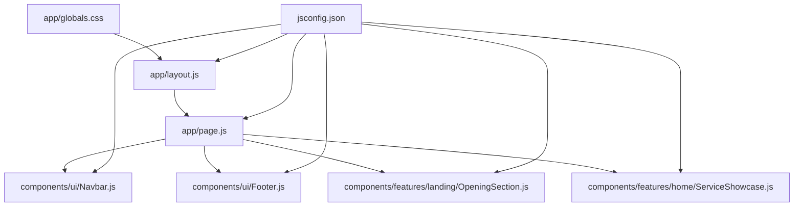
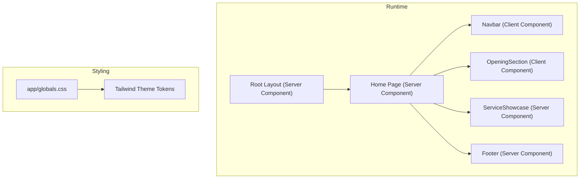
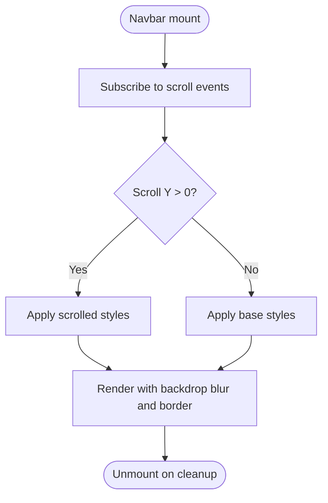
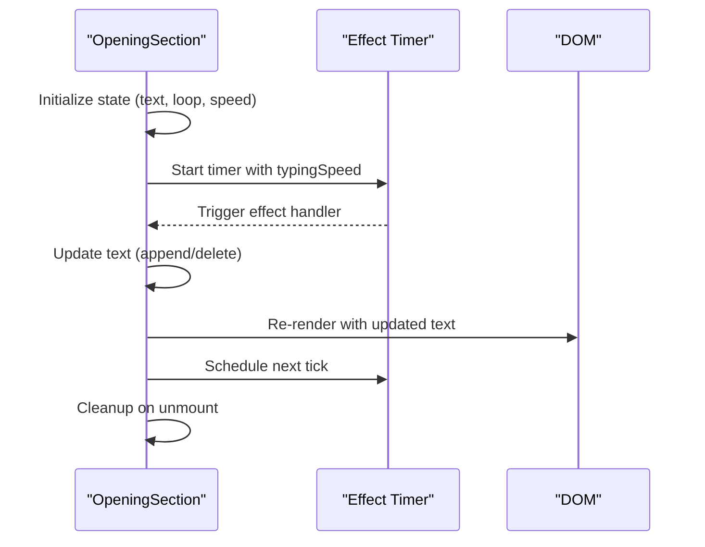
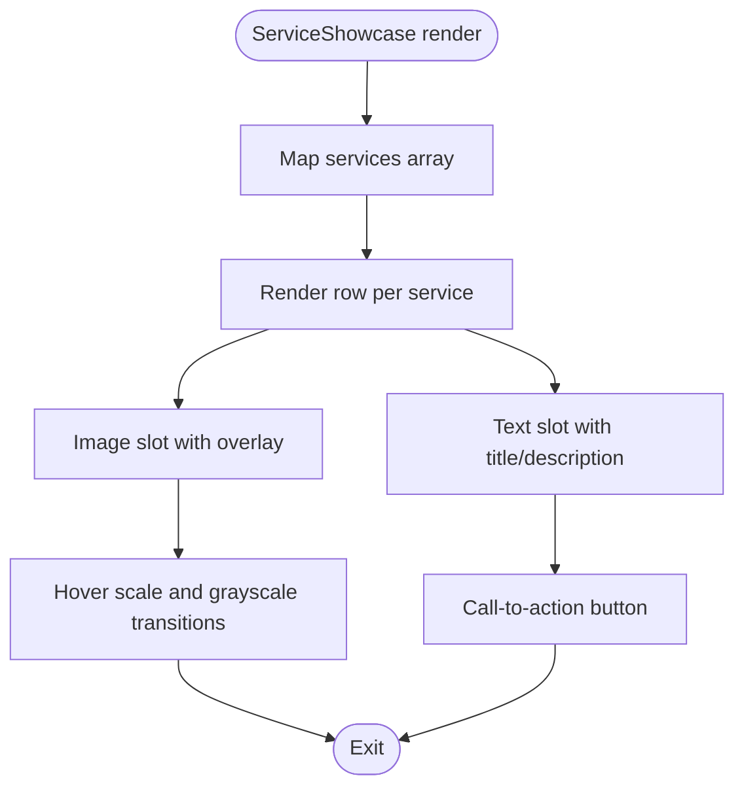
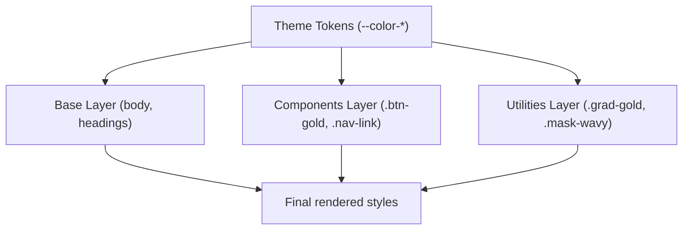
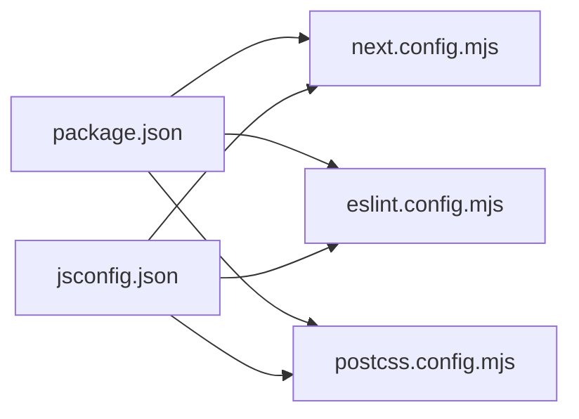
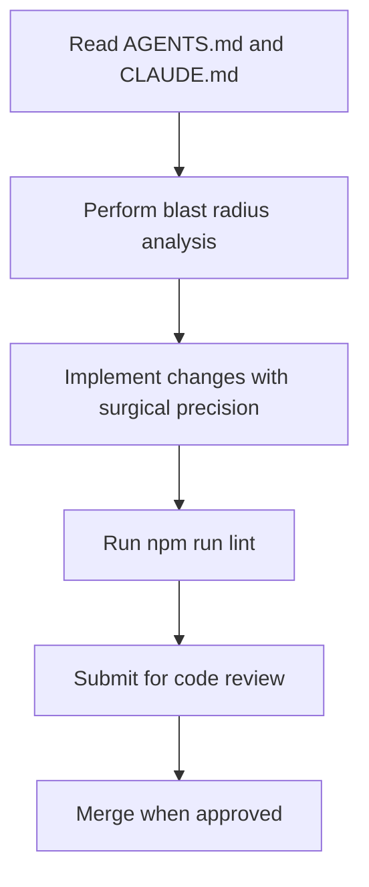

# Development Guidelines & Best Practices

<cite>
**Referenced Files in This Document**
- [package.json](file://package.json)
- [eslint.config.mjs](file://eslint.config.mjs)
- [next.config.mjs](file://next.config.mjs)
- [postcss.config.mjs](file://postcss.config.mjs)
- [jsconfig.json](file://jsconfig.json)
- [README.md](file://README.md)
- [app/layout.js](file://app/layout.js)
- [app/page.js](file://app/page.js)
- [app/globals.css](file://app/globals.css)
- [components/ui/Navbar.js](file://components/ui/Navbar.js)
- [components/ui/Footer.js](file://components/ui/Footer.js)
- [components/features/home/ServiceShowcase.js](file://components/features/home/ServiceShowcase.js)
- [components/features/landing/OpeningSection.js](file://components/features/landing/OpeningSection.js)
- [AGENTS.md](file://AGENTS.md)
- [CLAUDE.md](file://CLAUDE.md)
- [DOCS_OVERVIEW.md](file://DOCS_OVERVIEW.md)
</cite>

## Table of Contents
1. [Introduction](#introduction)
2. [Project Structure](#project-structure)
3. [Core Components](#core-components)
4. [Architecture Overview](#architecture-overview)
5. [Detailed Component Analysis](#detailed-component-analysis)
6. [Dependency Analysis](#dependency-analysis)
7. [Performance Considerations](#performance-considerations)
8. [Testing Strategies](#testing-strategies)
9. [Code Review & Contribution Workflows](#code-review--contribution-workflows)
10. [Troubleshooting Guide](#troubleshooting-guide)
11. [Conclusion](#conclusion)
12. [Appendices](#appendices)

## Introduction
This document defines development guidelines and best practices for the Momento Client Frontend. It consolidates code organization standards, component development patterns, architectural principles, tooling configurations (ESLint, TypeScript/JavaScript, PostCSS/Tailwind), state management approaches, performance optimization strategies, testing practices, and contribution workflows. The guidance is grounded in the project’s current setup and established repository standards.

## Project Structure
The project follows Next.js App Router conventions with a clear separation of concerns:
- app/: Application shell, metadata, and page components
- components/: Feature and UI component libraries
- public/: Static assets (images/icons)
- Tooling configs: ESLint, Next.js, PostCSS, and JS path aliases

**Diagram sources**
- [app/layout.js](file://app/layout.js)
- [app/page.js](file://app/page.js)
- [components/ui/Navbar.js](file://components/ui/Navbar.js)
- [components/ui/Footer.js](file://components/ui/Footer.js)
- [components/features/landing/OpeningSection.js](file://components/features/landing/OpeningSection.js)
- [components/features/home/ServiceShowcase.js](file://components/features/home/ServiceShowcase.js)
- [app/globals.css](file://app/globals.css)
- [jsconfig.json](file://jsconfig.json)

**Section sources**
- [app/layout.js](file://app/layout.js)
- [app/page.js](file://app/page.js)
- [jsconfig.json](file://jsconfig.json)

## Core Components
- UI primitives live under components/ui/ and are reusable across pages.
- Feature components live under components/features/<area>/ and encapsulate domain-specific layouts and sections.
- The root layout configures fonts, metadata, and global styles.
- Global CSS centralizes theme tokens, component utilities, and animations.

Key patterns observed:
- Server Components by default with explicit client directives where interactivity is needed.
- next/font for optimized fonts and next/image for asset optimization.
- Tailwind-based vanilla CSS for design tokens and utilities.

**Section sources**
- [app/layout.js](file://app/layout.js)
- [app/globals.css](file://app/globals.css)
- [components/ui/Navbar.js](file://components/ui/Navbar.js)
- [components/ui/Footer.js](file://components/ui/Footer.js)
- [components/features/landing/OpeningSection.js](file://components/features/landing/OpeningSection.js)
- [components/features/home/ServiceShowcase.js](file://components/features/home/ServiceShowcase.js)

## Architecture Overview
The frontend architecture emphasizes:
- App Router with Server Components by default
- Strict separation of UI primitives and feature components
- Centralized design system via Tailwind theme tokens and global CSS utilities
- Optimized asset delivery with next/image and next/font
- Minimal runtime state via React hooks and selective client components

**Diagram sources**
- [app/layout.js](file://app/layout.js)
- [app/page.js](file://app/page.js)
- [components/ui/Navbar.js](file://components/ui/Navbar.js)
- [components/ui/Footer.js](file://components/ui/Footer.js)
- [components/features/landing/OpeningSection.js](file://components/features/landing/OpeningSection.js)
- [components/features/home/ServiceShowcase.js](file://components/features/home/ServiceShowcase.js)
- [app/globals.css](file://app/globals.css)

## Detailed Component Analysis

### UI Component Pattern: Navbar
- Client-side interactivity for scroll-aware styling and mobile toggle
- Uses next/navigation for route awareness and next/link for navigation
- Integrates with global theme tokens and responsive breakpoints

**Diagram sources**
- [components/ui/Navbar.js](file://components/ui/Navbar.js)

**Section sources**
- [components/ui/Navbar.js](file://components/ui/Navbar.js)

### Feature Component Pattern: Landing Hero
- Client directive for dynamic typing effect with controlled state lifecycle
- next/image for optimized hero imagery and floating CTA decoration
- Responsive typography and layout with Tailwind utilities

**Diagram sources**
- [components/features/landing/OpeningSection.js](file://components/features/landing/OpeningSection.js)

**Section sources**
- [components/features/landing/OpeningSection.js](file://components/features/landing/OpeningSection.js)

### Feature Component Pattern: Service Showcase
- Reusable layout with alternating reverse rows
- next/image with hover transforms and gradient overlays
- Semantic section IDs and responsive grid behavior

**Diagram sources**
- [components/features/home/ServiceShowcase.js](file://components/features/home/ServiceShowcase.js)

**Section sources**
- [components/features/home/ServiceShowcase.js](file://components/features/home/ServiceShowcase.js)

### Global Styles and Theming
- Centralized theme tokens in app/globals.css
- Layered CSS (base, components, utilities) for predictable overrides
- Animations and gradient utilities for motion design

**Diagram sources**
- [app/globals.css](file://app/globals.css)

**Section sources**
- [app/globals.css](file://app/globals.css)

## Dependency Analysis
Tooling and configuration dependencies:
- Next.js runtime and compiler options
- ESLint with Next.js core-web-vitals preset and custom overrides
- Tailwind PostCSS plugin for CSS authoring
- Path aliasing via jsconfig.json

**Diagram sources**
- [package.json](file://package.json)
- [next.config.mjs](file://next.config.mjs)
- [eslint.config.mjs](file://eslint.config.mjs)
- [postcss.config.mjs](file://postcss.config.mjs)
- [jsconfig.json](file://jsconfig.json)

**Section sources**
- [package.json](file://package.json)
- [next.config.mjs](file://next.config.mjs)
- [eslint.config.mjs](file://eslint.config.mjs)
- [postcss.config.mjs](file://postcss.config.mjs)
- [jsconfig.json](file://jsconfig.json)

## Performance Considerations
- Prefer Server Components for initial HTML and SEO benefits
- Use next/image with fill and priority for hero imagery; constrain aspect ratios
- next/font with font-display swap and minimal subset loading
- Limit client components to areas requiring interactivity
- Minimize heavy JavaScript bundles; leverage React Compiler
- Optimize CSS via Tailwind utilities and avoid ad-hoc large blocks
- Keep animations lightweight; use transform and opacity for GPU acceleration

## Testing Strategies
Recommended practices:
- Unit tests for pure functions and small utilities
- Component tests for UI primitives and feature sections using React Testing Library
- Visual regression testing for critical pages and hero sections
- Accessibility checks with axe or similar tools
- Linting and type checks in CI to enforce quality gates

[No sources needed since this section provides general guidance]

## Code Review & Contribution Workflows
Repository standards and workflows:
- Read and follow AGENTS.md and CLAUDE.md before starting work
- Surgical precision: modify only necessary lines; preserve original intent
- Conduct blast radius analysis for shared components
- Validate with linting after changes
- Maintain pixel-perfect fidelity to Figma designs
- Keep code modular, readable, and aligned with App Router patterns

**Section sources**
- [AGENTS.md](file://AGENTS.md)
- [CLAUDE.md](file://CLAUDE.md)

## Troubleshooting Guide
Common issues and resolutions:
- ESLint errors: resolve rule violations or adjust eslint.config.mjs overrides sparingly
- Build failures: verify next.config.mjs settings (React Compiler, images.remotePatterns)
- Styling inconsistencies: ensure Tailwind plugin is enabled and theme tokens are defined in app/globals.css
- Path resolution errors: confirm jsconfig.json paths and module resolution

**Section sources**
- [eslint.config.mjs](file://eslint.config.mjs)
- [next.config.mjs](file://next.config.mjs)
- [postcss.config.mjs](file://postcss.config.mjs)
- [jsconfig.json](file://jsconfig.json)
- [app/globals.css](file://app/globals.css)

## Conclusion
These guidelines consolidate the current development practices and toolchain for the Momento Client Frontend. By adhering to component separation, App Router patterns, centralized theming, and rigorous linting/testing, the team can maintain a scalable, consistent, and high-quality codebase aligned with the project’s design and performance goals.

## Appendices

### A. ESLint Configuration
- Uses eslint-config-next/core-web-vitals preset
- Overrides default ignores to include app directory files
- Run linting via npm script

**Section sources**
- [eslint.config.mjs](file://eslint.config.mjs)
- [package.json](file://package.json)

### B. Next.js Configuration
- Enables React Compiler
- Configures next/image remotePatterns for external assets
- Ensures optimal SSR and static generation behavior

**Section sources**
- [next.config.mjs](file://next.config.mjs)

### C. PostCSS and Tailwind Setup
- Tailwind PostCSS plugin enabled
- Centralized design tokens and utilities in app/globals.css
- Layered CSS approach for predictable cascade

**Section sources**
- [postcss.config.mjs](file://postcss.config.mjs)
- [app/globals.css](file://app/globals.css)

### D. Path Aliasing
- @/* resolves to project root for concise imports
- Improves readability and reduces brittle relative paths

**Section sources**
- [jsconfig.json](file://jsconfig.json)

### E. Component Naming and Organization
- UI primitives: components/ui/*
- Feature sections: components/features/<area>/*
- Pages: app/*.js
- Follows “one component per file” and descriptive naming conventions

**Section sources**
- [components/ui/Navbar.js](file://components/ui/Navbar.js)
- [components/ui/Footer.js](file://components/ui/Footer.js)
- [components/features/landing/OpeningSection.js](file://components/features/landing/OpeningSection.js)
- [components/features/home/ServiceShowcase.js](file://components/features/home/ServiceShowcase.js)

### F. State Management Patterns
- Local state via React hooks for UI interactions
- Client components for interactivity; avoid unnecessary client directives
- Keep global state minimal; prefer local component state

**Section sources**
- [components/ui/Navbar.js](file://components/ui/Navbar.js)
- [components/features/landing/OpeningSection.js](file://components/features/landing/OpeningSection.js)

### G. Accessibility and SEO
- next/head metadata configured in root layout
- Semantic HTML and ARIA attributes where applicable
- next/font and next/image for performance and SEO

**Section sources**
- [app/layout.js](file://app/layout.js)

### H. Getting Started
- Development server, build, and start scripts defined in package.json
- See README for environment setup and local development steps

**Section sources**
- [package.json](file://package.json)
- [README.md](file://README.md)