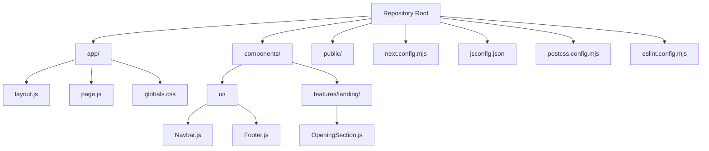

# Getting Started

<cite>
**Referenced Files in This Document**
- [package.json](file://package.json)
- [README.md](file://README.md)
- [next.config.mjs](file://next.config.mjs)
- [jsconfig.json](file://jsconfig.json)
- [postcss.config.mjs](file://postcss.config.mjs)
- [eslint.config.mjs](file://eslint.config.mjs)
- [app/layout.js](file://app/layout.js)
- [app/page.js](file://app/page.js)
- [components/ui/Navbar.js](file://components/ui/Navbar.js)
- [components/ui/Footer.js](file://components/ui/Footer.js)
- [components/features/landing/OpeningSection.js](file://components/features/landing/OpeningSection.js)
- [app/globals.css](file://app/globals.css)
- [AGENTS.md](file://AGENTS.md)
- [CLAUDE.md](file://CLAUDE.md)
- [DOCS_OVERVIEW.md](file://DOCS_OVERVIEW.md)
</cite>

## Table of Contents
1. [Introduction](#introduction)
2. [Prerequisites](#prerequisites)
3. [Installation](#installation)
4. [Development Environment Setup](#development-environment-setup)
5. [Project Structure Overview](#project-structure-overview)
6. [Running the Development Server](#running-the-development-server)
7. [Supported Package Managers](#supported-package-managers)
8. [Verification Steps](#verification-steps)
9. [Troubleshooting Guide](#troubleshooting-guide)
10. [Beginner-Friendly Tips](#beginner-friendly-tips)
11. [Conclusion](#conclusion)

## Introduction
This guide helps you set up and run the Momento Client Frontend locally. It covers prerequisites, installation, development server startup, project structure, and troubleshooting. The project is a Next.js application using the App Router, styled with Tailwind CSS v4, and optimized with Next.js features like next/font and next/image.

## Prerequisites
- Node.js version compatible with Next.js 16.x (check the runtime requirement in the Next.js release notes if upgrading). The project specifies Next.js 16.2.3; ensure your Node.js version supports it.
- Basic understanding of React and Next.js fundamentals (pages, components, routing).
- Familiarity with the terminal/command prompt.
- Optional but recommended: Understanding of Tailwind CSS and ESLint basics.

**Section sources**
- [package.json:11-16](file://package.json#L11-L16)
- [DOCS_OVERVIEW.md:8-10](file://DOCS_OVERVIEW.md#L8-L10)

## Installation
Follow these steps to install dependencies and prepare your environment:

1. Install dependencies using your preferred package manager:
   - npm: [package.json:5-10](file://package.json#L5-L10)
   - yarn: [README.md:10](file://README.md#L10)
   - pnpm: [README.md:12](file://README.md#L12)
   - bun: [README.md:14](file://README.md#L14)

2. After installing dependencies, you can proceed to run the development server.

**Section sources**
- [README.md:5-15](file://README.md#L5-L15)
- [package.json:5-10](file://package.json#L5-L10)

## Development Environment Setup
Configure your environment for optimal development:

- ESLint: The project uses ESLint with next/core-web-vitals preset and custom overrides. Run the linter to validate code quality.
  - Command: [package.json:9](file://package.json#L9)
  - Config: [eslint.config.mjs:1-17](file://eslint.config.mjs#L1-L17)

- PostCSS and Tailwind CSS v4: Tailwind is configured via PostCSS and enabled in the project.
  - PostCSS config: [postcss.config.mjs:1-8](file://postcss.config.mjs#L1-L8)
  - Tailwind is imported in global styles: [app/globals.css:1](file://app/globals.css#L1)

- Next.js Compiler Optimizations: React Compiler is enabled in Next.js config.
  - Config: [next.config.mjs:4](file://next.config.mjs#L4)

- Path Aliases: The project uses a path alias @ pointing to the repository root for convenient imports.
  - Config: [jsconfig.json:3-5](file://jsconfig.json#L3-L5)

**Section sources**
- [eslint.config.mjs:1-17](file://eslint.config.mjs#L1-L17)
- [postcss.config.mjs:1-8](file://postcss.config.mjs#L1-L8)
- [app/globals.css:1](file://app/globals.css#L1)
- [next.config.mjs:4](file://next.config.mjs#L4)
- [jsconfig.json:3-5](file://jsconfig.json#L3-L5)

## Project Structure Overview
The project follows Next.js App Router conventions. Key areas:

- app/: Application shell, metadata, and pages.
  - app/layout.js: Root layout with fonts and metadata.
  - app/page.js: Home page rendering multiple feature sections.
  - app/globals.css: Global Tailwind-based styles and theme tokens.

- components/: Reusable UI and feature components.
  - components/ui/: Shared UI primitives (Navbar, Footer).
  - components/features/landing/: Feature-specific sections (e.g., OpeningSection).

- public/: Static assets (images/icons) referenced by components.

- Tooling configs:
  - next.config.mjs: Next.js configuration including React Compiler and image remote patterns.
  - jsconfig.json: Path aliases for imports.
  - postcss.config.mjs: Tailwind integration via PostCSS.
  - eslint.config.mjs: ESLint configuration aligned with Next.js best practices.

**Diagram sources**
- [app/layout.js:1-35](file://app/layout.js#L1-L35)
- [app/page.js:1-42](file://app/page.js#L1-L42)
- [components/ui/Navbar.js:1-86](file://components/ui/Navbar.js#L1-L86)
- [components/ui/Footer.js:1-51](file://components/ui/Footer.js#L1-L51)
- [components/features/landing/OpeningSection.js:1-100](file://components/features/landing/OpeningSection.js#L1-L100)
- [next.config.mjs:1-16](file://next.config.mjs#L1-L16)
- [jsconfig.json:1-8](file://jsconfig.json#L1-L8)
- [postcss.config.mjs:1-8](file://postcss.config.mjs#L1-L8)
- [eslint.config.mjs:1-17](file://eslint.config.mjs#L1-L17)

**Section sources**
- [app/layout.js:1-35](file://app/layout.js#L1-L35)
- [app/page.js:1-42](file://app/page.js#L1-L42)
- [components/ui/Navbar.js:1-86](file://components/ui/Navbar.js#L1-L86)
- [components/ui/Footer.js:1-51](file://components/ui/Footer.js#L1-L51)
- [components/features/landing/OpeningSection.js:1-100](file://components/features/landing/OpeningSection.js#L1-L100)
- [next.config.mjs:1-16](file://next.config.mjs#L1-L16)
- [jsconfig.json:1-8](file://jsconfig.json#L1-L8)
- [postcss.config.mjs:1-8](file://postcss.config.mjs#L1-L8)
- [eslint.config.mjs:1-17](file://eslint.config.mjs#L1-L17)

## Running the Development Server
Start the Next.js development server:

- Command: [README.md:7-15](file://README.md#L7-L15)
- Scripts: [package.json:5-10](file://package.json#L5-L10)

Open http://localhost:3000 in your browser to view the site.

**Section sources**
- [README.md:5-17](file://README.md#L5-L17)
- [package.json:5-10](file://package.json#L5-L10)

## Supported Package Managers
The project supports multiple package managers. Choose one and use its standard commands:

- npm: [README.md:7-8](file://README.md#L7-L8)
- yarn: [README.md:10](file://README.md#L10)
- pnpm: [README.md:12](file://README.md#L12)
- bun: [README.md:14](file://README.md#L14)

Build and start scripts are also defined:
- Build: [package.json:7](file://package.json#L7)
- Start: [package.json:8](file://package.json#L8)

**Section sources**
- [README.md:7-15](file://README.md#L7-L15)
- [package.json:5-10](file://package.json#L5-L10)

## Verification Steps
After installation and server start, verify everything works:

- Confirm the homepage loads at http://localhost:3000.
- Inspect the root layout and metadata:
  - Root layout and fonts: [app/layout.js:1-35](file://app/layout.js#L1-L35)
- Verify the home page renders the expected sections:
  - Home page composition: [app/page.js:14-41](file://app/page.js#L14-L41)
- Ensure global styles and theme tokens are applied:
  - Global CSS and Tailwind integration: [app/globals.css:1-118](file://app/globals.css#L1-L118)
- Confirm navigation and footer components render:
  - Navbar: [components/ui/Navbar.js:17-84](file://components/ui/Navbar.js#L17-L84)
  - Footer: [components/ui/Footer.js:3-49](file://components/ui/Footer.js#L3-L49)
- Validate image optimization and remote image patterns:
  - Remote pattern configuration: [next.config.mjs:5-12](file://next.config.mjs#L5-L12)
- Run the linter to catch issues early:
  - Lint command: [package.json:9](file://package.json#L9)
  - ESLint config: [eslint.config.mjs:1-17](file://eslint.config.mjs#L1-L17)

**Section sources**
- [app/layout.js:1-35](file://app/layout.js#L1-L35)
- [app/page.js:14-41](file://app/page.js#L14-L41)
- [app/globals.css:1-118](file://app/globals.css#L1-L118)
- [components/ui/Navbar.js:17-84](file://components/ui/Navbar.js#L17-L84)
- [components/ui/Footer.js:3-49](file://components/ui/Footer.js#L3-L49)
- [next.config.mjs:5-12](file://next.config.mjs#L5-L12)
- [package.json:9](file://package.json#L9)
- [eslint.config.mjs:1-17](file://eslint.config.mjs#L1-L17)

## Troubleshooting Guide
Common setup and runtime issues:

- Port already in use (commonly port 3000):
  - Change the port in your environment or stop the conflicting process.
  - Start the dev server again: [README.md:7-15](file://README.md#L7-L15)

- Node.js version mismatch:
  - Ensure your Node.js version matches Next.js 16.x requirements.
  - Check the Next.js release notes for compatible versions.

- Missing dependencies after clone:
  - Reinstall dependencies using your chosen package manager:
    - npm: [README.md:7-8](file://README.md#L7-L8)
    - yarn: [README.md:10](file://README.md#L10)
    - pnpm: [README.md:12](file://README.md#L12)
    - bun: [README.md:14](file://README.md#L14)

- Tailwind CSS not applying:
  - Verify Tailwind is imported in global CSS: [app/globals.css:1](file://app/globals.css#L1)
  - Confirm PostCSS plugin is present: [postcss.config.mjs:3](file://postcss.config.mjs#L3)

- ESLint errors blocking development:
  - Run the linter and fix reported issues:
    - Command: [package.json:9](file://package.json#L9)
    - Config: [eslint.config.mjs:1-17](file://eslint.config.mjs#L1-L17)

- Images not loading:
  - Ensure images are placed under public/ or use next/image with remote patterns configured:
    - Remote patterns: [next.config.mjs:5-12](file://next.config.mjs#L5-L12)

- Path alias not resolving:
  - Confirm path alias configuration:
    - jsconfig.json: [jsconfig.json:3-5](file://jsconfig.json#L3-L5)

**Section sources**
- [README.md:7-15](file://README.md#L7-L15)
- [app/globals.css:1](file://app/globals.css#L1)
- [postcss.config.mjs:3](file://postcss.config.mjs#L3)
- [package.json:9](file://package.json#L9)
- [eslint.config.mjs:1-17](file://eslint.config.mjs#L1-L17)
- [next.config.mjs:5-12](file://next.config.mjs#L5-L12)
- [jsconfig.json:3-5](file://jsconfig.json#L3-L5)

## Beginner-Friendly Tips
- Start with the development server to confirm your environment is ready:
  - [README.md:7-15](file://README.md#L7-L15)
- Explore the root layout and metadata to understand global theming:
  - [app/layout.js:20-23](file://app/layout.js#L20-L23)
- Edit the home page to see changes live:
  - [app/page.js:14-41](file://app/page.js#L14-L41)
- Use the Navbar and Footer as reference for building new UI components:
  - [components/ui/Navbar.js:17-84](file://components/ui/Navbar.js#L17-L84)
  - [components/ui/Footer.js:3-49](file://components/ui/Footer.js#L3-L49)
- Keep the linter running during development to maintain code quality:
  - [package.json:9](file://package.json#L9)
  - [eslint.config.mjs:1-17](file://eslint.config.mjs#L1-L17)

**Section sources**
- [README.md:7-15](file://README.md#L7-L15)
- [app/layout.js:20-23](file://app/layout.js#L20-L23)
- [app/page.js:14-41](file://app/page.js#L14-L41)
- [components/ui/Navbar.js:17-84](file://components/ui/Navbar.js#L17-L84)
- [components/ui/Footer.js:3-49](file://components/ui/Footer.js#L3-L49)
- [package.json:9](file://package.json#L9)
- [eslint.config.mjs:1-17](file://eslint.config.mjs#L1-L17)

## Conclusion
You now have the essentials to set up, run, and iterate on the Momento Client Frontend. Use the development server, verify your setup, and leverage the provided configurations for a smooth development experience. Refer to the project’s guidelines for UI fidelity and Next.js best practices.

**Section sources**
- [AGENTS.md:1-56](file://AGENTS.md#L1-L56)
- [CLAUDE.md:1-21](file://CLAUDE.md#L1-L21)
- [DOCS_OVERVIEW.md:1-38](file://DOCS_OVERVIEW.md#L1-L38)