# Image Optimization & Asset Management

<cite>
**Referenced Files in This Document**
- [next.config.mjs](file://next.config.mjs)
- [package.json](file://package.json)
- [app/page.js](file://app/page.js)
- [components/features/landing/MaharSection.js](file://components/features/landing/MaharSection.js)
- [components/features/landing/SeserahanSection.js](file://components/features/landing/SeserahanSection.js)
- [components/features/landing/TestimonySection.js](file://components/features/landing/TestimonySection.js)
- [components/features/landing/InvitationSection.js](file://components/features/landing/InvitationSection.js)
- [components/features/landing/HighlightSection.js](file://components/features/landing/HighlightSection.js)
- [components/features/home/ExtrasGrid.js](file://components/features/home/ExtrasGrid.js)
- [components/features/home/Testimonials.js](file://components/features/home/Testimonials.js)
- [components/features/landing/ExtraBanner.js](file://components/features/landing/ExtraBanner.js)
</cite>

## Table of Contents
1. [Introduction](#introduction)
2. [Project Structure](#project-structure)
3. [Core Components](#core-components)
4. [Architecture Overview](#architecture-overview)
5. [Detailed Component Analysis](#detailed-component-analysis)
6. [Dependency Analysis](#dependency-analysis)
7. [Performance Considerations](#performance-considerations)
8. [Troubleshooting Guide](#troubleshooting-guide)
9. [Conclusion](#conclusion)
10. [Appendices](#appendices)

## Introduction
This document explains how images and assets are organized and optimized in the Momento Client Frontend built with Next.js. It covers the Next.js Image component usage, asset directory structure, performance optimization techniques, and best practices for image sizing, format selection, lazy loading, and responsive handling. It also outlines CDN considerations, maintenance strategies for large media libraries, and practical guidelines derived from the current implementation.

## Project Structure
The frontend organizes static assets under the public directory with a clear separation by service category:
- public/images/extras/: promotional and extra product visuals
- public/images/mahar-items/: framed mahr item images
- public/images/seserahan-items/: rental seserahan visuals
- public/images/testimonies/: client testimonials and related assets
- public/images/undangan-items/: digital invitation visuals grouped into left and right sides

Icons are stored under public/icons/why/. These locations are referenced directly via absolute paths in components.

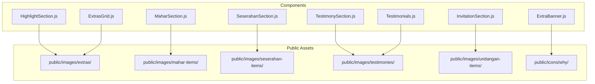

**Diagram sources**
- [components/features/landing/MaharSection.js:1-55](file://components/features/landing/MaharSection.js#L1-L55)
- [components/features/landing/SeserahanSection.js:1-45](file://components/features/landing/SeserahanSection.js#L1-L45)
- [components/features/landing/TestimonySection.js:1-184](file://components/features/landing/TestimonySection.js#L1-L184)
- [components/features/landing/InvitationSection.js:1-82](file://components/features/landing/InvitationSection.js#L1-L82)
- [components/features/landing/HighlightSection.js:1-81](file://components/features/landing/HighlightSection.js#L1-L81)
- [components/features/home/ExtrasGrid.js:1-38](file://components/features/home/ExtrasGrid.js#L1-L38)
- [components/features/home/Testimonials.js:1-40](file://components/features/home/Testimonials.js#L1-L40)
- [components/features/landing/ExtraBanner.js:1-30](file://components/features/landing/ExtraBanner.js#L1-L30)

**Section sources**
- [components/features/landing/MaharSection.js:1-55](file://components/features/landing/MaharSection.js#L1-L55)
- [components/features/landing/SeserahanSection.js:1-45](file://components/features/landing/SeserahanSection.js#L1-L45)
- [components/features/landing/TestimonySection.js:1-184](file://components/features/landing/TestimonySection.js#L1-L184)
- [components/features/landing/InvitationSection.js:1-82](file://components/features/landing/InvitationSection.js#L1-L82)
- [components/features/landing/HighlightSection.js:1-81](file://components/features/landing/HighlightSection.js#L1-L81)
- [components/features/home/ExtrasGrid.js:1-38](file://components/features/home/ExtrasGrid.js#L1-L38)
- [components/features/home/Testimonials.js:1-40](file://components/features/home/Testimonials.js#L1-L40)
- [components/features/landing/ExtraBanner.js:1-30](file://components/features/landing/ExtraBanner.js#L1-L30)

## Core Components
This section summarizes how images are used across key components and how Next.js Image is leveraged for optimization.

- Next.js Image configuration enables remote image optimization for specific domains and enables React Compiler for improved runtime performance.
- Components consistently use the Next.js Image component with fill and object-cover/object-contain classes to maintain aspect ratios and optimize rendering.
- Assets are referenced via absolute paths under public/images and public/icons, ensuring compatibility with Next.js Image and avoiding unnecessary bundling overhead.

Key observations:
- Remote image optimization is configured for a specific domain pattern.
- Local assets are served from public/ and referenced directly.
- Components implement responsive layouts with aspect ratios and container-based sizing.

**Section sources**
- [next.config.mjs:1-16](file://next.config.mjs#L1-L16)
- [package.json:1-25](file://package.json#L1-L25)
- [components/features/landing/MaharSection.js:1-55](file://components/features/landing/MaharSection.js#L1-L55)
- [components/features/landing/SeserahanSection.js:1-45](file://components/features/landing/SeserahanSection.js#L1-L45)
- [components/features/landing/TestimonySection.js:1-184](file://components/features/landing/TestimonySection.js#L1-L184)
- [components/features/landing/InvitationSection.js:1-82](file://components/features/landing/InvitationSection.js#L1-L82)
- [components/features/landing/HighlightSection.js:1-81](file://components/features/landing/HighlightSection.js#L1-L81)
- [components/features/home/ExtrasGrid.js:1-38](file://components/features/home/ExtrasGrid.js#L1-L38)
- [components/features/home/Testimonials.js:1-40](file://components/features/home/Testimonials.js#L1-L40)
- [components/features/landing/ExtraBanner.js:1-30](file://components/features/landing/ExtraBanner.js#L1-L30)

## Architecture Overview
The image pipeline follows a predictable flow: components request images via Next.js Image, which resolves local assets from public/ and applies optimization. Remote images are allowed via configured patterns. The build process prepares optimized assets for production.

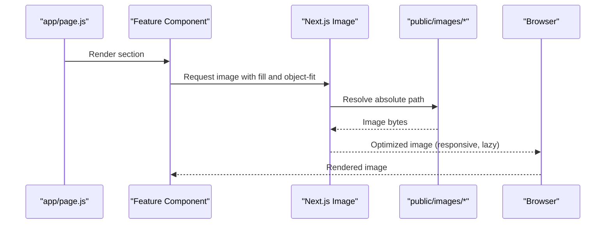

**Diagram sources**
- [app/page.js:1-42](file://app/page.js#L1-L42)
- [components/features/landing/MaharSection.js:1-55](file://components/features/landing/MaharSection.js#L1-L55)
- [components/features/landing/SeserahanSection.js:1-45](file://components/features/landing/SeserahanSection.js#L1-L45)
- [components/features/landing/TestimonySection.js:1-184](file://components/features/landing/TestimonySection.js#L1-L184)
- [components/features/landing/InvitationSection.js:1-82](file://components/features/landing/InvitationSection.js#L1-L82)
- [components/features/landing/HighlightSection.js:1-81](file://components/features/landing/HighlightSection.js#L1-L81)
- [components/features/home/ExtrasGrid.js:1-38](file://components/features/home/ExtrasGrid.js#L1-L38)
- [components/features/home/Testimonials.js:1-40](file://components/features/home/Testimonials.js#L1-L40)
- [components/features/landing/ExtraBanner.js:1-30](file://components/features/landing/ExtraBanner.js#L1-L30)
- [next.config.mjs:1-16](file://next.config.mjs#L1-L16)

## Detailed Component Analysis

### Next.js Image Configuration
- Remote image optimization is enabled for a specific HTTPS hostname pattern.
- React Compiler is enabled to improve runtime performance.

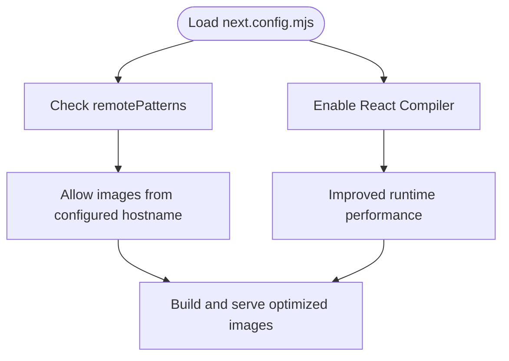

**Diagram sources**
- [next.config.mjs:1-16](file://next.config.mjs#L1-L16)

**Section sources**
- [next.config.mjs:1-16](file://next.config.mjs#L1-L16)
- [package.json:1-25](file://package.json#L1-L25)

### MaharSection: Framed Mahr Showcase
- Uses multiple small images arranged in a collage layout.
- Each image uses fill with object-cover to preserve aspect ratio and avoid layout shifts.
- Container sizes are explicit to ensure proper aspect ratios and responsiveness.

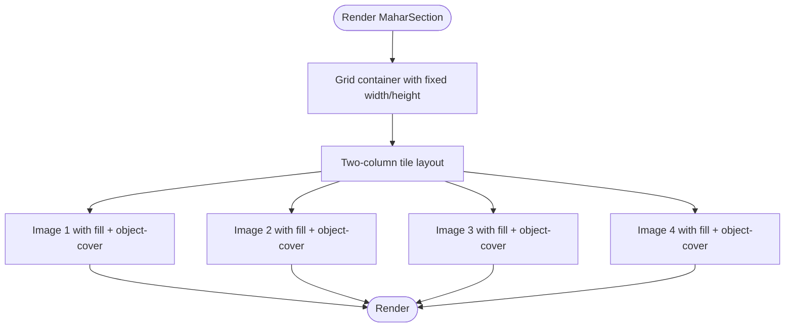

**Diagram sources**
- [components/features/landing/MaharSection.js:1-55](file://components/features/landing/MaharSection.js#L1-L55)

**Section sources**
- [components/features/landing/MaharSection.js:1-55](file://components/features/landing/MaharSection.js#L1-L55)

### SeserahanSection: Animated Gallery
- Implements horizontal marquee using repeated image blocks.
- Each gallery item uses fill with object-cover and rounded corners.
- Animation is applied at the parent level to achieve continuous scrolling.

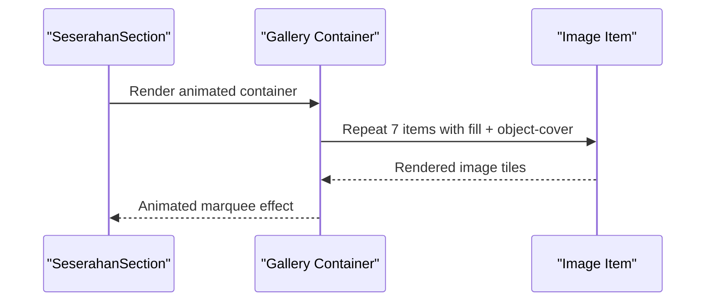

**Diagram sources**
- [components/features/landing/SeserahanSection.js:1-45](file://components/features/landing/SeserahanSection.js#L1-L45)

**Section sources**
- [components/features/landing/SeserahanSection.js:1-45](file://components/features/landing/SeserahanSection.js#L1-L45)

### TestimonySection: Testimonial Cards and Icons
- Testimonial avatars and stat icons are rendered using Next.js Image with fill and object-contain to preserve icon clarity.
- Quote mark and decorative background images use fill with object-cover and object-top alignment.

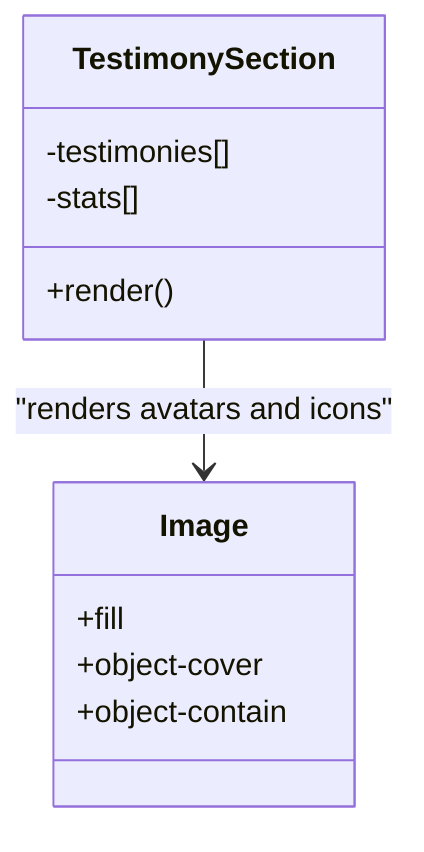

**Diagram sources**
- [components/features/landing/TestimonySection.js:1-184](file://components/features/landing/TestimonySection.js#L1-L184)

**Section sources**
- [components/features/landing/TestimonySection.js:1-184](file://components/features/landing/TestimonySection.js#L1-L184)

### InvitationSection: Digital Invitations
- Two vertical marquees display invitation samples moving in opposite directions.
- Each sample uses fill with object-cover and rounded borders for a polished look.

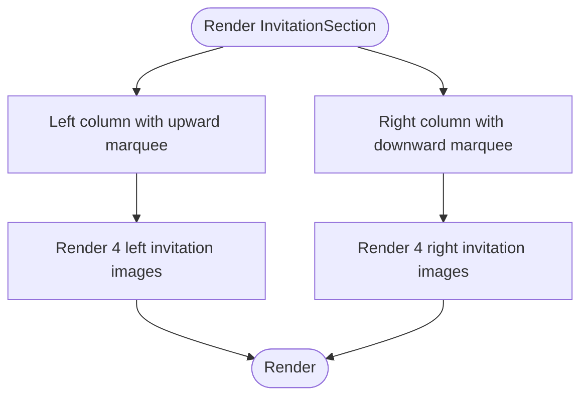

**Diagram sources**
- [components/features/landing/InvitationSection.js:1-82](file://components/features/landing/InvitationSection.js#L1-L82)

**Section sources**
- [components/features/landing/InvitationSection.js:1-82](file://components/features/landing/InvitationSection.js#L1-L82)

### HighlightSection: Extra Services
- Grid of extra services with aspect-ratio containers and fill images for consistent layouts.
- Titles and descriptions complement imagery to communicate service benefits.

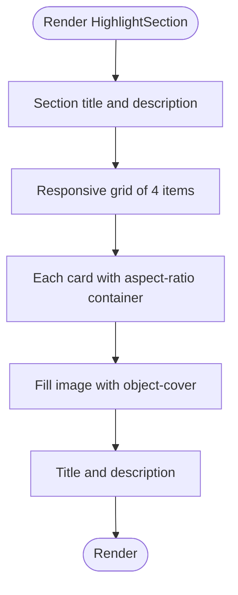

**Diagram sources**
- [components/features/landing/HighlightSection.js:1-81](file://components/features/landing/HighlightSection.js#L1-L81)

**Section sources**
- [components/features/landing/HighlightSection.js:1-81](file://components/features/landing/HighlightSection.js#L1-L81)

### ExtrasGrid and Testimonials: Additional Image Usage
- ExtrasGrid uses inline emoji icons for service categories.
- Testimonials showcases statistics and social proof with minimal image usage.

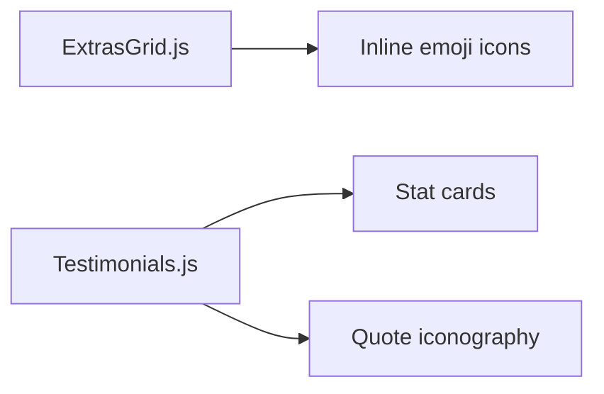

**Diagram sources**
- [components/features/home/ExtrasGrid.js:1-38](file://components/features/home/ExtrasGrid.js#L1-L38)
- [components/features/home/Testimonials.js:1-40](file://components/features/home/Testimonials.js#L1-L40)

**Section sources**
- [components/features/home/ExtrasGrid.js:1-38](file://components/features/home/ExtrasGrid.js#L1-L38)
- [components/features/home/Testimonials.js:1-40](file://components/features/home/Testimonials.js#L1-L40)

### ExtraBanner: Minimal Image Usage
- Uses gradient backgrounds and interactive buttons; no image rendering in this component.

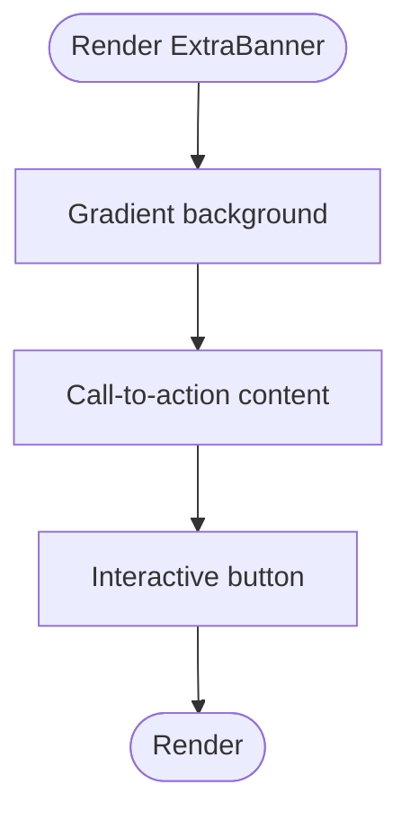

**Diagram sources**
- [components/features/landing/ExtraBanner.js:1-30](file://components/features/landing/ExtraBanner.js#L1-L30)

**Section sources**
- [components/features/landing/ExtraBanner.js:1-30](file://components/features/landing/ExtraBanner.js#L1-L30)

## Dependency Analysis
The following diagram maps how components depend on public assets and Next.js Image for rendering.

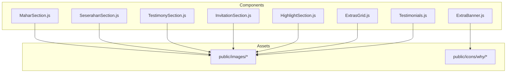

**Diagram sources**
- [components/features/landing/MaharSection.js:1-55](file://components/features/landing/MaharSection.js#L1-L55)
- [components/features/landing/SeserahanSection.js:1-45](file://components/features/landing/SeserahanSection.js#L1-L45)
- [components/features/landing/TestimonySection.js:1-184](file://components/features/landing/TestimonySection.js#L1-L184)
- [components/features/landing/InvitationSection.js:1-82](file://components/features/landing/InvitationSection.js#L1-L82)
- [components/features/landing/HighlightSection.js:1-81](file://components/features/landing/HighlightSection.js#L1-L81)
- [components/features/home/ExtrasGrid.js:1-38](file://components/features/home/ExtrasGrid.js#L1-L38)
- [components/features/home/Testimonials.js:1-40](file://components/features/home/Testimonials.js#L1-L40)
- [components/features/landing/ExtraBanner.js:1-30](file://components/features/landing/ExtraBanner.js#L1-L30)

**Section sources**
- [components/features/landing/MaharSection.js:1-55](file://components/features/landing/MaharSection.js#L1-L55)
- [components/features/landing/SeserahanSection.js:1-45](file://components/features/landing/SeserahanSection.js#L1-L45)
- [components/features/landing/TestimonySection.js:1-184](file://components/features/landing/TestimonySection.js#L1-L184)
- [components/features/landing/InvitationSection.js:1-82](file://components/features/landing/InvitationSection.js#L1-L82)
- [components/features/landing/HighlightSection.js:1-81](file://components/features/landing/HighlightSection.js#L1-L81)
- [components/features/home/ExtrasGrid.js:1-38](file://components/features/home/ExtrasGrid.js#L1-L38)
- [components/features/home/Testimonials.js:1-40](file://components/features/home/Testimonials.js#L1-L40)
- [components/features/landing/ExtraBanner.js:1-30](file://components/features/landing/ExtraBanner.js#L1-L30)

## Performance Considerations
- Next.js Image automatically applies responsive srcset generation and modern formats when deployed with optimized builds.
- Using fill with object-cover/object-contain prevents layout shift and ensures crisp rendering across breakpoints.
- Absolute paths under public/images reduce bundling overhead and enable efficient caching.
- Remote images are permitted for configured domains, enabling external assets while maintaining optimization controls.
- Maintain aspect-ratio containers to minimize reflows and improve CLS (Cumulative Layout Shift).
- Prefer modern formats (e.g., AVIF/WebP) when serving via a CDN that supports them; Next.js Image will select appropriate formats during build.
- Keep image sizes aligned with display dimensions to avoid unnecessary decoding work.
- Lazy loading is implicit with Next.js Image; ensure images are not forced to load eagerly unless required.

[No sources needed since this section provides general guidance]

## Troubleshooting Guide
Common issues and resolutions:
- Images not appearing:
  - Verify asset paths match the public directory structure and filenames.
  - Confirm Next.js Image is imported from next/image and fill is used with a parent container that defines dimensions.
- Blurry or pixelated images:
  - Ensure the source images are appropriately sized for their display dimensions.
  - Use object-cover for content images and object-contain for icons/logos.
- Layout shifts:
  - Wrap images in containers with explicit aspect ratios or fixed dimensions.
  - Avoid changing sizes after initial render.
- Remote image errors:
  - Confirm the remote hostname matches the configured pattern in next.config.mjs.
- Build-time warnings:
  - Review console logs for missing assets or invalid paths; fix references accordingly.

**Section sources**
- [next.config.mjs:1-16](file://next.config.mjs#L1-L16)
- [components/features/landing/MaharSection.js:1-55](file://components/features/landing/MaharSection.js#L1-L55)
- [components/features/landing/SeserahanSection.js:1-45](file://components/features/landing/SeserahanSection.js#L1-L45)
- [components/features/landing/TestimonySection.js:1-184](file://components/features/landing/TestimonySection.js#L1-L184)
- [components/features/landing/InvitationSection.js:1-82](file://components/features/landing/InvitationSection.js#L1-L82)
- [components/features/landing/HighlightSection.js:1-81](file://components/features/landing/HighlightSection.js#L1-L81)

## Conclusion
The Momento Client Frontend leverages Next.js Image effectively to optimize and render images across multiple service showcases. By organizing assets under public/images and public/icons, using fill with appropriate object-fit classes, and aligning container dimensions with intended display sizes, the application achieves responsive, performant, and visually consistent imagery. The Next.js configuration supports remote image optimization and React Compiler for runtime improvements. Following the best practices outlined here will help maintain a scalable and efficient asset pipeline as the media library grows.

[No sources needed since this section summarizes without analyzing specific files]

## Appendices

### Asset Directory Reference
- public/images/extras/: promotional and extra product visuals
- public/images/mahar-items/: framed mahr item images
- public/images/seserahan-items/: rental seserahan visuals
- public/images/testimonies/: client testimonials and related assets
- public/images/undangan-items/: digital invitation visuals grouped into left and right sides
- public/icons/why/: icon assets used in UI

**Section sources**
- [components/features/landing/MaharSection.js:1-55](file://components/features/landing/MaharSection.js#L1-L55)
- [components/features/landing/SeserahanSection.js:1-45](file://components/features/landing/SeserahanSection.js#L1-L45)
- [components/features/landing/TestimonySection.js:1-184](file://components/features/landing/TestimonySection.js#L1-L184)
- [components/features/landing/InvitationSection.js:1-82](file://components/features/landing/InvitationSection.js#L1-L82)
- [components/features/landing/HighlightSection.js:1-81](file://components/features/landing/HighlightSection.js#L1-L81)
- [components/features/home/ExtrasGrid.js:1-38](file://components/features/home/ExtrasGrid.js#L1-L38)
- [components/features/home/Testimonials.js:1-40](file://components/features/home/Testimonials.js#L1-L40)
- [components/features/landing/ExtraBanner.js:1-30](file://components/features/landing/ExtraBanner.js#L1-L30)