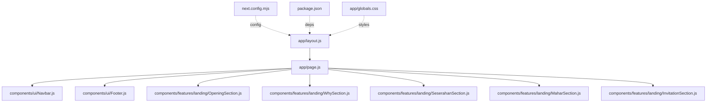
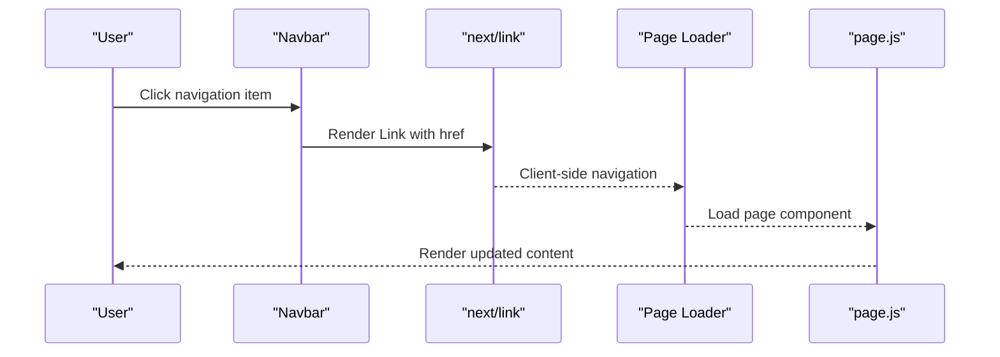
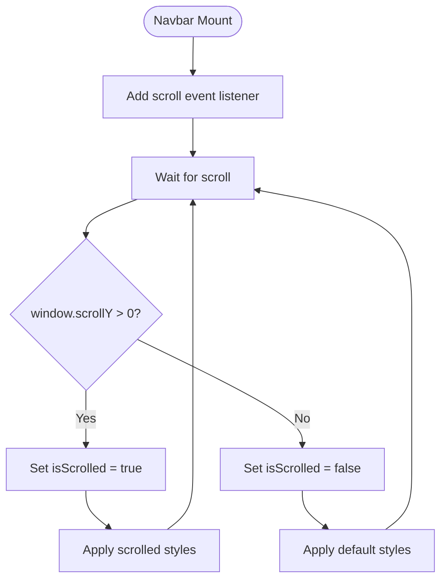
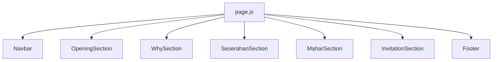
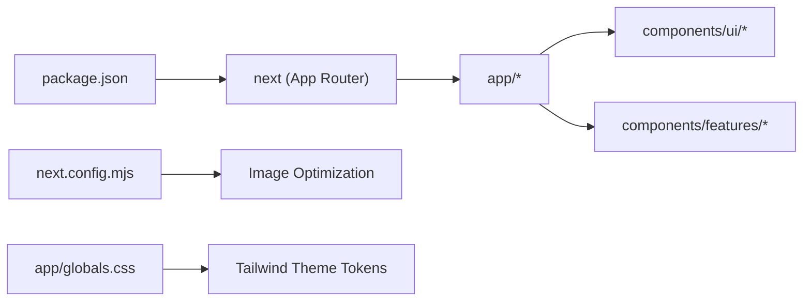

# Navigation & Routing

<cite>
**Referenced Files in This Document**
- [app/layout.js](file://app/layout.js)
- [app/page.js](file://app/page.js)
- [components/ui/Navbar.js](file://components/ui/Navbar.js)
- [components/ui/Footer.js](file://components/ui/Footer.js)
- [components/features/landing/OpeningSection.js](file://components/features/landing/OpeningSection.js)
- [components/features/landing/WhySection.js](file://components/features/landing/WhySection.js)
- [components/features/landing/SeserahanSection.js](file://components/features/landing/SeserahanSection.js)
- [components/features/landing/MaharSection.js](file://components/features/landing/MaharSection.js)
- [components/features/landing/InvitationSection.js](file://components/features/landing/InvitationSection.js)
- [next.config.mjs](file://next.config.mjs)
- [package.json](file://package.json)
- [app/globals.css](file://app/globals.css)
</cite>

## Table of Contents
1. [Introduction](#introduction)
2. [Project Structure](#project-structure)
3. [Core Components](#core-components)
4. [Architecture Overview](#architecture-overview)
5. [Detailed Component Analysis](#detailed-component-analysis)
6. [Dependency Analysis](#dependency-analysis)
7. [Performance Considerations](#performance-considerations)
8. [Troubleshooting Guide](#troubleshooting-guide)
9. [Conclusion](#conclusion)
10. [Appendices](#appendices)

## Introduction
This document explains the Next.js App Router-based navigation and routing implementation for the project. It focuses on the root layout configuration, page composition, and the navigation bar’s scroll-aware behavior. It also documents the navigation data structure, active state management, responsive behavior, and how to extend routes and customize navigation. Finally, it covers performance and SEO considerations for the current routing strategy.

## Project Structure
The application follows the Next.js App Router convention:
- app/layout.js defines the root HTML and body wrappers, fonts, and global metadata.
- app/page.js renders the homepage and composes the page sections and components.
- components/ui/Navbar.js implements the navigation bar with scroll-aware styling and internal/external links.
- components/ui/Footer.js provides secondary navigation and informational links.
- next.config.mjs configures image remote patterns and React compiler.
- package.json lists Next.js and related dependencies.
- app/globals.css centralizes Tailwind theme tokens and shared styles.

**Diagram sources**
- [app/layout.js](file://app/layout.js)
- [app/page.js](file://app/page.js)
- [components/ui/Navbar.js](file://components/ui/Navbar.js)
- [components/ui/Footer.js](file://components/ui/Footer.js)
- [components/features/landing/OpeningSection.js](file://components/features/landing/OpeningSection.js)
- [components/features/landing/WhySection.js](file://components/features/landing/WhySection.js)
- [components/features/landing/SeserahanSection.js](file://components/features/landing/SeserahanSection.js)
- [components/features/landing/MaharSection.js](file://components/features/landing/MaharSection.js)
- [components/features/landing/InvitationSection.js](file://components/features/landing/InvitationSection.js)
- [next.config.mjs](file://next.config.mjs)
- [package.json](file://package.json)
- [app/globals.css](file://app/globals.css)

**Section sources**
- [app/layout.js](file://app/layout.js)
- [app/page.js](file://app/page.js)
- [next.config.mjs](file://next.config.mjs)
- [package.json](file://package.json)
- [app/globals.css](file://app/globals.css)

## Core Components
- Root Layout: Provides HTML lang, global fonts, metadata, and wraps children in a flex-column body with dark theme classes.
- Home Page: Composes the navbar and multiple landing sections, rendering the main content hierarchy.
- Navigation Bar: Implements scroll-aware styling, a fixed position, and a navigation data structure for internal and anchor links.
- Footer: Provides complementary navigation and corporate links.

Key routing and navigation characteristics:
- The homepage is served at the root route.
- Internal navigation uses next/link for client-side transitions.
- Anchor navigation targets specific sections within the homepage.
- External navigation targets external pages (e.g., pricing estimation page).

**Section sources**
- [app/layout.js](file://app/layout.js)
- [app/page.js](file://app/page.js)
- [components/ui/Navbar.js](file://components/ui/Navbar.js)
- [components/ui/Footer.js](file://components/ui/Footer.js)

## Architecture Overview
The routing and navigation architecture centers on:
- Root layout for global metadata and fonts.
- Single-page application behavior via next/navigation hooks and next/link.
- Scroll-aware navbar using usePathname and scroll event listeners.
- Composition of page sections within the home page.

**Diagram sources**
- [components/ui/Navbar.js](file://components/ui/Navbar.js)
- [app/page.js](file://app/page.js)

## Detailed Component Analysis

### Root Layout (app/layout.js)
Responsibilities:
- Defines metadata (title and description).
- Loads Google Fonts and applies CSS variables to html/body.
- Wraps children in a flex-column dark-themed layout.

Behavioral notes:
- Uses next/font/google for Inter, Cinzel, and Montserrat.
- Applies Tailwind-based font variables and dark theme classes.

**Section sources**
- [app/layout.js](file://app/layout.js)

### Home Page (app/page.js)
Responsibilities:
- Renders the navbar and a series of landing sections.
- Serves as the single-page application entry for the root route.

Composition highlights:
- Navbar is rendered at the top of the page.
- Landing sections are stacked vertically to form the main content.

**Section sources**
- [app/page.js](file://app/page.js)

### Navigation Bar (components/ui/Navbar.js)
Responsibilities:
- Maintains a navigation data structure for menu items.
- Implements scroll-aware navbar styling via a scroll event listener.
- Uses next/navigation for pathname awareness and next/link for navigation.
- Includes a mobile toggle and an external action button.

Navigation data structure:
- navLinks array defines menu entries with name and href pairs.
- The first item is treated as the active route for visual emphasis.

Active state management:
- Active state is determined by comparing the link name to the “Home” value.
- An underline indicator is shown conditionally for the active item.

Scroll-aware behavior:
- On scroll events, the navbar toggles a scrolled class to adjust background, blur, and border styling.

Responsive behavior:
- Desktop menu is hidden on small screens; a mobile toggle icon is shown.

External navigation:
- One action link navigates to an external page (/estimasi).

Anchor navigation:
- Several links use hash anchors (#seserahan, #mahar, #undangan, #extras, #harga) to jump to sections within the same page.

**Diagram sources**
- [components/ui/Navbar.js](file://components/ui/Navbar.js)

**Section sources**
- [components/ui/Navbar.js](file://components/ui/Navbar.js)

### Footer (components/ui/Footer.js)
Responsibilities:
- Provides supplementary navigation links (Services, Company, Contact).
- Displays copyright and legal links.

Usage:
- Uses next/link for internal navigation.

**Section sources**
- [components/ui/Footer.js](file://components/ui/Footer.js)

### Landing Sections (features)
These components contribute to the single-page composition and are navigated via anchor links from the navbar:
- OpeningSection: Hero and animated headline.
- WhySection: Feature cards highlighting service benefits.
- SeserahanSection: Describes rental service with image marquee.
- MaharSection: Describes frame mahr service with image collage.
- InvitationSection: Describes digital invitations with vertical marquees.

**Diagram sources**
- [app/page.js](file://app/page.js)
- [components/ui/Navbar.js](file://components/ui/Navbar.js)
- [components/features/landing/OpeningSection.js](file://components/features/landing/OpeningSection.js)
- [components/features/landing/WhySection.js](file://components/features/landing/WhySection.js)
- [components/features/landing/SeserahanSection.js](file://components/features/landing/SeserahanSection.js)
- [components/features/landing/MaharSection.js](file://components/features/landing/MaharSection.js)
- [components/features/landing/InvitationSection.js](file://components/features/landing/InvitationSection.js)
- [components/ui/Footer.js](file://components/ui/Footer.js)

**Section sources**
- [components/features/landing/OpeningSection.js](file://components/features/landing/OpeningSection.js)
- [components/features/landing/WhySection.js](file://components/features/landing/WhySection.js)
- [components/features/landing/SeserahanSection.js](file://components/features/landing/SeserahanSection.js)
- [components/features/landing/MaharSection.js](file://components/features/landing/MaharSection.js)
- [components/features/landing/InvitationSection.js](file://components/features/landing/InvitationSection.js)

## Dependency Analysis
- Next.js runtime and App Router: Managed via package.json dependencies.
- Image optimization: Configured via next.config.mjs with remotePatterns for images.unsplash.com.
- Global styles: Tailwind-based theme tokens and utilities defined in app/globals.css.

**Diagram sources**
- [package.json](file://package.json)
- [next.config.mjs](file://next.config.mjs)
- [app/globals.css](file://app/globals.css)
- [app/layout.js](file://app/layout.js)
- [app/page.js](file://app/page.js)

**Section sources**
- [package.json](file://package.json)
- [next.config.mjs](file://next.config.mjs)
- [app/globals.css](file://app/globals.css)

## Performance Considerations
- Client-side navigation: next/link enables fast client-side transitions without full page reloads, reducing server requests and improving perceived performance.
- Font loading: Preloading Inter, Cinzel, and Montserrat via next/font/google reduces layout shift and improves Core Web Vitals.
- Image optimization: next/image with configured remotePatterns ensures efficient image delivery and lazy loading.
- Scroll handling: The navbar uses a lightweight scroll event listener; ensure throttling if extended with heavy computations.
- CSS-in-JS via Tailwind: Centralized theme tokens minimize CSS bloat and improve maintainability.

[No sources needed since this section provides general guidance]

## Troubleshooting Guide
Common issues and resolutions:
- Active state not updating: Verify that the active comparison logic matches the intended route. Currently, the active state is tied to the “Home” name; adjust the comparison if additional routes are introduced.
- Anchor links not scrolling to sections: Ensure the target IDs match the section container IDs and that the page height accommodates the fixed navbar.
- Scroll styling not applying: Confirm the scroll threshold and class application logic in the navbar component.
- External link behavior: When adding new external routes, ensure they are defined in the routing layer and that next/link is used consistently.

**Section sources**
- [components/ui/Navbar.js](file://components/ui/Navbar.js)
- [app/page.js](file://app/page.js)

## Conclusion
The project implements a clean, scroll-aware navigation experience atop Next.js App Router. The root layout sets up fonts and metadata, while the home page composes the UI and landing sections. The navbar uses a simple data structure and pathname awareness to manage active states and supports both internal and external navigation. Anchor links enable smooth single-page navigation to key sections. Extending the routing model involves adding new routes and updating the navbar data structure accordingly.

[No sources needed since this section summarizes without analyzing specific files]

## Appendices

### Adding New Routes
Steps to add a new route:
- Create a new page under app/<route>/page.js.
- Update the navigation data structure in the navbar to include the new route.
- Ensure the new route is reachable via next/link from the home page or other pages.

Example reference paths:
- [components/ui/Navbar.js](file://components/ui/Navbar.js)
- [app/page.js](file://app/page.js)

**Section sources**
- [components/ui/Navbar.js](file://components/ui/Navbar.js)
- [app/page.js](file://app/page.js)

### Customizing Navigation Behavior
Customization options:
- Modify the navLinks array to reorder, rename, or remove items.
- Adjust active state logic to support dynamic pathname matching.
- Extend the mobile toggle to open a drawer with the same navLinks.
- Add dropdown menus or nested navigation by extending the navbar JSX.

Example reference paths:
- [components/ui/Navbar.js](file://components/ui/Navbar.js)

**Section sources**
- [components/ui/Navbar.js](file://components/ui/Navbar.js)

### Advanced Routing Patterns
Patterns supported by the current setup:
- Client-side navigation with next/link.
- Hash-based anchor navigation for single-page sections.
- External navigation to dedicated pages (e.g., estimasi).

To implement additional patterns:
- Use dynamic routes by adding [param] segments under app/.
- Use catch-all routes for flexible paths.
- Integrate query parameters for filtering or state passing.

Example reference paths:
- [app/page.js](file://app/page.js)
- [components/ui/Navbar.js](file://components/ui/Navbar.js)

**Section sources**
- [app/page.js](file://app/page.js)
- [components/ui/Navbar.js](file://components/ui/Navbar.js)

### SEO Implications
Current SEO considerations:
- Metadata is defined at the root layout level.
- next/image is used for optimized assets.
- Anchor navigation does not change the browser URL; consider using proper route segments for canonical URLs if deep linking is required.

Recommendations:
- Add structured data for services.
- Use canonical tags and meta descriptions per route.
- Implement proper heading hierarchy and semantic markup.

**Section sources**
- [app/layout.js](file://app/layout.js)
- [app/page.js](file://app/page.js)