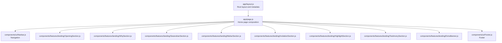
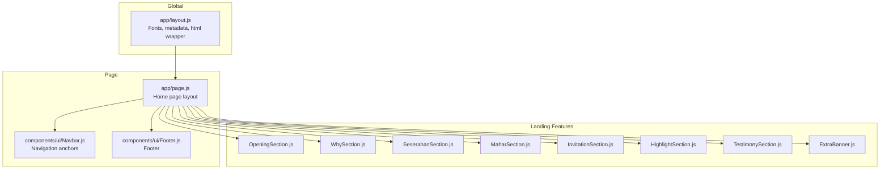
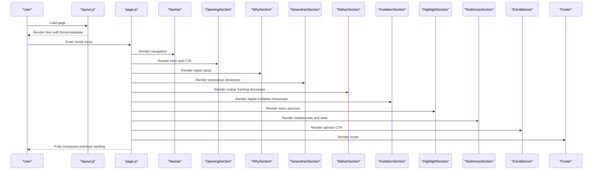
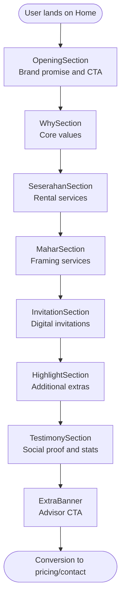
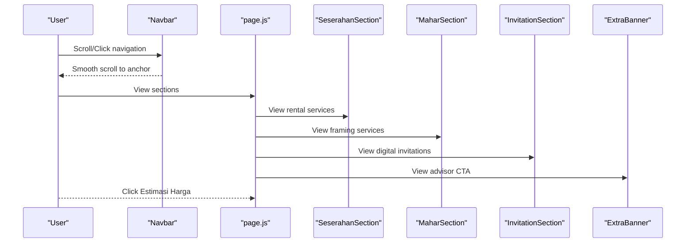
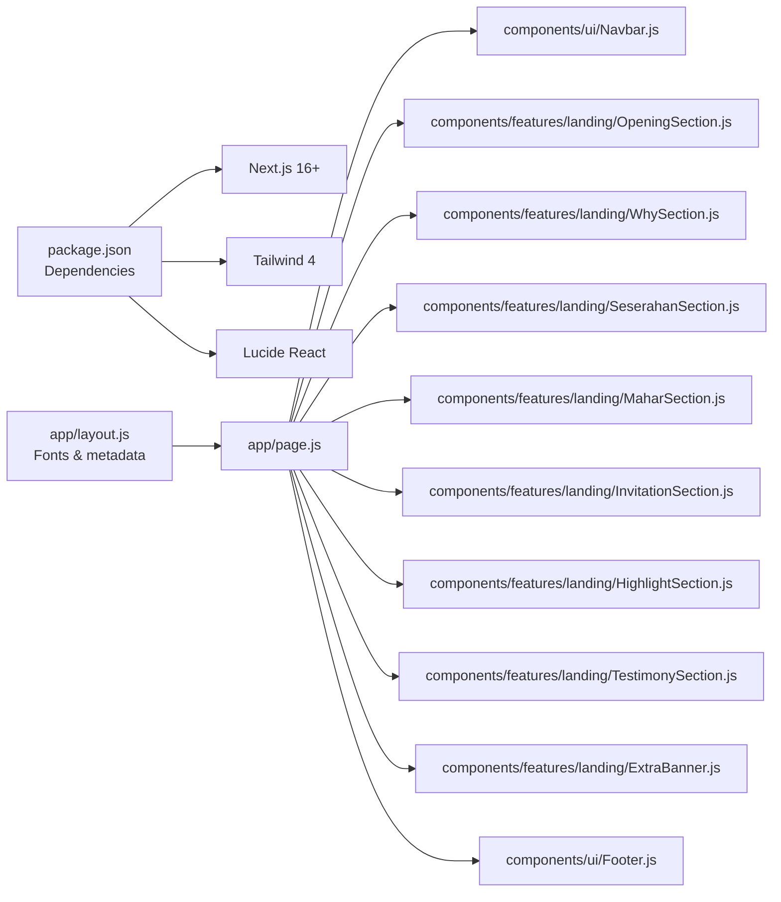

# Project Overview

<cite>
**Referenced Files in This Document**
- [README.md](file://README.md)
- [DOCS_OVERVIEW.md](file://DOCS_OVERVIEW.md)
- [package.json](file://package.json)
- [app/layout.js](file://app/layout.js)
- [app/page.js](file://app/page.js)
- [components/features/landing/OpeningSection.js](file://components/features/landing/OpeningSection.js)
- [components/features/landing/WhySection.js](file://components/features/landing/WhySection.js)
- [components/features/landing/SeserahanSection.js](file://components/features/landing/SeserahanSection.js)
- [components/features/landing/MaharSection.js](file://components/features/landing/MaharSection.js)
- [components/features/landing/InvitationSection.js](file://components/features/landing/InvitationSection.js)
- [components/features/landing/HighlightSection.js](file://components/features/landing/HighlightSection.js)
- [components/features/landing/TestimonySection.js](file://components/features/landing/TestimonySection.js)
- [components/features/landing/ExtraBanner.js](file://components/features/landing/ExtraBanner.js)
- [components/ui/Navbar.js](file://components/ui/Navbar.js)
- [components/ui/Footer.js](file://components/ui/Footer.js)
</cite>

## Table of Contents
1. [Introduction](#introduction)
2. [Project Structure](#project-structure)
3. [Core Components](#core-components)
4. [Architecture Overview](#architecture-overview)
5. [Detailed Component Analysis](#detailed-component-analysis)
6. [Dependency Analysis](#dependency-analysis)
7. [Performance Considerations](#performance-considerations)
8. [Troubleshooting Guide](#troubleshooting-guide)
9. [Conclusion](#conclusion)

## Introduction
Momento Client Frontend is a premium, client-facing web portal designed to showcase Momento’s high-end digital and physical services for special events. Its primary purpose is to serve as a digital ambassador that communicates the brand’s premium positioning, visual excellence, and service capabilities to prospective clients. The site focuses on three pillars of the special event industry: rental seserahan (traditional wedding setup), mahar framing (custom framed gifts), and digital invitations. It also highlights complementary extras such as keepsakes, bouquets, content creation, and master of ceremony services. The frontend emphasizes pixel-perfect fidelity to design, modern typography, smooth micro-interactions, and a cohesive gold-accented aesthetic to reinforce the premium brand identity.

Target audience
- Engaged couples and families planning weddings and related celebrations
- Clients seeking premium, curated experiences for seserahan, mahar, and digital invitations
- Prospects who value authenticity, professionalism, and up-to-date design trends

Business objectives
- Drive awareness and trust through a visually stunning, premium landing page
- Convert visitors into leads via clear CTAs and contact prompts
- Position Momento as the preferred partner for special moments with a consistent, elite brand experience
- Support downstream booking and estimation flows by guiding users to relevant sections and actions

Brand identity and visual aesthetics
- Premium gold accents (#D4AF37 and complementary gradients) symbolize luxury and craftsmanship
- Modern, serif-based typography conveys elegance and sophistication
- Dark theme (black/charcoal backgrounds) elevates visual contrast and premium feel
- Consistent micro-interactions and hover states reinforce quality and attention to detail

Core value proposition
- Authentic, professional, and customizable experiences tailored to each couple’s vision
- Responsive support and seamless delivery across JKT/JADTABEK with logistics partners
- Fresh, contemporary designs that keep special moments feeling current and memorable

How this frontend serves as a digital ambassador
- The homepage hero and feature sections present the full service portfolio with immersive visuals
- Testimonials and statistics reinforce trust and social proof
- Navigation anchors and CTAs guide users toward pricing and contact to continue the journey
- The footer reinforces brand messaging and provides essential navigation and legal links

## Project Structure
The project follows a Next.js 16+ App Router structure with a clear separation between UI primitives, feature components, and page-level composition. The root layout defines global fonts and metadata, while the home page composes a series of landing feature sections to form a complete premium narrative.

**Diagram sources**
- [app/layout.js:1-35](file://app/layout.js#L1-L35)
- [app/page.js:1-42](file://app/page.js#L1-L42)
- [components/ui/Navbar.js:1-86](file://components/ui/Navbar.js#L1-L86)
- [components/features/landing/OpeningSection.js:1-100](file://components/features/landing/OpeningSection.js#L1-L100)
- [components/features/landing/WhySection.js:1-53](file://components/features/landing/WhySection.js#L1-L53)
- [components/features/landing/SeserahanSection.js:1-45](file://components/features/landing/SeserahanSection.js#L1-L45)
- [components/features/landing/MaharSection.js:1-55](file://components/features/landing/MaharSection.js#L1-L55)
- [components/features/landing/InvitationSection.js:1-82](file://components/features/landing/InvitationSection.js#L1-L82)
- [components/features/landing/HighlightSection.js:1-81](file://components/features/landing/HighlightSection.js#L1-L81)
- [components/features/landing/TestimonySection.js:1-184](file://components/features/landing/TestimonySection.js#L1-L184)
- [components/features/landing/ExtraBanner.js:1-30](file://components/features/landing/ExtraBanner.js#L1-L30)
- [components/ui/Footer.js:1-51](file://components/ui/Footer.js#L1-L51)

**Section sources**
- [README.md:1-37](file://README.md#L1-L37)
- [DOCS_OVERVIEW.md:1-38](file://DOCS_OVERVIEW.md#L1-L38)
- [package.json:1-25](file://package.json#L1-L25)
- [app/layout.js:1-35](file://app/layout.js#L1-L35)
- [app/page.js:1-42](file://app/page.js#L1-L42)

## Core Components
This section outlines the premium landing page components and their roles in communicating the brand and services.

- OpeningSection: Hero presentation with animated typographic storytelling and integrated CTA, establishing the “Everything For Your Special Moments” promise.
- WhySection: Value-driven feature cards emphasizing authenticity, professionalism, customization, responsiveness, and freshness.
- SeserahanSection: Focus on rental services for engagement and wedding setups, location coverage, and logistics partnerships.
- MaharSection: Premium framing services with imagery collage, customization options, and delivery logistics.
- InvitationSection: Digital invitation showcase with responsive design features and curated imagery presentation.
- HighlightSection: Additional premium extras (keepsakes, bouquets, content creator, MC) with elevated visuals and hover animations.
- TestimonySection: Social proof through testimonials and key metrics, reinforcing trust and volume of successful events.
- ExtraBanner: Conversational prompt to connect with advisors for theme guidance and product selection.
- Navbar and Footer: Navigation anchors to key sections, pricing estimation, and consistent brand messaging.

These components collectively position Momento as a high-end digital and physical services provider for special events, with a strong emphasis on premium aesthetics, customization, and reliability.

**Section sources**
- [components/features/landing/OpeningSection.js:1-100](file://components/features/landing/OpeningSection.js#L1-L100)
- [components/features/landing/WhySection.js:1-53](file://components/features/landing/WhySection.js#L1-L53)
- [components/features/landing/SeserahanSection.js:1-45](file://components/features/landing/SeserahanSection.js#L1-L45)
- [components/features/landing/MaharSection.js:1-55](file://components/features/landing/MaharSection.js#L1-L55)
- [components/features/landing/InvitationSection.js:1-82](file://components/features/landing/InvitationSection.js#L1-L82)
- [components/features/landing/HighlightSection.js:1-81](file://components/features/landing/HighlightSection.js#L1-L81)
- [components/features/landing/TestimonySection.js:1-184](file://components/features/landing/TestimonySection.js#L1-L184)
- [components/features/landing/ExtraBanner.js:1-30](file://components/features/landing/ExtraBanner.js#L1-L30)
- [components/ui/Navbar.js:1-86](file://components/ui/Navbar.js#L1-L86)
- [components/ui/Footer.js:1-51](file://components/ui/Footer.js#L1-L51)

## Architecture Overview
The frontend architecture centers around a single-page application built with Next.js App Router. The root layout configures fonts and metadata globally, while the home page composes multiple landing feature sections. Navigation anchors enable smooth scrolling to relevant sections, and the footer provides consistent brand presence and navigation.

**Diagram sources**
- [app/layout.js:1-35](file://app/layout.js#L1-L35)
- [app/page.js:1-42](file://app/page.js#L1-L42)
- [components/ui/Navbar.js:1-86](file://components/ui/Navbar.js#L1-L86)
- [components/ui/Footer.js:1-51](file://components/ui/Footer.js#L1-L51)
- [components/features/landing/OpeningSection.js:1-100](file://components/features/landing/OpeningSection.js#L1-L100)
- [components/features/landing/WhySection.js:1-53](file://components/features/landing/WhySection.js#L1-L53)
- [components/features/landing/SeserahanSection.js:1-45](file://components/features/landing/SeserahanSection.js#L1-L45)
- [components/features/landing/MaharSection.js:1-55](file://components/features/landing/MaharSection.js#L1-L55)
- [components/features/landing/InvitationSection.js:1-82](file://components/features/landing/InvitationSection.js#L1-L82)
- [components/features/landing/HighlightSection.js:1-81](file://components/features/landing/HighlightSection.js#L1-L81)
- [components/features/landing/TestimonySection.js:1-184](file://components/features/landing/TestimonySection.js#L1-L184)
- [components/features/landing/ExtraBanner.js:1-30](file://components/features/landing/ExtraBanner.js#L1-L30)

## Detailed Component Analysis

### Premium Landing Page Composition
The home page composes a series of premium-focused sections that tell the Momento story and drive conversion. The hero establishes the brand promise, followed by value propositions, service showcases, and social proof. The page wraps with a conversational CTA and a consistent footer.

**Diagram sources**
- [app/layout.js:1-35](file://app/layout.js#L1-L35)
- [app/page.js:1-42](file://app/page.js#L1-L42)
- [components/ui/Navbar.js:1-86](file://components/ui/Navbar.js#L1-L86)
- [components/features/landing/OpeningSection.js:1-100](file://components/features/landing/OpeningSection.js#L1-L100)
- [components/features/landing/WhySection.js:1-53](file://components/features/landing/WhySection.js#L1-L53)
- [components/features/landing/SeserahanSection.js:1-45](file://components/features/landing/SeserahanSection.js#L1-L45)
- [components/features/landing/MaharSection.js:1-55](file://components/features/landing/MaharSection.js#L1-L55)
- [components/features/landing/InvitationSection.js:1-82](file://components/features/landing/InvitationSection.js#L1-L82)
- [components/features/landing/HighlightSection.js:1-81](file://components/features/landing/HighlightSection.js#L1-L81)
- [components/features/landing/TestimonySection.js:1-184](file://components/features/landing/TestimonySection.js#L1-L184)
- [components/features/landing/ExtraBanner.js:1-30](file://components/features/landing/ExtraBanner.js#L1-L30)
- [components/ui/Footer.js:1-51](file://components/ui/Footer.js#L1-L51)

**Section sources**
- [app/page.js:1-42](file://app/page.js#L1-L42)

### Special Event Services Showcase
The landing features are structured to highlight the three core service categories: seserahan, mahar, and digital invitations, with supporting extras and testimonials.

**Diagram sources**
- [components/features/landing/OpeningSection.js:1-100](file://components/features/landing/OpeningSection.js#L1-L100)
- [components/features/landing/WhySection.js:1-53](file://components/features/landing/WhySection.js#L1-L53)
- [components/features/landing/SeserahanSection.js:1-45](file://components/features/landing/SeserahanSection.js#L1-L45)
- [components/features/landing/MaharSection.js:1-55](file://components/features/landing/MaharSection.js#L1-L55)
- [components/features/landing/InvitationSection.js:1-82](file://components/features/landing/InvitationSection.js#L1-L82)
- [components/features/landing/HighlightSection.js:1-81](file://components/features/landing/HighlightSection.js#L1-L81)
- [components/features/landing/TestimonySection.js:1-184](file://components/features/landing/TestimonySection.js#L1-L184)
- [components/features/landing/ExtraBanner.js:1-30](file://components/features/landing/ExtraBanner.js#L1-L30)

**Section sources**
- [components/features/landing/SeserahanSection.js:1-45](file://components/features/landing/SeserahanSection.js#L1-L45)
- [components/features/landing/MaharSection.js:1-55](file://components/features/landing/MaharSection.js#L1-L55)
- [components/features/landing/InvitationSection.js:1-82](file://components/features/landing/InvitationSection.js#L1-L82)
- [components/features/landing/HighlightSection.js:1-81](file://components/features/landing/HighlightSection.js#L1-L81)
- [components/features/landing/TestimonySection.js:1-184](file://components/features/landing/TestimonySection.js#L1-L184)

### Navigation and Conversion Flow
The navbar anchors users to key sections, while the footer reiterates brand messaging and provides essential links. The page’s composition ensures a smooth journey from discovery to contact.

**Diagram sources**
- [components/ui/Navbar.js:1-86](file://components/ui/Navbar.js#L1-L86)
- [app/page.js:1-42](file://app/page.js#L1-L42)
- [components/features/landing/SeserahanSection.js:1-45](file://components/features/landing/SeserahanSection.js#L1-L45)
- [components/features/landing/MaharSection.js:1-55](file://components/features/landing/MaharSection.js#L1-L55)
- [components/features/landing/InvitationSection.js:1-82](file://components/features/landing/InvitationSection.js#L1-L82)
- [components/features/landing/ExtraBanner.js:1-30](file://components/features/landing/ExtraBanner.js#L1-L30)

**Section sources**
- [components/ui/Navbar.js:1-86](file://components/ui/Navbar.js#L1-L86)
- [components/ui/Footer.js:1-51](file://components/ui/Footer.js#L1-L51)

## Dependency Analysis
The frontend relies on Next.js 16+, Tailwind 4, and Lucide React for icons. Fonts are configured globally via the root layout, and the home page composes feature components and UI primitives. There are no detected circular dependencies; the structure maintains clean separation between layout, page, and feature components.

**Diagram sources**
- [package.json:1-25](file://package.json#L1-L25)
- [app/layout.js:1-35](file://app/layout.js#L1-L35)
- [app/page.js:1-42](file://app/page.js#L1-L42)
- [components/ui/Navbar.js:1-86](file://components/ui/Navbar.js#L1-L86)
- [components/features/landing/OpeningSection.js:1-100](file://components/features/landing/OpeningSection.js#L1-L100)
- [components/features/landing/WhySection.js:1-53](file://components/features/landing/WhySection.js#L1-L53)
- [components/features/landing/SeserahanSection.js:1-45](file://components/features/landing/SeserahanSection.js#L1-L45)
- [components/features/landing/MaharSection.js:1-55](file://components/features/landing/MaharSection.js#L1-L55)
- [components/features/landing/InvitationSection.js:1-82](file://components/features/landing/InvitationSection.js#L1-L82)
- [components/features/landing/HighlightSection.js:1-81](file://components/features/landing/HighlightSection.js#L1-L81)
- [components/features/landing/TestimonySection.js:1-184](file://components/features/landing/TestimonySection.js#L1-L184)
- [components/features/landing/ExtraBanner.js:1-30](file://components/features/landing/ExtraBanner.js#L1-L30)
- [components/ui/Footer.js:1-51](file://components/ui/Footer.js#L1-L51)

**Section sources**
- [package.json:1-25](file://package.json#L1-L25)
- [app/layout.js:1-35](file://app/layout.js#L1-L35)
- [app/page.js:1-42](file://app/page.js#L1-L42)

## Performance Considerations
- Server Components and App Router: The page leverages Next.js App Router to optimize rendering and SEO, aligning with the technical standards for maintainability and performance.
- Typography and Fonts: Global font configuration ensures efficient loading and consistent typography across devices.
- Image Optimization: Uses next/image for optimized assets, supporting the premium visual experience without sacrificing performance.
- Micro-interactions: Hover states and transitions are designed to be lightweight and smooth, preserving responsiveness.
- Maintainability: Clean modular structure and descriptive component naming improve long-term maintainability and team collaboration.

[No sources needed since this section provides general guidance]

## Troubleshooting Guide
Common areas to review when diagnosing issues:
- Layout and fonts: Verify metadata and font variables in the root layout.
- Navigation: Confirm anchor links and scroll behavior in the navbar.
- Hero animation: Inspect the opening section’s typing animation and floating CTA.
- Image assets: Ensure image paths match the public/images structure and are properly sized.
- Footer links: Validate footer navigation and brand messaging alignment.

**Section sources**
- [app/layout.js:1-35](file://app/layout.js#L1-L35)
- [components/ui/Navbar.js:1-86](file://components/ui/Navbar.js#L1-L86)
- [components/features/landing/OpeningSection.js:1-100](file://components/features/landing/OpeningSection.js#L1-L100)
- [components/ui/Footer.js:1-51](file://components/ui/Footer.js#L1-L51)

## Conclusion
Momento Client Frontend is a premium, purpose-built digital ambassador that communicates the brand’s commitment to authentic, professional, and customizable experiences for special events. Through a carefully orchestrated combination of hero storytelling, value-driven sections, service showcases, and social proof, the site positions Momento as the ideal partner for seserahan, mahar, and digital invitations. The technical foundation, visual identity, and user flow work together to deliver a seamless, high-end experience that converts interest into action.