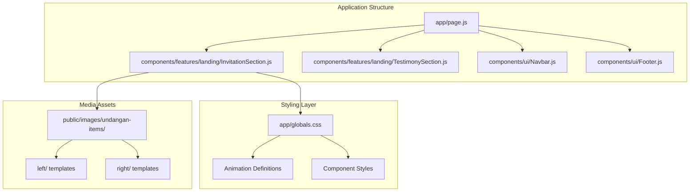
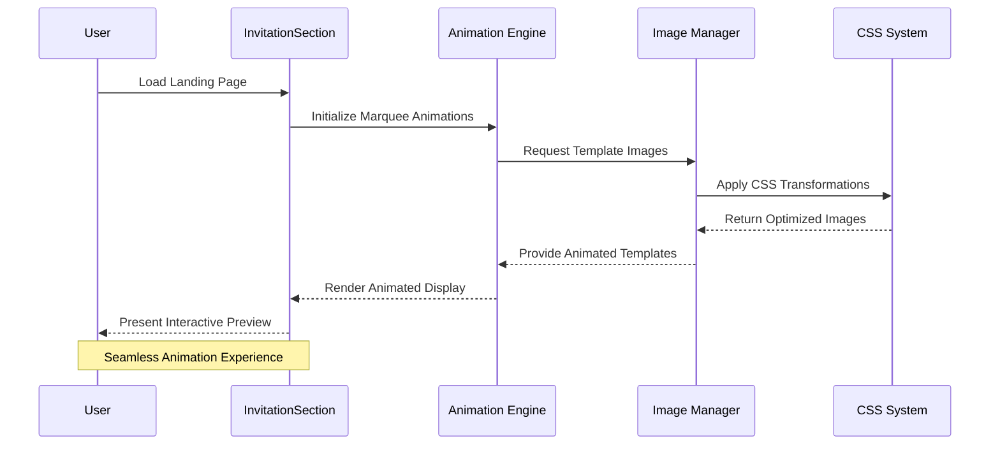
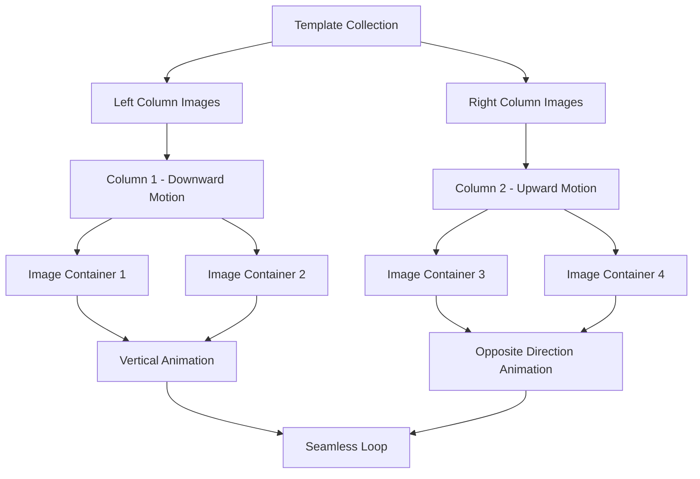
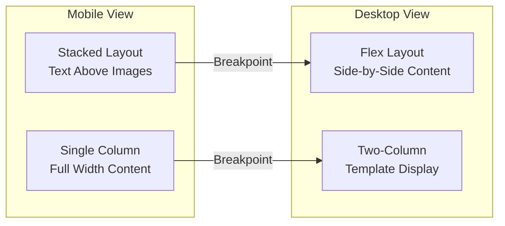
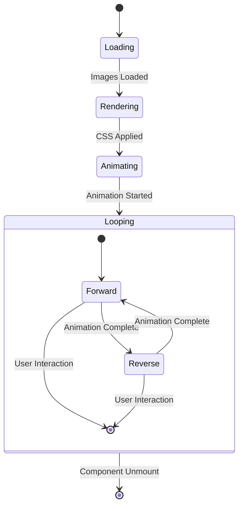
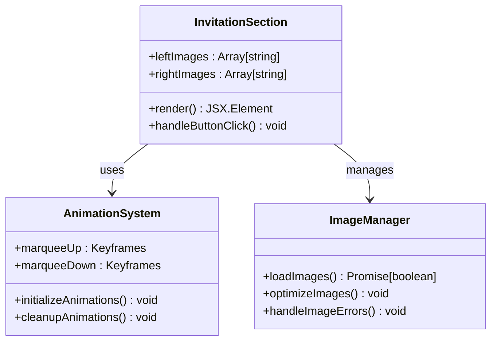
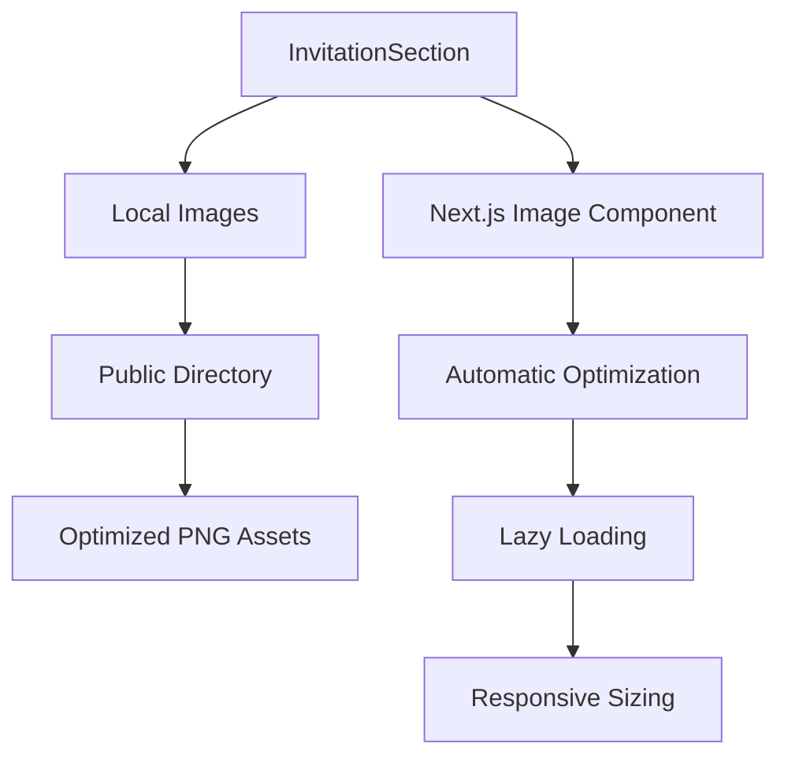
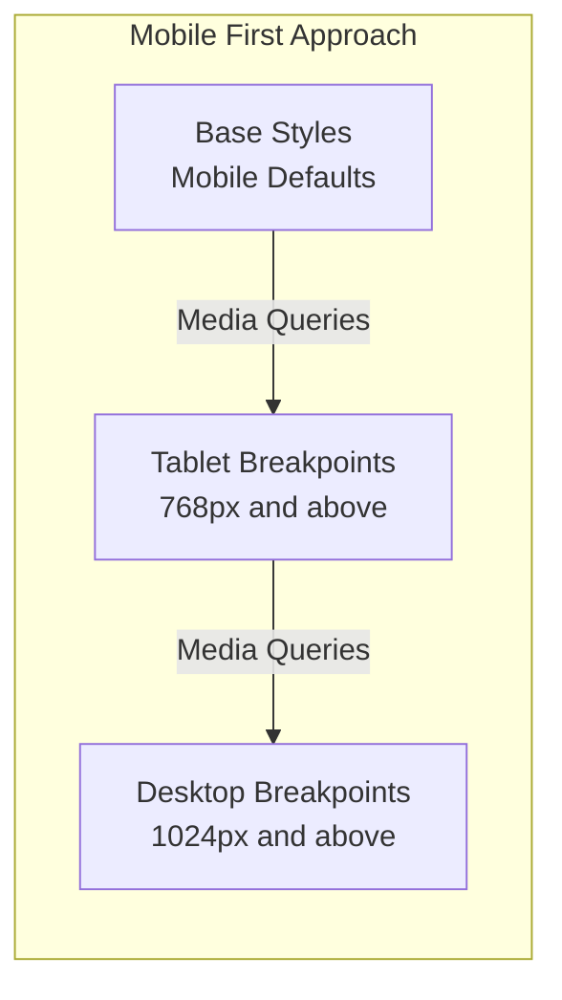

# Digital Invitation Section

<cite>
**Referenced Files in This Document**
- [InvitationSection.js](file://components/features/landing/InvitationSection.js)
- [page.js](file://app/page.js)
- [globals.css](file://app/globals.css)
- [TestimonySection.js](file://components/features/landing/TestimonySection.js)
</cite>

## Table of Contents
1. [Introduction](#introduction)
2. [Project Structure](#project-structure)
3. [Core Components](#core-components)
4. [Architecture Overview](#architecture-overview)
5. [Detailed Component Analysis](#detailed-component-analysis)
6. [Interactive Preview Functionality](#interactive-preview-functionality)
7. [Template Selection Mechanisms](#template-selection-mechanisms)
8. [Customization Options](#customization-options)
9. [User Engagement Features](#user-engagement-features)
10. [State Management](#state-management)
11. [Form Handling](#form-handling)
12. [External Service Integration](#external-service-integration)
13. [Responsive Design Patterns](#responsive-design-patterns)
14. [Performance Considerations](#performance-considerations)
15. [Troubleshooting Guide](#troubleshooting-guide)
16. [Conclusion](#conclusion)

## Introduction

The Digital Invitation Section component serves as a showcase for the company's digital invitation service offerings. This component presents a visually compelling presentation of customizable invitation templates through an animated preview system, highlighting the responsive design capabilities and interactive features available to users.

The component leverages modern web technologies including Next.js Image optimization, CSS animations, and responsive design principles to create an engaging user experience that demonstrates the full potential of the digital invitation platform.

## Project Structure

The Digital Invitation Section is integrated into the main landing page as part of a comprehensive feature showcase. The component follows a modular architecture pattern where individual feature sections are organized within dedicated folders.

**Diagram sources**
- [page.js:14-41](file://app/page.js#L14-L41)
- [InvitationSection.js:6-82](file://components/features/landing/InvitationSection.js#L6-L82)

**Section sources**
- [page.js:14-41](file://app/page.js#L14-L41)
- [InvitationSection.js:6-82](file://components/features/landing/InvitationSection.js#L6-L82)

## Core Components

The Digital Invitation Section consists of several key architectural elements that work together to create a cohesive user experience:

### Component Architecture
- **Template Preview System**: Dual-column animated display showcasing invitation designs
- **Content Presentation**: Feature-rich text content highlighting service capabilities
- **Interactive Elements**: Call-to-action buttons with hover animations
- **Responsive Layout**: Adaptive design for mobile and desktop viewing

### Visual Design Elements
- **Dark Theme Foundation**: Deep charcoal background (#090909) for premium feel
- **Gold Accent Color**: Strategic use of (#D4AF37) for highlights and CTAs
- **Typography Hierarchy**: Serif fonts for headings, sans-serif for body text
- **Glass Morphism Effects**: Subtle borders and shadows for depth perception

**Section sources**
- [InvitationSection.js:21-82](file://components/features/landing/InvitationSection.js#L21-L82)
- [globals.css:31-55](file://app/globals.css#L31-L55)

## Architecture Overview

The Digital Invitation Section employs a hybrid architecture combining static content presentation with dynamic visual elements:

**Diagram sources**
- [InvitationSection.js:48-77](file://components/features/landing/InvitationSection.js#L48-L77)
- [globals.css:88-117](file://app/globals.css#L88-L117)

The architecture ensures smooth performance through optimized image loading and efficient CSS animations, while maintaining responsive behavior across different device sizes.

## Detailed Component Analysis

### Template Preview System

The component implements a sophisticated dual-column animation system that showcases invitation templates in an engaging manner:

**Diagram sources**
- [InvitationSection.js:7-19](file://components/features/landing/InvitationSection.js#L7-L19)
- [InvitationSection.js:48-77](file://components/features/landing/InvitationSection.js#L48-L77)

### Content Presentation Structure

The left-side content area provides comprehensive information about the digital invitation service:

| Element | Purpose | Implementation |
|---------|---------|----------------|
| **Headings** | Service branding and positioning | Large serif typography with gold accents |
| **Feature List** | Core service capabilities | Bullet-pointed feature highlights |
| **Call-to-Action** | Conversion driver | Gold gradient button with hover effects |

**Section sources**
- [InvitationSection.js:25-40](file://components/features/landing/InvitationSection.js#L25-L40)

### Responsive Layout Implementation

The component utilizes a flexible grid system that adapts to different screen sizes:

**Diagram sources**
- [InvitationSection.js:23-24](file://components/features/landing/InvitationSection.js#L23-L24)

**Section sources**
- [InvitationSection.js:23-24](file://components/features/landing/InvitationSection.js#L23-L24)

## Interactive Preview Functionality

The interactive preview system represents the core innovation of the Digital Invitation Section, providing users with a dynamic demonstration of available template options.

### Animation System Architecture

The preview functionality relies on a sophisticated CSS animation framework that creates seamless looping effects:

| Animation Type | Direction | Speed | Duration |
|----------------|-----------|-------|----------|
| **Marquee Down** | Vertical | Smooth | 40 seconds |
| **Marquee Up** | Vertical | Smooth | 40 seconds |
| **Horizontal** | Side-to-Side | Continuous | 40 seconds |

### Template Display Logic

The component manages two distinct animation streams that complement each other:

**Diagram sources**
- [InvitationSection.js:48-77](file://components/features/landing/InvitationSection.js#L48-L77)
- [globals.css:88-117](file://app/globals.css#L88-L117)

**Section sources**
- [InvitationSection.js:48-77](file://components/features/landing/InvitationSection.js#L48-L77)
- [globals.css:88-117](file://app/globals.css#L88-L117)

## Template Selection Mechanisms

While the current implementation focuses on showcasing existing templates, the component architecture supports future expansion for user-driven template selection.

### Current Template Management

The component maintains a static array of template references that are rendered through the animation system:

| Template Group | File Pattern | Count | Display Method |
|----------------|--------------|-------|----------------|
| **Left Templates** | invitation-left-*.png | 4 | Vertical Down Animation |
| **Right Templates** | invitation-right-*.png | 4 | Vertical Up Animation |

### Future Enhancement Opportunities

Potential extensions for dynamic template selection could include:

- **User Interface Controls**: Interactive template browsing interface
- **Filtering System**: Category-based template organization
- **Preview Modal**: Detailed template examination before selection
- **Customization Previews**: Real-time template modification visualization

**Section sources**
- [InvitationSection.js:7-19](file://components/features/landing/InvitationSection.js#L7-L19)

## Customization Options

The component presents several customization capabilities through its visual design and feature presentation:

### Visual Customization Features

| Customization Area | Available Options | Implementation Method |
|--------------------|-------------------|----------------------|
| **Color Schemes** | Gold (#D4AF37) accents | CSS gradient definitions |
| **Typography** | Serif headings, Sans-serif body | Font family declarations |
| **Layout Variations** | Mobile-responsive stacking | Flexbox and media queries |
| **Animation Speed** | Adjustable timing | CSS animation-duration |

### Content Customization Capabilities

The feature content highlights various customization possibilities available to users:

- **Exclusive Guest Name**: Personalized guest identification
- **Dashboard Kelola Tamu**: RSVP management interface
- **Unique Link Invitation**: Shareable invitation URLs
- **Theme Customization**: Color and design personalization

**Section sources**
- [InvitationSection.js:30-33](file://components/features/landing/InvitationSection.js#L30-L33)

## User Engagement Features

The Digital Invitation Section incorporates several engagement strategies designed to convert viewers into customers:

### Interactive Elements

| Element | Function | User Benefit |
|---------|----------|--------------|
| **Hover Effects** | Button animations | Enhanced interactivity feedback |
| **Gradient Accents** | Visual appeal | Premium brand positioning |
| **Smooth Transitions** | Loading experience | Professional user interface |
| **Responsive Design** | Cross-device compatibility | Universal accessibility |

### Call-to-Action Strategy

The component employs a strategic approach to conversion through:

- **Primary Action Button**: Clear pathway to service exploration
- **Visual Hierarchy**: Important features emphasized through typography
- **Social Proof Integration**: Testimonial section positioned for credibility
- **Feature Emphasis**: Key benefits highlighted through bold formatting

**Section sources**
- [InvitationSection.js:34-39](file://components/features/landing/InvitationSection.js#L34-L39)

## State Management

The Digital Invitation Section operates as a client-side component with minimal state requirements, focusing primarily on animation lifecycle management.

### Component State Architecture

**Diagram sources**
- [InvitationSection.js:6-82](file://components/features/landing/InvitationSection.js#L6-L82)

### State Lifecycle

The component follows a straightforward state management pattern:

1. **Initialization Phase**: Template arrays loaded and validated
2. **Rendering Phase**: Static content and image assets prepared
3. **Animation Phase**: CSS animations applied and started
4. **Cleanup Phase**: Animation resources released on component unmount

**Section sources**
- [InvitationSection.js:6-82](file://components/features/landing/InvitationSection.js#L6-L82)

## Form Handling

The current Digital Invitation Section does not implement form handling functionality. The component is designed as a presentation layer focused on showcasing services rather than collecting user data.

### Current Limitations

- **No User Input Fields**: Static content presentation only
- **No Validation Logic**: No form processing or error handling
- **Limited Interactivity**: Basic hover effects only
- **Static Data Binding**: Hard-coded feature descriptions

### Potential Form Integration Points

Future enhancements could include:

- **Contact Forms**: Lead capture for invitation service inquiries
- **Template Selection Forms**: User-driven template choice interfaces
- **Customization Forms**: Parameter collection for personalized invitations
- **Booking Systems**: Direct service reservation capabilities

## External Service Integration

The component maintains minimal external dependencies, focusing on internal asset management and CSS-based animations.

### Asset Management

**Diagram sources**
- [InvitationSection.js:3-4](file://components/features/landing/InvitationSection.js#L3-L4)

### External Dependencies

| Dependency | Version | Purpose | Integration Method |
|------------|---------|---------|-------------------|
| **lucide-react** | ^0.244.0 | Iconography | Named imports |
| **next/image** | Latest | Image optimization | Component integration |
| **Tailwind CSS** | ^3.3.0 | Utility styling | CSS class application |

**Section sources**
- [InvitationSection.js:3-4](file://components/features/landing/InvitationSection.js#L3-L4)

## Responsive Design Patterns

The component implements comprehensive responsive design principles to ensure optimal viewing experiences across all device categories.

### Breakpoint Strategy

### Layout Adaptation

The component demonstrates adaptive layout patterns:

| Screen Size | Layout Pattern | Key Changes |
|-------------|----------------|-------------|
| **Mobile** | Stacked Content | Text above image preview |
| **Tablet** | Flexible Grid | Adjusted spacing and sizing |
| **Desktop** | Side-by-Side | Full-width template display |

**Section sources**
- [InvitationSection.js:23-24](file://components/features/landing/InvitationSection.js#L23-L24)

## Performance Considerations

The Digital Invitation Section prioritizes performance through several optimization strategies:

### Image Optimization

- **Next.js Image Component**: Automatic format optimization and lazy loading
- **Asset Compression**: PNG optimization for reduced bandwidth usage
- **Responsive Sizing**: Device-specific image resolution selection

### Animation Performance

- **Hardware Acceleration**: CSS transforms leveraging GPU rendering
- **Efficient Keyframes**: Minimal property animations for smooth performance
- **Memory Management**: Proper cleanup of animation resources

### Bundle Optimization

- **Tree Shaking**: Unused CSS and JavaScript automatically removed
- **Code Splitting**: Component-level loading for improved initial load times
- **Critical Path Optimization**: Essential styles loaded before non-critical assets

## Troubleshooting Guide

Common issues and their solutions when working with the Digital Invitation Section:

### Animation Issues

**Problem**: Templates not animating properly
- **Solution**: Verify CSS keyframe definitions are loaded
- **Check**: Animation duration values in globals.css
- **Debug**: Browser developer tools for animation playback

**Problem**: Images not displaying
- **Solution**: Confirm image paths match actual file locations
- **Check**: Public directory structure and file naming
- **Debug**: Network tab for failed asset requests

### Responsive Design Problems

**Problem**: Layout breaks on mobile devices
- **Solution**: Review flexbox properties and media queries
- **Check**: Container width constraints and padding values
- **Debug**: Viewport meta tag configuration

**Problem**: Animation stuttering on low-end devices
- **Solution**: Reduce animation complexity or duration
- **Check**: Hardware acceleration support
- **Debug**: Frame rate monitoring tools

### Performance Issues

**Problem**: Slow initial page load
- **Solution**: Implement image lazy loading strategies
- **Check**: Bundle size analysis and optimization
- **Debug**: Core Web Vitals monitoring

**Section sources**
- [globals.css:88-117](file://app/globals.css#L88-L117)
- [InvitationSection.js:48-77](file://components/features/landing/InvitationSection.js#L48-L77)

## Conclusion

The Digital Invitation Section component successfully demonstrates the capabilities of the digital invitation service through an innovative animated preview system. The component's architecture balances visual appeal with technical efficiency, providing a foundation for future enhancements while maintaining excellent performance characteristics.

Key strengths of the implementation include:

- **Innovative Animation System**: Sophisticated dual-column animation creating engaging previews
- **Responsive Design**: Adaptive layout ensuring optimal viewing across all devices
- **Performance Optimization**: Efficient resource management and lazy loading strategies
- **Scalable Architecture**: Modular design supporting future feature additions

The component serves as an effective marketing tool while establishing a solid technical foundation for expanding into full-service digital invitation creation capabilities.