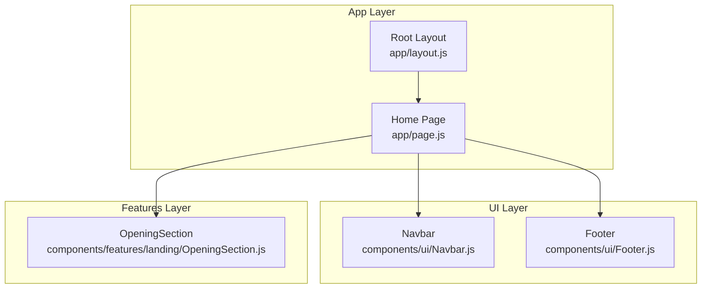
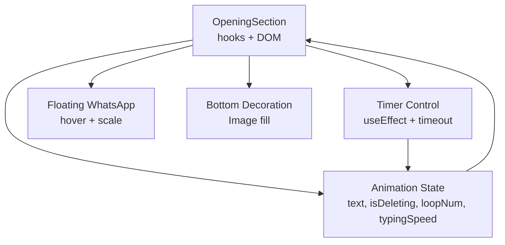
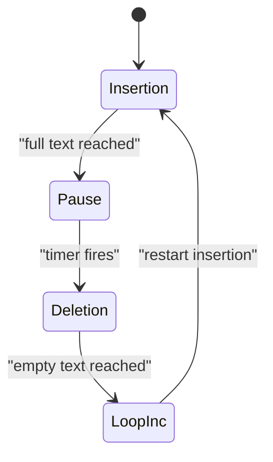
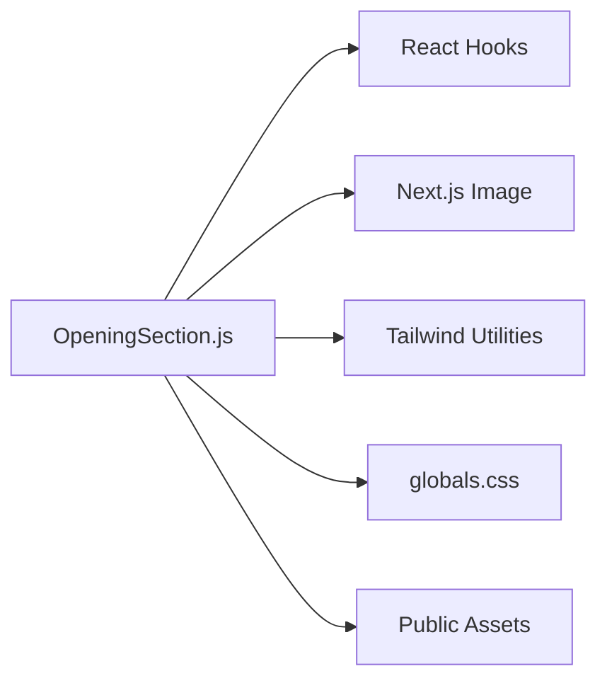

# Dynamic Opening Section

<cite>
**Referenced Files in This Document**
- [OpeningSection.js](file://components/features/landing/OpeningSection.js)
- [page.js](file://app/page.js)
- [layout.js](file://app/layout.js)
- [globals.css](file://app/globals.css)
- [Navbar.js](file://components/ui/Navbar.js)
- [Footer.js](file://components/ui/Footer.js)
</cite>

## Table of Contents
1. [Introduction](#introduction)
2. [Project Structure](#project-structure)
3. [Core Components](#core-components)
4. [Architecture Overview](#architecture-overview)
5. [Detailed Component Analysis](#detailed-component-analysis)
6. [Dependency Analysis](#dependency-analysis)
7. [Performance Considerations](#performance-considerations)
8. [Troubleshooting Guide](#troubleshooting-guide)
9. [Conclusion](#conclusion)

## Introduction
This document explains the dynamic opening section component responsible for the animated headline and floating WhatsApp integration. It covers the typing animation state machine, character-by-character text display logic, deletion cycle management, timing controls, floating integration with hover effects, decorative bottom elements, and responsive design considerations. It also provides customization options and integration patterns with the main page layout.

## Project Structure
The dynamic opening section is a standalone React component integrated into the main page layout. It relies on Tailwind CSS utilities and Next.js Image optimization for visuals and animations.

**Diagram sources**
- [layout.js:25-34](file://app/layout.js#L25-L34)
- [page.js:14-41](file://app/page.js#L14-L41)
- [Navbar.js:17-85](file://components/ui/Navbar.js#L17-L85)
- [OpeningSection.js:6-99](file://components/features/landing/OpeningSection.js#L6-L99)
- [Footer.js:3-50](file://components/ui/Footer.js#L3-L50)

**Section sources**
- [layout.js:20-34](file://app/layout.js#L20-L34)
- [page.js:14-41](file://app/page.js#L14-L41)

## Core Components
- OpeningSection: Implements the typing animation and floating WhatsApp integration.
- Navbar and Footer: Provide global navigation and footer context for the page layout.
- Global styles: Define fonts, colors, and reusable utilities used by the component.

Key responsibilities:
- Typing animation: Manages insertion/deletion cycles and timing.
- Floating WhatsApp: Provides a fixed-position, hover-enhanced action element.
- Decorative elements: Adds bottom decoration and responsive typography.
- Layout integration: Renders within the main page structure.

**Section sources**
- [OpeningSection.js:6-99](file://components/features/landing/OpeningSection.js#L6-L99)
- [Navbar.js:17-85](file://components/ui/Navbar.js#L17-L85)
- [Footer.js:3-50](file://components/ui/Footer.js#L3-L50)
- [globals.css:30-55](file://app/globals.css#L30-L55)

## Architecture Overview
The component is self-contained and uses React hooks for state and effects. It renders a centered headline with a blinking cursor, a floating WhatsApp button, decorative text chips, a call-to-action, and a bottom decoration image.

**Diagram sources**
- [OpeningSection.js:6-99](file://components/features/landing/OpeningSection.js#L6-L99)

## Detailed Component Analysis

### Typing Animation State Machine
The animation is driven by four state variables and a single effect hook. The state machine transitions between insertion and deletion modes, adjusting timing dynamically.

States and transitions:
- Insertion mode: Characters are appended until the full text is shown.
- Pause at full text: A longer delay holds the text before deletion begins.
- Deletion mode: Characters are removed until the text is empty.
- Loop increment: After a full deletion, the loop counter increments and insertion restarts.

Timing controls:
- Initial typing speed: Fast insertion.
- Pause at completion: Extended delay before deletion.
- Deletion speed: Faster removal.
- Restart speed: Short delay after loop increment.

**Diagram sources**
- [OpeningSection.js:14-37](file://components/features/landing/OpeningSection.js#L14-L37)

Implementation highlights:
- Uses a single effect to schedule the next tick based on the current typing speed.
- Updates the text state each tick, switching between insertion and deletion based on the deletion flag.
- Adjusts typing speed depending on the current phase to create a natural rhythm.

Customization options:
- Full text content: Modify the constant holding the headline text.
- Speeds: Adjust initial insertion, pause, deletion, and restart speeds.
- Loop count: Track iterations via the loop number state.

Integration patterns:
- Render within the main page layout to appear as the hero section.
- Coordinate with other sections to ensure smooth scrolling and visual continuity.

**Section sources**
- [OpeningSection.js:6-12](file://components/features/landing/OpeningSection.js#L6-L12)
- [OpeningSection.js:14-37](file://components/features/landing/OpeningSection.js#L14-L37)
- [OpeningSection.js:39-61](file://components/features/landing/OpeningSection.js#L39-L61)

### Floating WhatsApp Integration
The floating WhatsApp element is fixed at the bottom-right corner with a subtle glow and hover scaling effect. It uses a Next.js Image component for optimized rendering.

Hover effects:
- Background blur intensity increases on hover.
- Container scales up slightly for emphasis.
- Icon remains centered and sized appropriately.

Accessibility and UX:
- Cursor indicates clickable interaction.
- Fixed positioning ensures visibility across scroll.
- Z-index stacking prevents overlap with other content.

Responsive considerations:
- Consistent sizing across breakpoints.
- Hover effects remain functional on touch devices.

**Section sources**
- [OpeningSection.js:41-53](file://components/features/landing/OpeningSection.js#L41-L53)

### Decorative Bottom Elements
The bottom decoration is a full-width image positioned absolutely at the bottom of the section. It uses Next.js Image with fill to adapt to container size while maintaining aspect ratio.

Responsiveness:
- Height adapts by breakpoint to fit larger screens.
- Object containment ensures the image fills without distortion.
- Priority prop optimizes loading order.

**Section sources**
- [OpeningSection.js:87-96](file://components/features/landing/OpeningSection.js#L87-L96)

### Responsive Design Considerations
Typography and spacing:
- Headline uses large font sizes with line heights optimized for readability.
- Text wraps naturally with pre-line whitespace handling.
- Chips and buttons adjust spacing and sizing across breakpoints.

Layout constraints:
- Max widths and centering ensure content remains readable on small screens.
- Relative z-index stacking keeps the floating element above content.

**Section sources**
- [OpeningSection.js:39-61](file://components/features/landing/OpeningSection.js#L39-L61)
- [OpeningSection.js:87-96](file://components/features/landing/OpeningSection.js#L87-L96)

### Integration with Main Page Layout
The component is rendered as part of the home page, sandwiched between the navbar and footer. The page wrapper provides a dark theme and global fonts.

Integration highlights:
- The opening section occupies a tall viewport height to establish visual impact.
- Other sections follow immediately below, maintaining a cohesive flow.
- Global styles define fonts and accent colors used throughout.

**Section sources**
- [page.js:14-41](file://app/page.js#L14-L41)
- [layout.js:20-34](file://app/layout.js#L20-L34)
- [globals.css:3-28](file://app/globals.css#L3-L28)

## Dependency Analysis
The component depends on:
- React hooks for state and effects.
- Next.js Image for optimized asset rendering.
- Tailwind CSS utilities for styling and responsiveness.
- Global CSS for shared fonts and utilities.

External assets:
- WhatsApp icon SVG.
- Bottom decoration PNG.

**Diagram sources**
- [OpeningSection.js:3-5](file://components/features/landing/OpeningSection.js#L3-L5)
- [OpeningSection.js:45-51](file://components/features/landing/OpeningSection.js#L45-L51)
- [OpeningSection.js:90-95](file://components/features/landing/OpeningSection.js#L90-L95)
- [globals.css:30-55](file://app/globals.css#L30-L55)

**Section sources**
- [OpeningSection.js:3-5](file://components/features/landing/OpeningSection.js#L3-L5)
- [OpeningSection.js:45-51](file://components/features/landing/OpeningSection.js#L45-L51)
- [OpeningSection.js:90-95](file://components/features/landing/OpeningSection.js#L90-L95)
- [globals.css:30-55](file://app/globals.css#L30-L55)

## Performance Considerations
- Effect cleanup: The effect clears the timeout on unmount to prevent memory leaks.
- Minimal re-renders: State updates are scoped to the animation loop, reducing unnecessary renders.
- Image optimization: Next.js Image handles lazy loading and responsive sizing.
- CSS animations: Pure CSS hover effects avoid heavy JavaScript computations.

Recommendations:
- Keep the full text concise to minimize DOM updates.
- Consider throttling or debouncing if extending the animation to many loops.
- Monitor asset sizes for the decoration image to maintain fast load times.

**Section sources**
- [OpeningSection.js:36-37](file://components/features/landing/OpeningSection.js#L36-L37)

## Troubleshooting Guide
Common issues and resolutions:
- Animation not starting: Verify the effect runs by checking the initial state and timer creation.
- Text flickering: Ensure the effect cleans up timers and does not accumulate multiple intervals.
- Hover effects not working: Confirm Tailwind utilities are loaded and the group hover selectors are applied.
- Image not displaying: Check asset paths and ensure the image exists in the public directory.
- Layout shifts: Validate responsive classes and ensure the container maintains aspect ratios.

Debugging tips:
- Temporarily log state changes during the animation loop.
- Inspect computed styles for hover states.
- Verify Next.js Image props and fill behavior.

**Section sources**
- [OpeningSection.js:14-37](file://components/features/landing/OpeningSection.js#L14-L37)
- [OpeningSection.js:41-53](file://components/features/landing/OpeningSection.js#L41-L53)
- [OpeningSection.js:87-96](file://components/features/landing/OpeningSection.js#L87-L96)

## Conclusion
The dynamic opening section combines a robust typing animation with a polished floating action element and decorative visuals. Its modular design integrates seamlessly into the main page layout, leveraging React hooks and Tailwind CSS for maintainable, responsive behavior. The state machine provides clear control over timing and flow, while customization options allow easy adaptation to brand messaging and content changes.