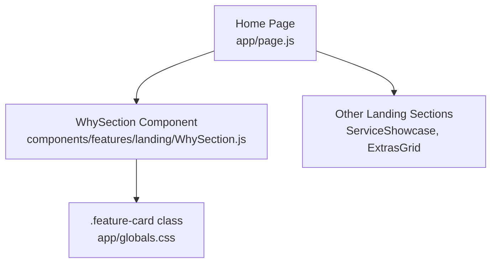
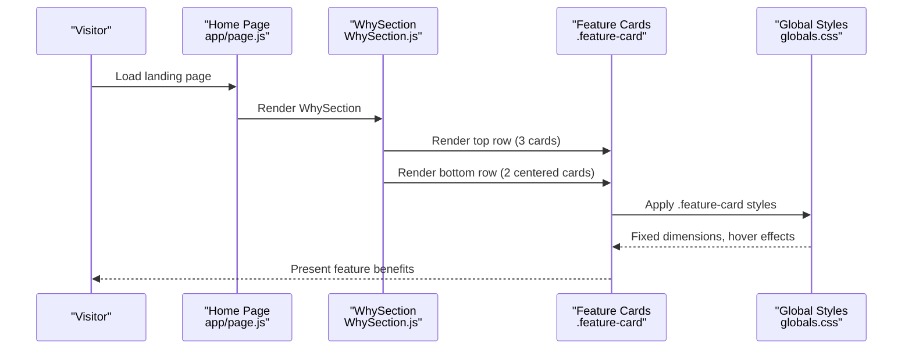
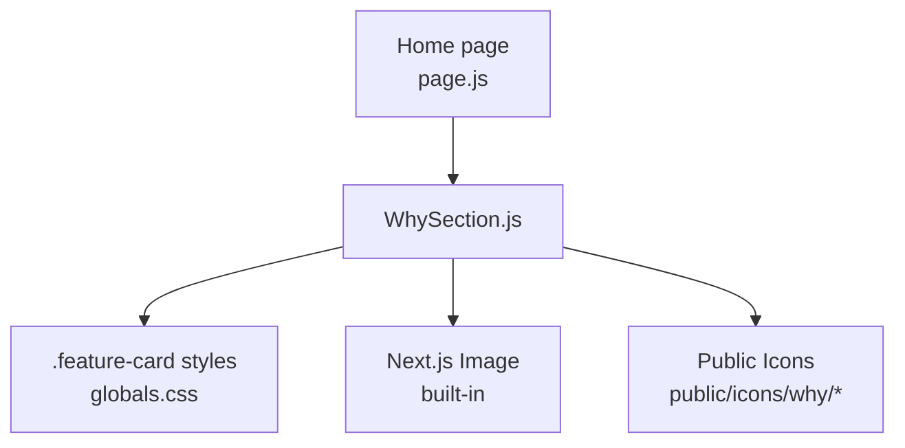

# Feature Cards Section

<cite>
**Referenced Files in This Document**
- [WhySection.js](file://components/features/landing/WhySection.js)
- [page.js](file://app/page.js)
- [globals.css](file://app/globals.css)
- [ServiceShowcase.js](file://components/features/home/ServiceShowcase.js)
- [ExtrasGrid.js](file://components/features/home/ExtrasGrid.js)
</cite>

## Table of Contents
1. [Introduction](#introduction)
2. [Project Structure](#project-structure)
3. [Core Components](#core-components)
4. [Architecture Overview](#architecture-overview)
5. [Detailed Component Analysis](#detailed-component-analysis)
6. [Dependency Analysis](#dependency-analysis)
7. [Performance Considerations](#performance-considerations)
8. [Troubleshooting Guide](#troubleshooting-guide)
9. [Conclusion](#conclusion)

## Introduction
This document explains the "Why Choose Us" feature cards section, focusing on the card layout implementation, feature presentation patterns, and content organization strategy. It covers the component structure, prop handling, responsive design considerations, customization examples, content management approaches, and integration with the overall landing page flow.

## Project Structure
The feature cards section is implemented as a dedicated landing section component integrated into the main landing page. The section uses a two-row layout: three cards in the top row and two centered cards in the bottom row. Styling is centralized in global CSS with a reusable card class.

**Diagram sources**
- [page.js:14-41](file://app/page.js#L14-L41)
- [WhySection.js:3-52](file://components/features/landing/WhySection.js#L3-L52)
- [globals.css:44-49](file://app/globals.css#L44-L49)

**Section sources**
- [page.js:14-41](file://app/page.js#L14-L41)
- [WhySection.js:3-52](file://components/features/landing/WhySection.js#L3-L52)
- [globals.css:44-49](file://app/globals.css#L44-L49)

## Core Components
- WhySection: Renders the Why Choose Us section with two rows of feature cards.
- Feature Card Pattern: Reusable card class and layout structure for consistent presentation.
- Global Styling: Centralized card dimensions, spacing, and hover effects.

Key characteristics:
- Two-row layout: Three cards in the top row and two centered cards in the bottom row.
- Fixed card dimensions: 392px wide by 250px tall with strict min/max constraints.
- Consistent spacing: 20px horizontal gap between cards and 40px vertical gap between rows.
- Typography: Title uses bold 20px text; description uses regular 14px with 22px line height.
- Responsive behavior: Flex layout adapts to mobile and desktop while maintaining fixed card sizes.

**Section sources**
- [WhySection.js:8-30](file://components/features/landing/WhySection.js#L8-L30)
- [WhySection.js:33-48](file://components/features/landing/WhySection.js#L33-L48)
- [globals.css:44-49](file://app/globals.css#L44-L49)

## Architecture Overview
The WhySection integrates into the landing page as part of the main content flow. It is positioned after the opening section and before the main content sections wrapper, ensuring a logical progression for the visitor’s journey.

**Diagram sources**
- [page.js:14-41](file://app/page.js#L14-L41)
- [WhySection.js:3-52](file://components/features/landing/WhySection.js#L3-L52)
- [globals.css:44-49](file://app/globals.css#L44-L49)

## Detailed Component Analysis

### WhySection Component
The WhySection component defines the layout and content for the feature cards section. It uses a two-row structure:
- Top row: Three feature cards arranged in a flex container with horizontal gaps.
- Bottom row: Two feature cards centered horizontally with flex layout.

Each card includes:
- An icon image loaded from the public icons directory.
- A title with bold 20px typography.
- A description paragraph with 14px font and 22px line height.
- Strict card sizing via Tailwind utility classes to ensure uniformity across rows.

Responsive behavior:
- On small screens, both rows stack vertically.
- On medium and larger screens, the top row uses a flex layout with three columns and the bottom row uses a centered flex layout.

Content management:
- Titles and descriptions are embedded directly in the component.
- Icons are referenced via static assets in the public directory.

Integration:
- The component is rendered by the Home page as part of the landing page sequence.

**Section sources**
- [WhySection.js:3-52](file://components/features/landing/WhySection.js#L3-L52)

### Feature Card Pattern (.feature-card)
The .feature-card class centralizes styling for all feature cards:
- Fixed dimensions: 392px wide by 250px tall with min/max constraints.
- Padding: 30px on all sides for consistent internal spacing.
- Background: Dark theme (#010101) for contrast against the gold gradient background.
- Border-radius: 20px corners for a modern look.
- Hover effect: Subtle lift animation to enhance interactivity.
- Flex layout: Column orientation with center alignment for icon/title/description.

Layout constraints:
- The class includes a shrink property to prevent cards from resizing within flex containers.
- Utility classes on individual cards enforce strict width and height to match the top row.

**Section sources**
- [globals.css:44-49](file://app/globals.css#L44-L49)
- [WhySection.js:9-29](file://components/features/landing/WhySection.js#L9-L29)
- [WhySection.js:34-47](file://components/features/landing/WhySection.js#L34-L47)

### Responsive Design Considerations
- Mobile-first layout: Cards stack vertically on small screens.
- Desktop layout: Flex-based arrangement maintains fixed card sizes and consistent gaps.
- Centering strategy: Bottom row uses a centered flex container to keep cards aligned.
- Typography scaling: Font sizes remain constant across breakpoints for readability.

Accessibility:
- Alt text is provided for all icons.
- Color contrast meets WCAG guidelines for text on dark backgrounds.

**Section sources**
- [WhySection.js:8-30](file://components/features/landing/WhySection.js#L8-L30)
- [WhySection.js:33-48](file://components/features/landing/WhySection.js#L33-L48)

### Content Organization Strategy
- Content grouping: Benefits are grouped into two rows to balance visual weight and readability.
- Iconography: Each card pairs a relevant icon with a concise benefit statement.
- Typography hierarchy: Clear distinction between title and description improves scannability.
- Spacing: Consistent gaps ensure visual rhythm and prevent clutter.

**Section sources**
- [WhySection.js:10-14](file://components/features/landing/WhySection.js#L10-L14)
- [WhySection.js:17-21](file://components/features/landing/WhySection.js#L17-L21)
- [WhySection.js:24-28](file://components/features/landing/WhySection.js#L24-L28)
- [WhySection.js:35-39](file://components/features/landing/WhySection.js#L35-L39)
- [WhySection.js:42-46](file://components/features/landing/WhySection.js#L42-L46)

### Prop Handling and Customization
Current implementation:
- Props are not passed to the WhySection component; content is hardcoded.
- Card dimensions are enforced via Tailwind utility classes on each card element.

Customization approaches:
- Parameterized props: Introduce props for title, description, and icon path to enable dynamic rendering.
- Theming: Add props for background color, text color, and hover effects to support alternate themes.
- Layout variants: Expose props for row counts and alignment to adapt to different content volumes.

Example customization patterns:
- Dynamic content: Replace hardcoded arrays with props to render cards from external data sources.
- Conditional layouts: Add a prop to switch between grid and flex layouts based on screen size or content length.

**Section sources**
- [WhySection.js:3-52](file://components/features/landing/WhySection.js#L3-L52)

### Integration with Landing Page Flow
The WhySection is integrated into the Home page as follows:
- Positioned after the opening section and before the main content sections wrapper.
- Uses a gold gradient background to create visual separation and highlight the section.
- Maintains consistent spacing and typography with other landing components.

Related components:
- ServiceShowcase demonstrates a different layout pattern using a grid and reverse ordering for alternating content.
- ExtrasGrid showcases a simpler grid-based card layout for additional services.

**Section sources**
- [page.js:14-41](file://app/page.js#L14-L41)
- [ServiceShowcase.js:30-76](file://components/features/home/ServiceShowcase.js#L30-L76)
- [ExtrasGrid.js:12-37](file://components/features/home/ExtrasGrid.js#L12-L37)

## Dependency Analysis
The WhySection depends on:
- Global CSS for card styling and hover effects.
- Static assets for icons located under the public directory.
- Next.js Image component for optimized image loading.

**Diagram sources**
- [WhySection.js:1-52](file://components/features/landing/WhySection.js#L1-L52)
- [globals.css:44-49](file://app/globals.css#L44-L49)
- [page.js:14-41](file://app/page.js#L14-L41)

**Section sources**
- [WhySection.js:1-52](file://components/features/landing/WhySection.js#L1-L52)
- [globals.css:44-49](file://app/globals.css#L44-L49)
- [page.js:14-41](file://app/page.js#L14-L41)

## Performance Considerations
- Static assets: Icons are served from the public directory for fast delivery.
- Image optimization: Next.js Image component optimizes icon loading with automatic sizing and compression.
- CSS isolation: Centralized card styles reduce duplication and improve maintainability.
- Minimal JavaScript: The component relies on Tailwind utilities and Next.js Image, minimizing runtime overhead.

## Troubleshooting Guide
Common issues and resolutions:
- Cards not aligning properly on desktop:
  - Ensure each card has explicit width and height utilities to prevent flex-based resizing.
  - Verify the bottom row uses a centered flex layout to maintain horizontal alignment.
- Typography inconsistencies:
  - Confirm font sizes and line heights match the design spec.
  - Remove uppercase classes to preserve Title Case formatting.
- Hover effects not appearing:
  - Check that the .feature-card class includes hover transitions and that the component renders within the styled section.

**Section sources**
- [WhySection.js:33-48](file://components/features/landing/WhySection.js#L33-L48)
- [globals.css:44-49](file://app/globals.css#L44-L49)

## Conclusion
The "Why Choose Us" feature cards section demonstrates a clean, responsive layout with consistent card styling and clear content organization. By enforcing fixed card dimensions, using a standardized card class, and integrating thoughtfully into the landing page flow, the section effectively communicates key benefits while maintaining visual coherence across devices.