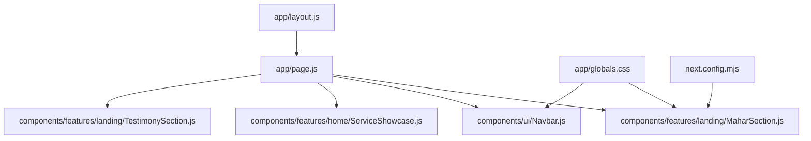
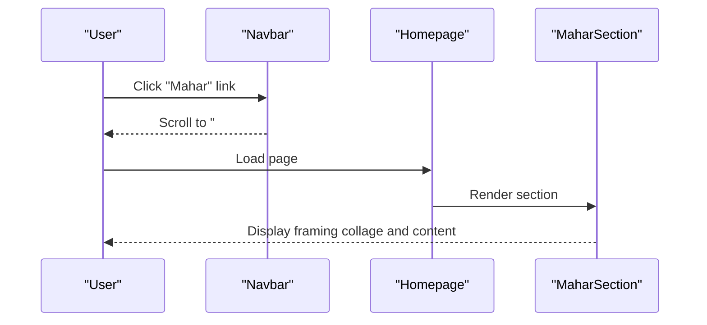
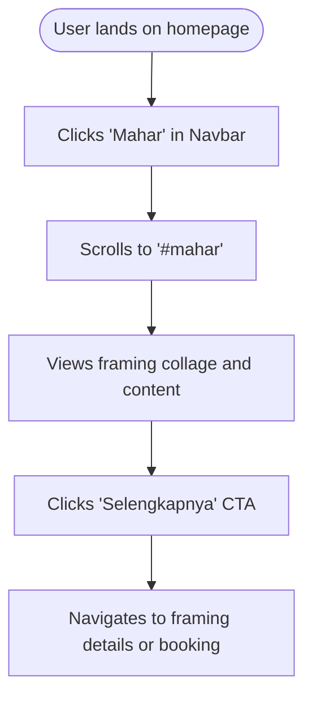
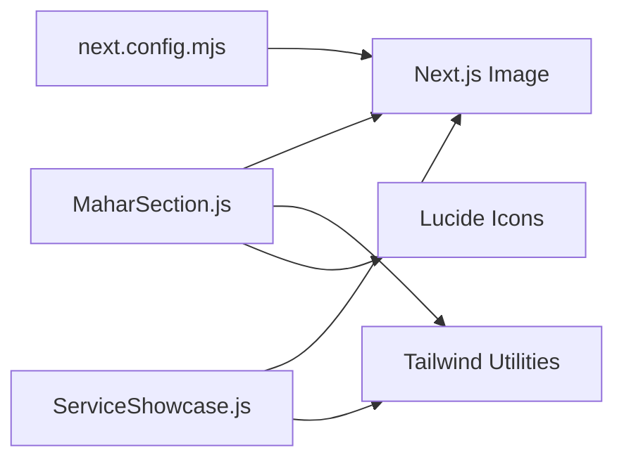

# Mahar Framing Display

<cite>
**Referenced Files in This Document**
- [MaharSection.js](file://components/features/landing/MaharSection.js)
- [page.js](file://app/page.js)
- [globals.css](file://app/globals.css)
- [Navbar.js](file://components/ui/Navbar.js)
- [ServiceShowcase.js](file://components/features/home/ServiceShowcase.js)
- [TestimonySection.js](file://components/features/landing/TestimonySection.js)
- [layout.js](file://app/layout.js)
- [next.config.mjs](file://next.config.mjs)
</cite>

## Table of Contents
1. [Introduction](#introduction)
2. [Project Structure](#project-structure)
3. [Core Components](#core-components)
4. [Architecture Overview](#architecture-overview)
5. [Detailed Component Analysis](#detailed-component-analysis)
6. [Dependency Analysis](#dependency-analysis)
7. [Performance Considerations](#performance-considerations)
8. [Troubleshooting Guide](#troubleshooting-guide)
9. [Conclusion](#conclusion)
10. [Appendices](#appendices)

## Introduction
This document explains the Mahar Framing Display component and its role in the landing page experience. It covers the framing presentation logic, product showcase layouts, customization options for different mahar items, implementation patterns, content organization strategies, and responsive design considerations. It also provides practical guidance for adding new mahar items, managing inventory displays, and integrating with the overall service architecture.

## Project Structure
The Mahar Framing Display is implemented as a dedicated landing section integrated into the homepage. It is composed of:
- A section-level component that renders a dark-themed collage of mahar frames alongside descriptive text and a call-to-action.
- A global stylesheet that defines theme tokens, typography, and reusable component styles.
- A navigation bar that links to the section via an anchor.
- Supporting showcases and testimonials that reinforce the framing service’s positioning within the broader service portfolio.

**Diagram sources**
- [page.js:14-41](file://app/page.js#L14-L41)
- [MaharSection.js:4-54](file://components/features/landing/MaharSection.js#L4-L54)
- [Navbar.js:8-15](file://components/ui/Navbar.js#L8-L15)
- [ServiceShowcase.js:3-28](file://components/features/home/ServiceShowcase.js#L3-L28)
- [TestimonySection.js:60-182](file://components/features/landing/TestimonySection.js#L60-L182)
- [globals.css:3-55](file://app/globals.css#L3-L55)
- [layout.js:21](file://app/layout.js#L21)
- [next.config.mjs:5-12](file://next.config.mjs#L5-L12)

**Section sources**
- [page.js:14-41](file://app/page.js#L14-L41)
- [MaharSection.js:4-54](file://components/features/landing/MaharSection.js#L4-L54)
- [globals.css:3-55](file://app/globals.css#L3-L55)
- [Navbar.js:8-15](file://components/ui/Navbar.js#L8-L15)
- [ServiceShowcase.js:3-28](file://components/features/home/ServiceShowcase.js#L3-L28)
- [TestimonySection.js:60-182](file://components/features/landing/TestimonySection.js#L60-L182)
- [layout.js:21](file://app/layout.js#L21)
- [next.config.mjs:5-12](file://next.config.mjs#L5-L12)

## Core Components
- MaharSection: Renders the framing showcase with a grid collage of mahar images, gradient overlays, and a text-and-CTA block. It uses Next.js Image for optimized assets and Tailwind utility classes for layout and responsiveness.
- Navbar: Provides a scroll-aware header with internal navigation, including a link to the mahar section via an anchor.
- ServiceShowcase: Presents the framing service among other offerings, reinforcing the framing value proposition with a complementary visual treatment.
- TestimonySection: Reinforces trust and quality by showcasing real customer outcomes, including “Frame Mahar” achievements.
- Global Styles: Defines theme tokens and reusable component classes (e.g., button styles) used across components.

Key implementation patterns:
- Composition: The homepage composes multiple feature sections, including the mahar section.
- Responsive breakpoints: Flex and grid utilities adapt the layout from mobile to desktop.
- Asset optimization: Next.js Image handles scaling and aspect fitting for optimal performance.
- Theming: CSS variables define accent colors and typography, ensuring consistent branding.

**Section sources**
- [MaharSection.js:4-54](file://components/features/landing/MaharSection.js#L4-L54)
- [page.js:14-41](file://app/page.js#L14-L41)
- [Navbar.js:8-15](file://components/ui/Navbar.js#L8-L15)
- [ServiceShowcase.js:3-28](file://components/features/home/ServiceShowcase.js#L3-L28)
- [TestimonySection.js:60-182](file://components/features/landing/TestimonySection.js#L60-L182)
- [globals.css:3-55](file://app/globals.css#L3-L55)

## Architecture Overview
The mahar framing display participates in the landing page architecture as follows:
- The homepage imports and renders the mahar section alongside other feature sections.
- The navbar anchors to the mahar section via an internal link.
- Global styles unify the visual language across components.
- The service showcase and testimonials complement the framing section by reinforcing service quality and outcomes.

**Diagram sources**
- [Navbar.js:10-11](file://components/ui/Navbar.js#L10-L11)
- [page.js:25](file://app/page.js#L25)
- [MaharSection.js:4-54](file://components/features/landing/MaharSection.js#L4-L54)

**Section sources**
- [page.js:14-41](file://app/page.js#L14-L41)
- [Navbar.js:8-15](file://components/ui/Navbar.js#L8-L15)
- [MaharSection.js:4-54](file://components/features/landing/MaharSection.js#L4-L54)

## Detailed Component Analysis

### MaharSection: Framing Presentation Logic
Responsibilities:
- Present a curated grid collage of mahar items with precise sizing and spacing.
- Provide descriptive copy and a prominent call-to-action aligned with the framing service.
- Apply blend gradients to enhance depth and readability against the dark background.

Layout and composition:
- Container: Full-width dark section with vertical padding and z-index for layering.
- Left: Fixed-width grid container (two columns, two rows) with controlled gaps and margins to align images precisely.
- Right: Flexible text block with centered-on-mobile and left-aligned-on-large screens, including headline, paragraph, and CTA.

Styling and theming:
- Uses global theme tokens for background and accents.
- Leverages reusable button classes for the CTA.
- Gradient overlays improve contrast between text and background.

Accessibility and semantics:
- Alt attributes are provided for images.
- Semantic headings and paragraphs support screen readers.

Responsive behavior:
- On small screens, the layout stacks vertically.
- On medium and larger screens, the layout becomes a two-column arrangement.

Customization options:
- To change the framing items, update the image sources and alt texts in the grid.
- To adjust spacing or sizing, modify the grid and item dimensions while preserving aspect ratios.

Integration points:
- Anchor link in the navbar targets the section ID to enable smooth scrolling.
- Global styles provide consistent typography and color application.

**Section sources**
- [MaharSection.js:4-54](file://components/features/landing/MaharSection.js#L4-L54)
- [globals.css:31-38](file://app/globals.css#L31-L38)
- [Navbar.js:10-11](file://components/ui/Navbar.js#L10-L11)

### Adding New Mahar Items
Steps:
- Add new images to the public media directory under the mahar items folder.
- Update the grid structure to include the new items, maintaining the existing spacing and alignment patterns.
- Ensure alt attributes are descriptive and accessible.
- Verify responsive behavior across breakpoints after changes.

Guidance:
- Keep consistent aspect ratios to preserve the collage layout.
- Use Next.js Image for optimized rendering and automatic aspect fitting.

**Section sources**
- [MaharSection.js:15-32](file://components/features/landing/MaharSection.js#L15-L32)

### Managing Inventory Displays
Strategy:
- Maintain a fixed number of featured items in the collage to avoid visual clutter.
- Use placeholder or fallback assets if an image is missing.
- Consider lazy loading and aspect ratio constraints to prevent layout shifts.

**Section sources**
- [MaharSection.js:15-32](file://components/features/landing/MaharSection.js#L15-L32)

### Integration with the Overall Service Architecture
- The mahar section is part of the homepage composition, alongside other service showcases and testimonials.
- The service showcase highlights framing among premium offerings.
- Testimonials reinforce framing quality and outcomes, supporting conversion.

**Section sources**
- [page.js:14-41](file://app/page.js#L14-L41)
- [ServiceShowcase.js:3-28](file://components/features/home/ServiceShowcase.js#L3-L28)
- [TestimonySection.js:60-182](file://components/features/landing/TestimonySection.js#L60-L182)

### Conceptual Overview
The framing display emphasizes:
- Curated visuals that communicate quality and customization.
- Clear messaging about customization options and delivery logistics.
- Consistent theming and responsive behavior across devices.

[No sources needed since this diagram shows conceptual workflow, not actual code structure]

## Dependency Analysis
External dependencies and integrations:
- Next.js Image: Optimized asset rendering for mahar images.
- Tailwind CSS: Utility-first styling and responsive utilities.
- Lucide React: Icons for interactive elements and visual cues.
- Remote image pattern: Allows external image sources for service showcase.

**Diagram sources**
- [MaharSection.js:1-2](file://components/features/landing/MaharSection.js#L1-L2)
- [next.config.mjs:5-12](file://next.config.mjs#L5-L12)
- [ServiceShowcase.js:1](file://components/features/home/ServiceShowcase.js#L1)

**Section sources**
- [MaharSection.js:1-2](file://components/features/landing/MaharSection.js#L1-L2)
- [next.config.mjs:5-12](file://next.config.mjs#L5-L12)
- [ServiceShowcase.js:1](file://components/features/home/ServiceShowcase.js#L1)

## Performance Considerations
- Asset optimization: Use Next.js Image to automatically optimize and resize images based on the device viewport.
- Lazy loading: Rely on Next.js Image defaults for lazy loading to reduce initial load time.
- Minimized layout shifts: Maintain fixed dimensions for the grid to prevent cumulative layout shift during render.
- Theme consistency: Centralize styles in global CSS to reduce duplication and improve maintainability.

[No sources needed since this section provides general guidance]

## Troubleshooting Guide
Common issues and resolutions:
- Missing images: Ensure image paths match the public media directory and filenames are correct.
- Layout misalignment: Verify grid dimensions and spacing classes remain consistent with the intended collage.
- Accessibility: Confirm alt attributes are present and descriptive for all images.
- Responsiveness: Test breakpoints to ensure the layout stacks appropriately on smaller screens.

**Section sources**
- [MaharSection.js:15-32](file://components/features/landing/MaharSection.js#L15-L32)

## Conclusion
The Mahar Framing Display component delivers a visually compelling presentation of framing options, anchored by a dark-themed collage, gradient overlays, and clear messaging. Its integration into the homepage, supported by global theming and responsive utilities, ensures a cohesive and accessible user experience. By following the documented patterns for adding new items, managing inventory, and maintaining responsive behavior, teams can evolve the display to reflect changing product offerings while preserving brand consistency.

[No sources needed since this section summarizes without analyzing specific files]

## Appendices

### Appendix A: Responsive Breakpoints and Layout Notes
- Mobile-first design: The layout stacks vertically on small screens.
- Medium and above: Two-column layout with a fixed-width image grid and flexible text block.
- Spacing and gaps: Controlled spacing ensures visual balance across items.

**Section sources**
- [MaharSection.js:13-32](file://components/features/landing/MaharSection.js#L13-L32)

### Appendix B: Theming Tokens and Reusable Classes
- Theme tokens: Accent colors and typography are defined centrally for consistent application.
- Reusable classes: Buttons and text styles are standardized for uniformity across components.

**Section sources**
- [globals.css:3-16](file://app/globals.css#L3-L16)
- [globals.css:31-38](file://app/globals.css#L31-L38)