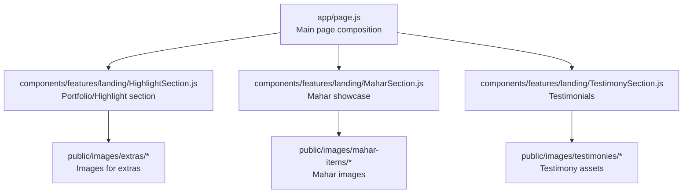
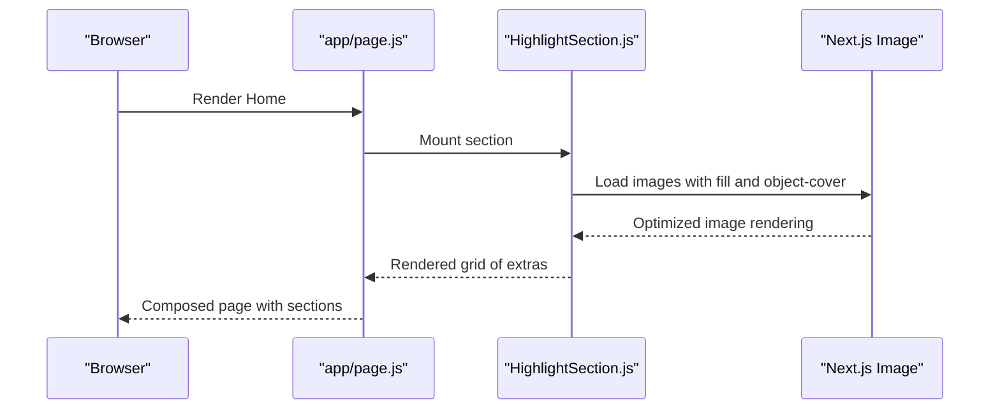
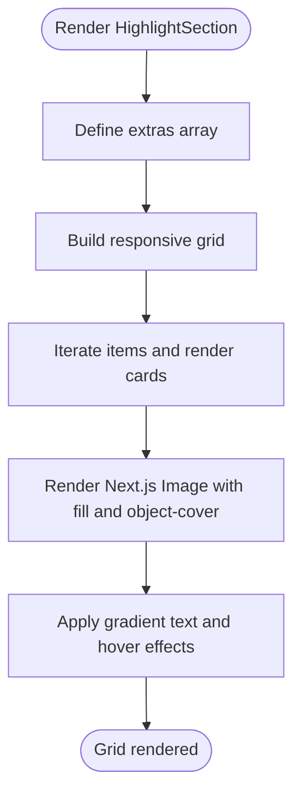
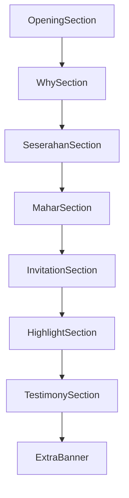
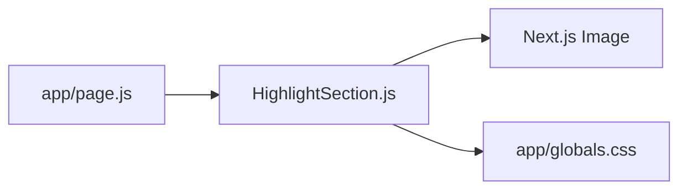

# Portfolio/Highlight Section

<cite>
**Referenced Files in This Document**
- [HighlightSection.js](file://components/features/landing/HighlightSection.js)
- [page.js](file://app/page.js)
- [globals.css](file://app/globals.css)
- [MaharSection.js](file://components/features/landing/MaharSection.js)
- [TestimonySection.js](file://components/features/landing/TestimonySection.js)
- [ExtrasGrid.js](file://components/features/home/ExtrasGrid.js)
- [Testimonials.js](file://components/features/home/Testimonials.js)
</cite>

## Table of Contents
1. [Introduction](#introduction)
2. [Project Structure](#project-structure)
3. [Core Components](#core-components)
4. [Architecture Overview](#architecture-overview)
5. [Detailed Component Analysis](#detailed-component-analysis)
6. [Dependency Analysis](#dependency-analysis)
7. [Performance Considerations](#performance-considerations)
8. [Troubleshooting Guide](#troubleshooting-guide)
9. [Conclusion](#conclusion)

## Introduction
This document explains the portfolio/highlight section component used to present curated extras and services in a responsive, visually rich layout. It covers the image gallery implementation, item presentation, responsive grid behavior, content management approach, and integration within the overall page structure. It also provides guidance on extending the component with new items, implementing filtering, and optimizing performance for larger image collections.

## Project Structure
The portfolio/highlight section is part of the landing page composition and integrates with other feature sections. The main page composes several sections, including the highlight section, which displays a grid of extras with images, titles, and descriptions.

**Diagram sources**
- [page.js:14-41](file://app/page.js#L14-L41)
- [HighlightSection.js:4-80](file://components/features/landing/HighlightSection.js#L4-L80)
- [MaharSection.js:4-54](file://components/features/landing/MaharSection.js#L4-L54)
- [TestimonySection.js:60-183](file://components/features/landing/TestimonySection.js#L60-L183)

**Section sources**
- [page.js:14-41](file://app/page.js#L14-L41)

## Core Components
- HighlightSection: Renders a grid of extra offerings with Next.js Image optimization, gradient accents, and hover animations. Items are statically defined in the component and mapped to a responsive grid.
- MaharSection: Demonstrates a collage-style image grid with explicit sizing and spacing, showcasing Next.js Image usage with fill and object-cover.
- TestimonySection: Provides a vertical marquee of testimonials with images and gradient styling, illustrating advanced layout and animation patterns.
- ExtrasGrid (home): A simpler grid of extras represented by emoji and labels, useful for understanding responsive grid patterns.
- Testimonials (home): A statistics-focused grid layout for performance metrics.

Key implementation characteristics:
- Responsive grid: Uses Tailwind grid utilities to adapt from single-column on small screens to multi-column layouts on larger screens.
- Next.js Image: Leverages fill and object-cover for responsive, optimized images.
- Gradient accents: Uses CSS gradients for gold branding and text effects.
- Hover interactions: Applies transitions and transforms for interactive feedback.

**Section sources**
- [HighlightSection.js:4-80](file://components/features/landing/HighlightSection.js#L4-L80)
- [MaharSection.js:4-54](file://components/features/landing/MaharSection.js#L4-L54)
- [TestimonySection.js:60-183](file://components/features/landing/TestimonySection.js#L60-L183)
- [ExtrasGrid.js:12-37](file://components/features/home/ExtrasGrid.js#L12-L37)
- [Testimonials.js:1-40](file://components/features/home/Testimonials.js#L1-L40)

## Architecture Overview
The highlight section participates in the page’s composition via the main page component. It is positioned between the Mahar and Testimony sections to create a cohesive visual narrative around extras and services.

**Diagram sources**
- [page.js:14-41](file://app/page.js#L14-L41)
- [HighlightSection.js:4-80](file://components/features/landing/HighlightSection.js#L4-L80)

## Detailed Component Analysis

### HighlightSection: Image Gallery and Item Presentation
Highlights a collection of extras with:
- Static data array of items containing title, description, and image path.
- Responsive grid layout using Tailwind utilities.
- Next.js Image with fill and object-cover for optimized rendering.
- Gradient text and button styling for branding consistency.
- Hover animations and subtle borders for interactivity.

**Diagram sources**
- [HighlightSection.js:4-80](file://components/features/landing/HighlightSection.js#L4-L80)

**Section sources**
- [HighlightSection.js:4-80](file://components/features/landing/HighlightSection.js#L4-L80)

### Responsive Grid Layout
The highlight section uses a responsive grid:
- Single column on small screens.
- Two columns on medium screens.
- Four columns on large screens.
Spacing and padding are applied consistently across breakpoints.

Implementation pattern:
- Tailwind grid utilities define columns and gaps.
- Aspect ratios and overflow controls ensure consistent card heights and image cropping.

**Section sources**
- [HighlightSection.js:44-69](file://components/features/landing/HighlightSection.js#L44-L69)

### Content Management Approach
Current approach:
- Items are defined inline as a static array within the component.
- Images are referenced via public paths under the images directory.

Extensibility:
- To add new items, extend the static array with new entries containing title, description, and image path.
- Maintain image paths aligned with the public/images directory structure.

**Section sources**
- [HighlightSection.js:5-26](file://components/features/landing/HighlightSection.js#L5-L26)

### Filtering Mechanisms
The current implementation does not include filtering. To implement filtering:
- Introduce a state variable to track selected categories or tags.
- Add UI controls (buttons or dropdowns) to toggle filters.
- Filter the items array based on the selected criteria before mapping to the grid.
- Debounce or memoize filters for performance if the dataset grows large.

[No sources needed since this section provides general guidance]

### Lazy Loading Strategies
Optimization opportunities:
- Replace static images with dynamic imports or server-side image optimization if images are fetched from CMS or external APIs.
- Use IntersectionObserver to defer loading offscreen images until they enter the viewport.
- Implement skeleton loaders while images are loading to improve perceived performance.
- Consider WebP or AVIF formats for smaller file sizes where supported.

[No sources needed since this section provides general guidance]

### Integration with Overall Page Structure
The highlight section is integrated into the main page composition alongside other sections. It appears after the Mahar section and before the Testimony section, forming a visual progression from product showcases to social proof.

**Diagram sources**
- [page.js:14-41](file://app/page.js#L14-L41)

**Section sources**
- [page.js:14-41](file://app/page.js#L14-L41)

### Related Components and Patterns
- MaharSection demonstrates a fixed-size collage grid with explicit spacing and shadows, useful for inspiration when designing dense image layouts.
- TestimonySection shows advanced layout patterns with gradients, overlays, and animated marquees, helpful for understanding visual hierarchy and motion.
- ExtrasGrid and Testimonials illustrate simpler grid patterns that can inform responsive behavior and content density.

**Section sources**
- [MaharSection.js:4-54](file://components/features/landing/MaharSection.js#L4-L54)
- [TestimonySection.js:60-183](file://components/features/landing/TestimonySection.js#L60-L183)
- [ExtrasGrid.js:12-37](file://components/features/home/ExtrasGrid.js#L12-L37)
- [Testimonials.js:1-40](file://components/features/home/Testimonials.js#L1-L40)

## Dependency Analysis
- HighlightSection depends on Next.js Image for optimized image rendering.
- Global styles define accent colors and reusable utilities (e.g., gradient text) used throughout the component.
- The component is composed into the main page via app/page.js.

**Diagram sources**
- [HighlightSection.js:1-2](file://components/features/landing/HighlightSection.js#L1-L2)
- [globals.css:30-55](file://app/globals.css#L30-L55)
- [page.js:14-41](file://app/page.js#L14-L41)

**Section sources**
- [HighlightSection.js:1-2](file://components/features/landing/HighlightSection.js#L1-L2)
- [globals.css:30-55](file://app/globals.css#L30-L55)
- [page.js:14-41](file://app/page.js#L14-L41)

## Performance Considerations
- Use Next.js Image with appropriate widths and aspect ratios to avoid layout shifts.
- Keep image sizes reasonable; leverage modern formats (WebP/AVIF) where possible.
- Consider lazy-loading offscreen images using IntersectionObserver.
- Minimize the number of concurrent heavy images; batch or stagger rendering if needed.
- Prefer CSS transforms for animations (already used) to reduce layout thrashing.

[No sources needed since this section provides general guidance]

## Troubleshooting Guide
Common issues and resolutions:
- Missing images: Verify image paths match the public/images directory structure and filenames.
- Layout shifts: Ensure aspect ratios and container sizes are defined to prevent cumulative layout shift.
- Hover effects not smooth: Confirm hardware acceleration-friendly properties (transforms and opacity) are used.
- Gradient text not visible: Check that the gradient CSS utility is defined and applied correctly.

**Section sources**
- [HighlightSection.js:44-69](file://components/features/landing/HighlightSection.js#L44-L69)
- [globals.css:30-55](file://app/globals.css#L30-L55)

## Conclusion
The highlight section provides an elegant, responsive presentation of extras and services using a clean grid layout, optimized images, and consistent branding. Extending it with filtering, lazy loading, and dynamic content sourcing will further enhance maintainability and performance, especially as the collection grows.