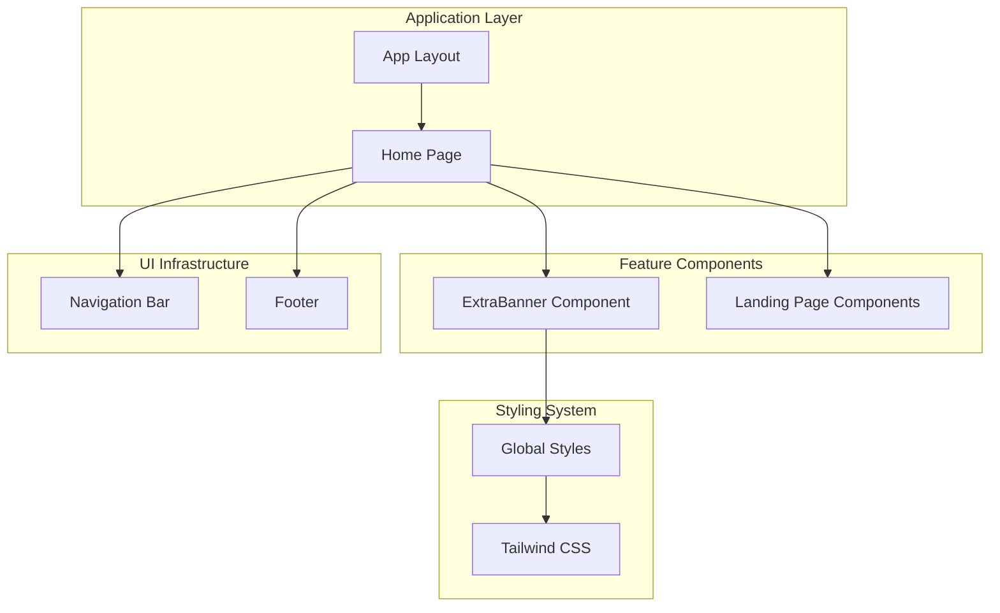
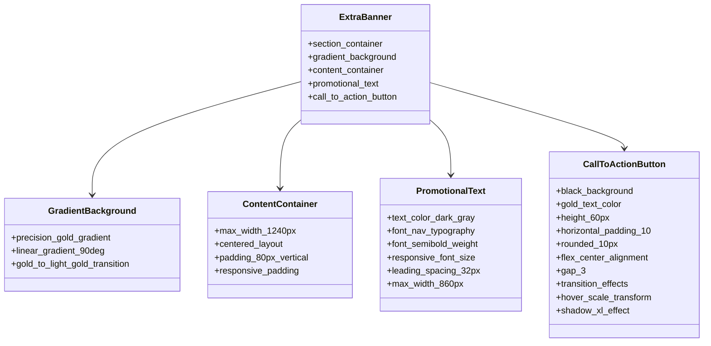
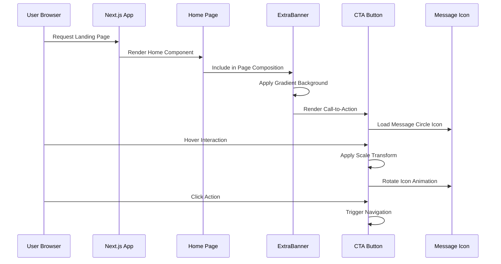
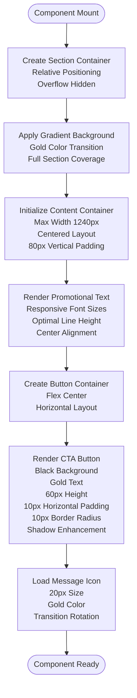
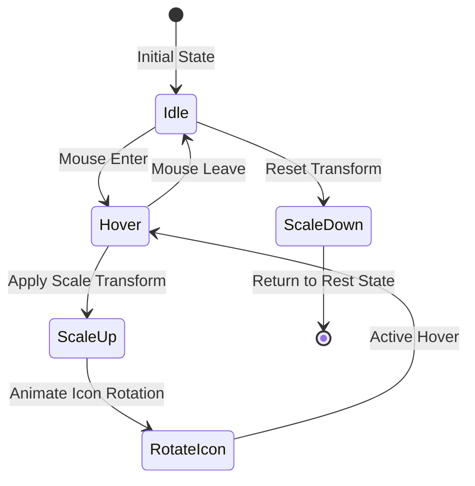
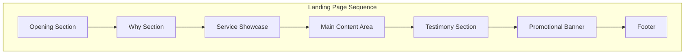
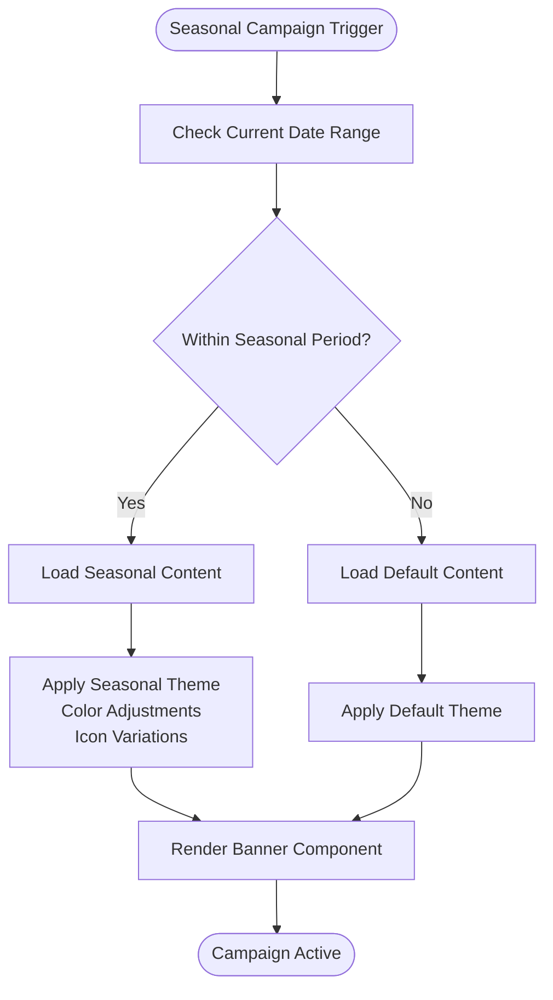

# Promotional Banner

<cite>
**Referenced Files in This Document**
- [ExtraBanner.js](file://components/features/landing/ExtraBanner.js)
- [page.js](file://app/page.js)
- [globals.css](file://app/globals.css)
- [next.config.mjs](file://next.config.mjs)
- [jsconfig.json](file://jsconfig.json)
</cite>

## Table of Contents
1. [Introduction](#introduction)
2. [Project Structure](#project-structure)
3. [Core Components](#core-components)
4. [Architecture Overview](#architecture-overview)
5. [Detailed Component Analysis](#detailed-component-analysis)
6. [Responsive Design Implementation](#responsive-design-implementation)
7. [Animation Effects](#animation-effects)
8. [Integration with Page Flow](#integration-with-page-flow)
9. [Customization Guidelines](#customization-guidelines)
10. [Seasonal Promotion Handling](#seasonal-promotion-handling)
11. [Performance Considerations](#performance-considerations)
12. [Troubleshooting Guide](#troubleshooting-guide)
13. [Conclusion](#conclusion)

## Introduction

The promotional banner component serves as a strategic call-to-action element positioned at the conclusion of the landing page, designed to capture user attention and drive engagement through targeted messaging and interactive elements. This component plays a crucial role in the overall conversion funnel by providing a prominent, visually appealing pathway for potential customers to initiate contact with the service provider.

The banner implementation demonstrates sophisticated design principles including gradient backgrounds, typography hierarchy, and interactive elements that work together to create a cohesive promotional experience. Its placement within the page flow ensures optimal visibility while maintaining visual continuity with the preceding content sections.

## Project Structure

The promotional banner is integrated as part of the landing page composition within the Next.js application architecture. The component follows a modular design pattern that allows for easy maintenance and potential reuse across different pages or contexts.



**Diagram sources**
- [page.js:14-41](file://app/page.js#L14-L41)
- [ExtraBanner.js:4-29](file://components/features/landing/ExtraBanner.js#L4-L29)

**Section sources**
- [page.js:12-36](file://app/page.js#L12-L36)
- [ExtraBanner.js:1-30](file://components/features/landing/ExtraBanner.js#L1-L30)

## Core Components

The promotional banner consists of several interconnected elements that work together to create a unified promotional experience:

### Primary Elements Structure



**Diagram sources**
- [ExtraBanner.js:6-26](file://components/features/landing/ExtraBanner.js#L6-L26)

### Component Hierarchy

The component structure demonstrates a clear hierarchical organization with distinct layers serving specific functional purposes:

1. **Section Container**: Establishes the primary layout context with relative positioning and overflow handling
2. **Gradient Background**: Provides visual depth through sophisticated gold color transitions
3. **Content Container**: Manages typography and spacing with responsive design considerations
4. **Interactive Elements**: Implements call-to-action functionality with hover states and animations

**Section sources**
- [ExtraBanner.js:4-29](file://components/features/landing/ExtraBanner.js#L4-L29)

## Architecture Overview

The promotional banner integrates seamlessly with the broader application architecture through a well-defined component composition pattern. The implementation leverages Next.js server-side rendering capabilities while maintaining client-side interactivity for enhanced user experience.



**Diagram sources**
- [page.js:36](file://app/page.js#L36)
- [ExtraBanner.js:21-24](file://components/features/landing/ExtraBanner.js#L21-L24)

The architectural pattern demonstrates clean separation of concerns with the banner component handling presentation logic independently while integrating smoothly with the parent page context.

**Section sources**
- [page.js:14-41](file://app/page.js#L14-L41)
- [ExtraBanner.js:1-30](file://components/features/landing/ExtraBanner.js#L1-L30)

## Detailed Component Analysis

### Visual Design Implementation

The promotional banner employs a sophisticated visual design system centered around gold color gradients and carefully calibrated typography:

#### Gradient Background System

The background utilizes a precision gold gradient that transitions from deep gold (#D4AF37) to lighter gold (#EDD498) and back to deep gold, creating a sophisticated visual effect that enhances brand recognition and creates depth perception.

#### Typography Hierarchy

The component implements a responsive typography system with:
- Base font size of 16px transitioning to 20px on medium screens
- Line height of 32px for optimal readability
- Max-width constraint of 860px for content density control
- Font weight progression from regular to semibold for emphasis

#### Interactive Button Design

The call-to-action button incorporates multiple interaction states:
- Base state: Black background with gold text (#161616/#D4AF37)
- Hover state: Subtle scale transformation (105%) with dark gray background
- Transition effects: Smooth 300ms duration for all interactive states
- Shadow enhancement: Elevated shadow (shadow-xl) for depth perception

**Section sources**
- [ExtraBanner.js:8-25](file://components/features/landing/ExtraBanner.js#L8-L25)

### Component Composition Pattern

The banner follows a composition pattern that separates concerns effectively:



**Diagram sources**
- [ExtraBanner.js:5-27](file://components/features/landing/ExtraBanner.js#L5-L27)

**Section sources**
- [ExtraBanner.js:4-29](file://components/features/landing/ExtraBanner.js#L4-L29)

## Responsive Design Implementation

The promotional banner implements a comprehensive responsive design strategy that ensures optimal presentation across all device categories:

### Breakpoint Strategy

The component utilizes Tailwind CSS's standard breakpoint system with specific adaptations for the promotional context:

| Breakpoint | Minimum Width | Typography Adjustment | Spacing Modifications |
|------------|---------------|----------------------|----------------------|
| Base (Mobile) | 0px | 16px font size | Standard padding |
| Medium (Tablet) | 768px | 20px font size | Enhanced vertical spacing |
| Large (Desktop) | 1024px | 20px font size | Maximum content width |
| Extra Large | 1280px | 20px font size | Optimal content density |

### Layout Adaptations

The responsive implementation includes several key adaptations:

#### Content Width Management
- Maximum width constrained to 1240px for optimal readability
- Auto-centered layout with horizontal padding of 10 units
- Flexible container that adapts to viewport constraints

#### Typography Scaling
- Fluid font size progression from 16px to 20px
- Consistent line height of 32px across all breakpoints
- Maintained character spacing and tracking adjustments

#### Interactive Element Scaling
- Button maintains 60px height across all devices
- Responsive padding adjustments for touch targets
- Hover effects remain consistent regardless of screen size

**Section sources**
- [ExtraBanner.js:15-18](file://components/features/landing/ExtraBanner.js#L15-L18)
- [ExtraBanner.js:21-24](file://components/features/landing/ExtraBanner.js#L21-L24)

## Animation Effects

The promotional banner incorporates subtle yet effective animation systems that enhance user engagement without compromising performance:

### Hover State Animations



**Diagram sources**
- [ExtraBanner.js:21-24](file://components/features/landing/ExtraBanner.js#L21-L24)

### Animation Specifications

The component implements several coordinated animation effects:

#### Scale Transformation
- Duration: 300ms with ease timing function
- Scale factor: 105% increase on hover
- Smooth easing for natural feel
- Hardware acceleration for optimal performance

#### Icon Rotation Effect
- Rotation angle: 12 degrees clockwise
- Transition timing: Coordinated with button hover
- Directional consistency for visual harmony
- Smooth interpolation for fluid motion

#### Gradient Background Stability
- Static gradient maintains visual consistency
- No animation applied to background elements
- Focus remains on interactive elements

**Section sources**
- [ExtraBanner.js:21-24](file://components/features/landing/ExtraBanner.js#L21-L24)

## Integration with Page Flow

The promotional banner serves as the concluding element in the landing page sequence, strategically positioned to maximize conversion potential through optimal visual hierarchy and user flow considerations.

### Page Composition Context



**Diagram sources**
- [page.js:19-36](file://app/page.js#L19-L36)

### Strategic Positioning Benefits

The banner's placement at the page's conclusion provides several strategic advantages:

#### Conversion Optimization
- Captures user attention during decision-making phase
- Provides clear call-to-action after content consumption
- Minimizes cognitive load through focused messaging

#### Visual Continuity
- Maintains consistent design language throughout page
- Preserves brand identity through gold color scheme
- Ensures smooth transition between content sections

#### User Experience Enhancement
- Reduces bounce rates through engaging interactive elements
- Provides clear navigation path for interested users
- Maintains accessibility standards across all interaction states

**Section sources**
- [page.js:14-41](file://app/page.js#L14-L41)

## Customization Guidelines

The promotional banner component offers extensive customization capabilities while maintaining design integrity and performance standards.

### Content Customization Options

#### Text Content Modification
- Promotional message can be adapted for different campaigns
- Language support for multilingual implementations
- Dynamic content integration possibilities
- SEO-friendly markup structure

#### Visual Customization
- Color scheme modifications through CSS variables
- Typography adjustments for brand consistency
- Layout variations for different content densities
- Icon replacement for varied messaging themes

### Implementation Patterns

#### Dynamic Content Integration
```javascript
// Example pattern for dynamic content
const promotionalContent = {
  message: "Custom promotional message",
  buttonText: "Custom Button Text",
  iconType: "MessageCircle" // or other Lucide icons
};
```

#### Conditional Visibility
- Seasonal content display based on date ranges
- Geographic targeting for regional campaigns
- User segmentation for personalized experiences
- A/B testing implementations for optimization

**Section sources**
- [ExtraBanner.js:16-24](file://components/features/landing/ExtraBanner.js#L16-L24)

## Seasonal Promotion Handling

The component architecture supports sophisticated seasonal promotion management through flexible content adaptation and conditional display mechanisms.

### Seasonal Content Management



**Diagram sources**
- [ExtraBanner.js:16-24](file://components/features/landing/ExtraBanner.js#L16-L24)

### Implementation Strategies

#### Date-Based Content Switching
- Automatic seasonal content rotation
- Campaign duration management
- Preview mode for upcoming campaigns
- Historical content archiving

#### Thematic Adaptations
- Color palette modifications for seasonal themes
- Icon replacements for holiday or event-specific messaging
- Typography adjustments for seasonal branding
- Content localization for different markets

**Section sources**
- [ExtraBanner.js:16-18](file://components/features/landing/ExtraBanner.js#L16-L18)

## Performance Considerations

The promotional banner component is optimized for performance through several strategic implementation choices that balance visual appeal with loading efficiency.

### Rendering Optimizations

#### Efficient DOM Structure
- Minimal DOM nodes for reduced memory footprint
- Semantic HTML structure for accessibility
- CSS-only animations for hardware acceleration
- Lazy loading considerations for future enhancements

#### Asset Management
- SVG icons for crisp rendering at any size
- Optimized color gradients for minimal bandwidth
- Efficient CSS class usage for reduced payload
- CDN-ready asset delivery patterns

### Browser Compatibility

The component leverages modern CSS features with graceful degradation for older browsers:

#### Progressive Enhancement
- Core functionality available across all browsers
- Enhanced animations for capable browsers
- Fallback styles for reduced capability environments
- Mobile-first responsive design approach

**Section sources**
- [ExtraBanner.js:1-30](file://components/features/landing/ExtraBanner.js#L1-L30)

## Troubleshooting Guide

Common issues and solutions for the promotional banner component implementation:

### Visual Rendering Issues

#### Gradient Display Problems
- **Issue**: Inconsistent gradient appearance across browsers
- **Solution**: Verify CSS vendor prefixes and fallback colors
- **Prevention**: Test across target browser versions

#### Typography Scaling Issues
- **Issue**: Text not scaling appropriately on different devices
- **Solution**: Review Tailwind breakpoint configurations
- **Prevention**: Validate responsive design system setup

### Interactive Element Problems

#### Hover State Malfunctions
- **Issue**: Buttons not responding to hover events
- **Solution**: Check z-index stacking context and pointer-events
- **Prevention**: Validate CSS specificity and cascade order

#### Animation Performance Issues
- **Issue**: Choppy or delayed animations on mobile devices
- **Solution**: Implement will-change property for hardware acceleration
- **Prevention**: Monitor performance metrics across device categories

### Integration Challenges

#### Layout Positioning Conflicts
- **Issue**: Banner overlapping with other page elements
- **Solution**: Review z-index hierarchy and positioning context
- **Prevention**: Establish clear component composition guidelines

**Section sources**
- [ExtraBanner.js:6-27](file://components/features/landing/ExtraBanner.js#L6-L27)

## Conclusion

The promotional banner component represents a sophisticated implementation of modern web design principles, combining aesthetic appeal with functional effectiveness. Through careful attention to responsive design, animation optimization, and integration patterns, the component delivers a compelling user experience that drives engagement and conversions.

The modular architecture ensures maintainability and extensibility, while the performance optimizations guarantee smooth operation across diverse device ecosystems. The component's strategic placement within the page flow maximizes its impact on user behavior, making it a valuable asset in the overall digital marketing strategy.

Future enhancements could include advanced personalization features, expanded seasonal content management, and enhanced analytics integration to further optimize campaign performance and user engagement.