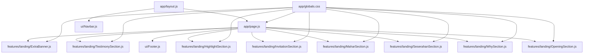
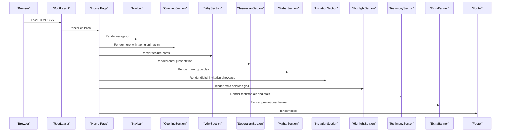
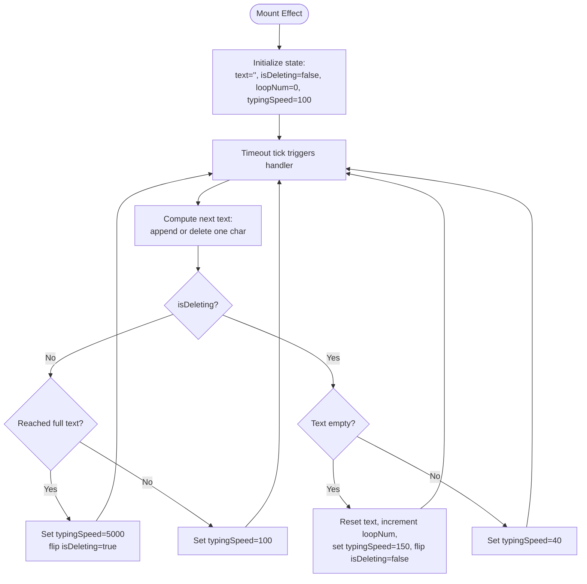
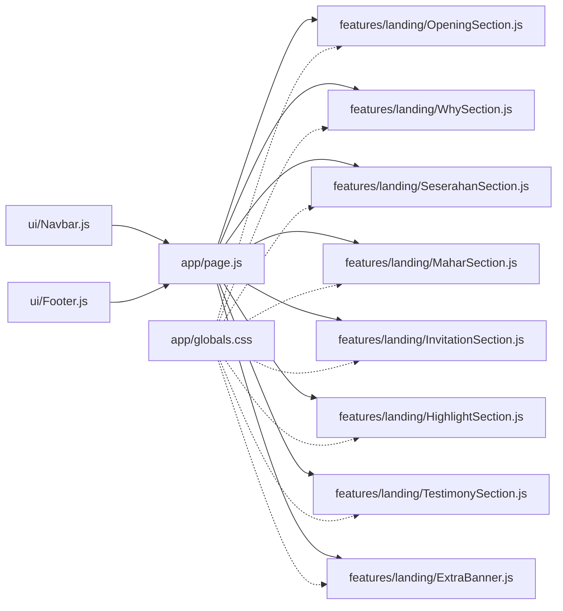

# Service Sections Implementation

<cite>
**Referenced Files in This Document**
- [app/page.js](file://app/page.js)
- [app/layout.js](file://app/layout.js)
- [app/globals.css](file://app/globals.css)
- [components/features/landing/OpeningSection.js](file://components/features/landing/OpeningSection.js)
- [components/features/landing/WhySection.js](file://components/features/landing/WhySection.js)
- [components/features/landing/SeserahanSection.js](file://components/features/landing/SeserahanSection.js)
- [components/features/landing/MaharSection.js](file://components/features/landing/MaharSection.js)
- [components/features/landing/InvitationSection.js](file://components/features/landing/InvitationSection.js)
- [components/features/landing/HighlightSection.js](file://components/features/landing/HighlightSection.js)
- [components/features/landing/TestimonySection.js](file://components/features/landing/TestimonySection.js)
- [components/features/landing/ExtraBanner.js](file://components/features/landing/ExtraBanner.js)
- [components/features/home/ServiceShowcase.js](file://components/features/home/ServiceShowcase.js)
- [components/features/home/Testimonials.js](file://components/features/home/Testimonials.js)
- [components/features/home/ExtrasGrid.js](file://components/features/home/ExtrasGrid.js)
- [components/ui/Navbar.js](file://components/ui/Navbar.js)
- [components/ui/Footer.js](file://components/ui/Footer.js)
</cite>

## Table of Contents
1. [Introduction](#introduction)
2. [Project Structure](#project-structure)
3. [Core Components](#core-components)
4. [Architecture Overview](#architecture-overview)
5. [Detailed Component Analysis](#detailed-component-analysis)
6. [Dependency Analysis](#dependency-analysis)
7. [Performance Considerations](#performance-considerations)
8. [Troubleshooting Guide](#troubleshooting-guide)
9. [Conclusion](#conclusion)

## Introduction
This document explains the service sections implementation for the Momento Client Frontend. It covers the dynamic opening section with typing animation, the "Why Choose Us" feature cards, the Seserahan rental presentation, the Mahar framing display, the digital invitation section, the portfolio/highlight showcase, the testimonial system, and promotional banners. For each section, we describe implementation patterns, interactive elements, content management approaches, responsive design considerations, customization options, and integration with the overall page structure.

## Project Structure
The landing page composes multiple dedicated sections under the features/landing directory, integrated into the main Home page. Global styles define animations, gradients, and reusable components. Navigation and footer provide cross-section UX and branding continuity.

**Diagram sources**
- [app/page.js:14-41](file://app/page.js#L14-L41)
- [app/layout.js:25-34](file://app/layout.js#L25-L34)
- [app/globals.css:30-118](file://app/globals.css#L30-L118)
- [components/features/landing/OpeningSection.js:6-99](file://components/features/landing/OpeningSection.js#L6-L99)
- [components/features/landing/WhySection.js:3-52](file://components/features/landing/WhySection.js#L3-L52)
- [components/features/landing/SeserahanSection.js:4-44](file://components/features/landing/SeserahanSection.js#L4-L44)
- [components/features/landing/MaharSection.js:4-54](file://components/features/landing/MaharSection.js#L4-L54)
- [components/features/landing/InvitationSection.js:6-81](file://components/features/landing/InvitationSection.js#L6-L81)
- [components/features/landing/HighlightSection.js:4-79](file://components/features/landing/HighlightSection.js#L4-L79)
- [components/features/landing/TestimonySection.js:6-183](file://components/features/landing/TestimonySection.js#L6-L183)
- [components/features/landing/ExtraBanner.js:4-29](file://components/features/landing/ExtraBanner.js#L4-L29)
- [components/ui/Navbar.js:17-85](file://components/ui/Navbar.js#L17-L85)
- [components/ui/Footer.js:3-50](file://components/ui/Footer.js#L3-L50)

**Section sources**
- [app/page.js:14-41](file://app/page.js#L14-L41)
- [app/layout.js:25-34](file://app/layout.js#L25-L34)
- [app/globals.css:30-118](file://app/globals.css#L30-L118)

## Core Components
- Dynamic Opening Section: Typing animation with looping and deletion, floating CTA, decorative overlays, and responsive typography.
- Why Choose Us: Feature cards with icons and descriptive copy, organized in a two-row grid.
- Seserahan Rental: Hero headline, location and delivery info, and horizontally scrolling image marquee.
- Mahar Framing: Dual-column layout with gradient overlays, image collage grid, and call-to-action.
- Digital Invitation: Left-aligned text content and a dual-column vertical marquee of invitation mockups.
- Portfolio/Highlights: Grid of extra services with hover effects and gradient text accents.
- Testimonial System: Stat highlights and a vertically scrolling testimonial carousel with avatar and quote.
- Promotional Banner: Full-width gradient banner with centered CTA and messaging.

**Section sources**
- [components/features/landing/OpeningSection.js:6-99](file://components/features/landing/OpeningSection.js#L6-L99)
- [components/features/landing/WhySection.js:3-52](file://components/features/landing/WhySection.js#L3-L52)
- [components/features/landing/SeserahanSection.js:4-44](file://components/features/landing/SeserahanSection.js#L4-L44)
- [components/features/landing/MaharSection.js:4-54](file://components/features/landing/MaharSection.js#L4-L54)
- [components/features/landing/InvitationSection.js:6-81](file://components/features/landing/InvitationSection.js#L6-L81)
- [components/features/landing/HighlightSection.js:4-79](file://components/features/landing/HighlightSection.js#L4-L79)
- [components/features/landing/TestimonySection.js:6-183](file://components/features/landing/TestimonySection.js#L6-L183)
- [components/features/landing/ExtraBanner.js:4-29](file://components/features/landing/ExtraBanner.js#L4-L29)

## Architecture Overview
The Home page orchestrates the sequence of sections. Each section is self-contained with its own layout, animations, and assets. Global CSS defines shared animations and utility classes. Navigation and footer wrap the page for consistent branding and UX.

**Diagram sources**
- [app/layout.js:25-34](file://app/layout.js#L25-L34)
- [app/page.js:14-41](file://app/page.js#L14-L41)
- [components/features/landing/OpeningSection.js:6-99](file://components/features/landing/OpeningSection.js#L6-L99)
- [components/features/landing/WhySection.js:3-52](file://components/features/landing/WhySection.js#L3-L52)
- [components/features/landing/SeserahanSection.js:4-44](file://components/features/landing/SeserahanSection.js#L4-L44)
- [components/features/landing/MaharSection.js:4-54](file://components/features/landing/MaharSection.js#L4-L54)
- [components/features/landing/InvitationSection.js:6-81](file://components/features/landing/InvitationSection.js#L6-L81)
- [components/features/landing/HighlightSection.js:4-79](file://components/features/landing/HighlightSection.js#L4-L79)
- [components/features/landing/TestimonySection.js:6-183](file://components/features/landing/TestimonySection.js#L6-L183)
- [components/features/landing/ExtraBanner.js:4-29](file://components/features/landing/ExtraBanner.js#L4-L29)
- [components/ui/Navbar.js:17-85](file://components/ui/Navbar.js#L17-L85)
- [components/ui/Footer.js:3-50](file://components/ui/Footer.js#L3-L50)

## Detailed Component Analysis

### Dynamic Opening Section with Typing Animation
- Implementation pattern: React state machine with useEffect-driven timers to simulate typing and deleting, adjusting speed and loop count.
- Interactive elements: Animated typewriter effect with a blinking cursor, floating WhatsApp button with hover scaling and glow.
- Content management: Static text array for full message; loop-controlled deletion and re-entry.
- Responsive design: Fluid typography with line-height adjustments and wrapping for multiline titles; padding and spacing adapt to viewport.
- Customization options: Adjust typing speed constants, loop count thresholds, and text content; modify gradient overlay and decorative image.
- Integration: Positioned as the first section; integrates with global animations and gradient utilities.

**Diagram sources**
- [components/features/landing/OpeningSection.js:14-37](file://components/features/landing/OpeningSection.js#L14-L37)

**Section sources**
- [components/features/landing/OpeningSection.js:6-99](file://components/features/landing/OpeningSection.js#L6-L99)
- [app/globals.css:74-118](file://app/globals.css#L74-L118)

### Why Choose Us Feature Cards
- Implementation pattern: Static card components with iconography and descriptive paragraphs; arranged in a two-tier flex layout.
- Interactive elements: Hover lift effect; card dimensions constrained via utility classes.
- Content management: Copy and icon paths are static; easy to swap or localize.
- Responsive design: Flex layout stacks on small screens; fixed widths on larger screens.
- Customization options: Modify card dimensions, colors, and typography; replace icons and texts.
- Integration: Uses shared feature-card utility and gold gradient accents.

**Section sources**
- [components/features/landing/WhySection.js:3-52](file://components/features/landing/WhySection.js#L3-L52)
- [app/globals.css:44-49](file://app/globals.css#L44-L49)

### Seserahan Rental Presentation
- Implementation pattern: Hero headline with large serif font, descriptive paragraph, and horizontally scrolling image marquee using CSS animation.
- Interactive elements: Hover effect on the CTA with arrow translation; infinite loop marquee.
- Content management: Image assets mapped by index; text content localized.
- Responsive design: Centered hero on mobile; marquee adapts to container width.
- Customization options: Change marquee speed, adjust image sizes, update copy and locations.
- Integration: Uses marquee animation utilities and Next/Image for optimized rendering.

**Section sources**
- [components/features/landing/SeserahanSection.js:4-44](file://components/features/landing/SeserahanSection.js#L4-L44)
- [app/globals.css:74-79](file://app/globals.css#L74-L79)

### Mahar Framing Display
- Implementation pattern: Two-column layout with gradient overlays and a precise grid collage of images.
- Interactive elements: Hover brightness on CTA; subtle borders and shadows for depth.
- Content management: Image paths configured per tile; text content localized.
- Responsive design: Stacks on smaller screens; maintains aspect ratios with aspect utilities.
- Customization options: Adjust grid gaps, image proportions, and gradient overlay positions.
- Integration: Leverages marquee utilities and gradient overlays for visual transitions.

**Section sources**
- [components/features/landing/MaharSection.js:4-54](file://components/features/landing/MaharSection.js#L4-L54)
- [app/globals.css:70-72](file://app/globals.css#L70-L72)

### Digital Invitation Section
- Implementation pattern: Split layout with text content on the left and a dual-column vertical marquee of invitation mockups on the right.
- Interactive elements: Dual-direction marquee (up/down) with gradient overlays; hover translation on CTA.
- Content management: Arrays of left and right mockup images; localized feature copy.
- Responsive design: Flex direction flips on medium screens; maintains vertical rhythm.
- Customization options: Add/remove mockups, adjust marquee speeds, and update feature list.
- Integration: Uses marquee utilities and gradient overlays; relies on Next/Image for performance.

**Section sources**
- [components/features/landing/InvitationSection.js:6-81](file://components/features/landing/InvitationSection.js#L6-L81)
- [app/globals.css:88-117](file://app/globals.css#L88-L117)

### Portfolio/Highlight Showcase
- Implementation pattern: Grid of extra services with hover elevation and gradient text accents.
- Interactive elements: Hover lift and border accentuation; icon and title transitions.
- Content management: Static array of items with title, description, and image path.
- Responsive design: Responsive grid with 1–4 columns depending on screen size.
- Customization options: Add new items, change grid breakpoints, and update gradient text.
- Integration: Uses shared gradient utilities and hover effects.

**Section sources**
- [components/features/landing/HighlightSection.js:4-79](file://components/features/landing/HighlightSection.js#L4-L79)
- [app/globals.css:50-55](file://app/globals.css#L50-L55)

### Testimonial System
- Implementation pattern: Two-column layout with statistics and a vertically scrolling testimonial carousel; uses gradient overlays and avatar images.
- Interactive elements: Smooth vertical marquee with extended duration; hover effects on stats and testimonials.
- Content management: Static arrays for stats and testimonials; localized names and dates.
- Responsive design: Flex layout with stacked columns on small screens; maintains readability.
- Customization options: Add testimonials, adjust marquee timing, and customize gradient accents.
- Integration: Uses marquee utilities and gradient overlays; leverages Next/Image for avatars.

**Section sources**
- [components/features/landing/TestimonySection.js:6-183](file://components/features/landing/TestimonySection.js#L6-L183)
- [app/globals.css:112-117](file://app/globals.css#L112-L117)

### Promotional Banner
- Implementation pattern: Full-width gradient background with centered content and a prominent CTA.
- Interactive elements: Hover scale and rotation on CTA; gradient background mapping.
- Content management: Static message and button text; easy to localize.
- Responsive design: Centered content with max-width constraints; padding adjusts across breakpoints.
- Customization options: Change gradient stops, button text, and message content.
- Integration: Uses shared gradient utilities and button styles.

**Section sources**
- [components/features/landing/ExtraBanner.js:4-29](file://components/features/landing/ExtraBanner.js#L4-L29)
- [app/globals.css:70-72](file://app/globals.css#L70-L72)

### Home Page Service Showcase (Alternative Home View)
While the landing page focuses on the features/landing components, the home page also includes a compact service showcase with image and text pairs and testimonials grid. These complement the landing sections and can be used for alternate layouts or mobile-first presentations.

**Section sources**
- [components/features/home/ServiceShowcase.js:30-76](file://components/features/home/ServiceShowcase.js#L30-L76)
- [components/features/home/Testimonials.js:1-39](file://components/features/home/Testimonials.js#L1-L39)
- [components/features/home/ExtrasGrid.js:12-37](file://components/features/home/ExtrasGrid.js#L12-L37)

## Dependency Analysis
- Component coupling: Sections are independent React components imported by the Home page; minimal cross-dependencies.
- Shared utilities: All sections rely on global CSS utilities for animations, gradients, buttons, and typography.
- Navigation and footer: Provide consistent UX and branding across sections.
- Asset dependencies: Sections reference local images and icons; ensure paths match the public directory structure.

**Diagram sources**
- [app/page.js:14-41](file://app/page.js#L14-L41)
- [components/ui/Navbar.js:17-85](file://components/ui/Navbar.js#L17-L85)
- [components/ui/Footer.js:3-50](file://components/ui/Footer.js#L3-L50)
- [app/globals.css:30-118](file://app/globals.css#L30-L118)

**Section sources**
- [app/page.js:14-41](file://app/page.js#L14-L41)
- [app/globals.css:30-118](file://app/globals.css#L30-L118)

## Performance Considerations
- Lazy loading and optimization: Use Next/Image with appropriate sizes and fill to optimize asset delivery.
- Animation performance: Utilize will-change transforms and GPU-accelerated properties for smooth marquee animations.
- Minimize repaints: Prefer transform and opacity changes over layout-affecting properties.
- Bundle size: Keep animation keyframes and utilities scoped to global CSS to avoid duplication.
- Accessibility: Ensure sufficient contrast for gradient text and provide skip links for keyboard navigation.

## Troubleshooting Guide
- Typing animation not updating: Verify state updates and timer cleanup in the effect hook; confirm typingSpeed toggles between modes.
- Marquee not looping: Check animation durations and keyframes; ensure container widths accommodate full content.
- Images not loading: Confirm image paths exist under the public directory and filenames match imports.
- Gradient overlays missing: Ensure gradient utilities are applied and z-index stacking is correct for layered effects.
- Navigation scroll behavior: Validate scroll event listeners and backdrop blur conditions in Navbar.

**Section sources**
- [components/features/landing/OpeningSection.js:14-37](file://components/features/landing/OpeningSection.js#L14-L37)
- [components/features/landing/InvitationSection.js:48-76](file://components/features/landing/InvitationSection.js#L48-L76)
- [components/features/landing/TestimonySection.js:140-168](file://components/features/landing/TestimonySection.js#L140-L168)
- [components/ui/Navbar.js:17-27](file://components/ui/Navbar.js#L17-L27)

## Conclusion
The service sections are implemented as cohesive, self-contained components that share a unified design system and animations. They emphasize visual storytelling, responsive layouts, and smooth interactions. By leveraging global CSS utilities and Next/Image, the implementation balances maintainability and performance while offering clear customization hooks for content and visuals.