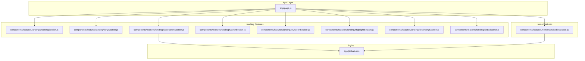
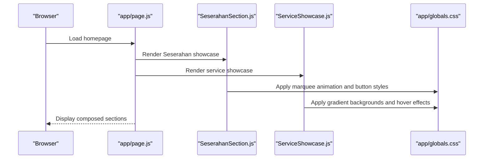
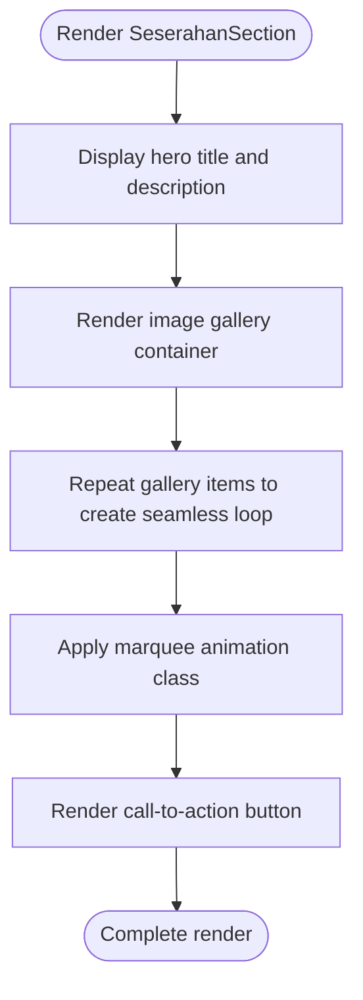
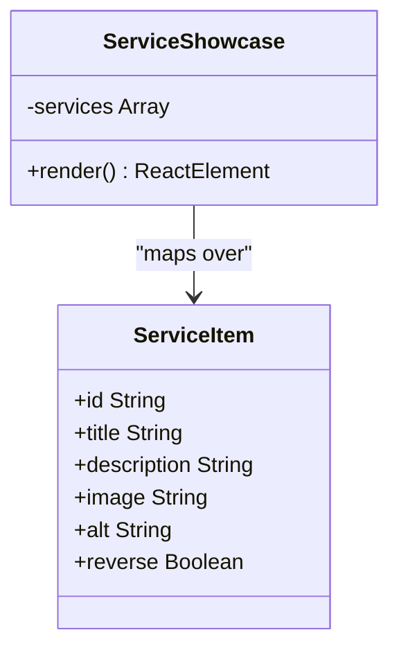
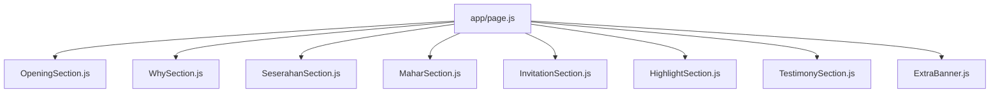
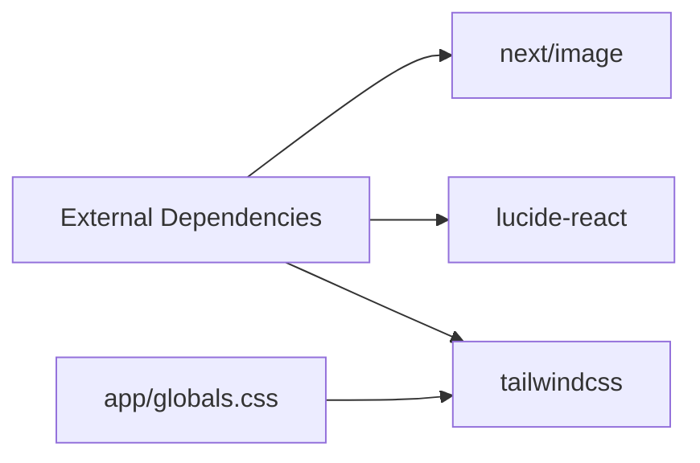

# Seserahan Rental Showcase

<cite>
**Referenced Files in This Document**
- [SeserahanSection.js](file://components/features/landing/SeserahanSection.js)
- [ServiceShowcase.js](file://components/features/home/ServiceShowcase.js)
- [page.js](file://app/page.js)
- [globals.css](file://app/globals.css)
- [OpeningSection.js](file://components/features/landing/OpeningSection.js)
- [HighlightSection.js](file://components/features/landing/HighlightSection.js)
- [package.json](file://package.json)
</cite>

## Table of Contents
1. [Introduction](#introduction)
2. [Project Structure](#project-structure)
3. [Core Components](#core-components)
4. [Architecture Overview](#architecture-overview)
5. [Detailed Component Analysis](#detailed-component-analysis)
6. [Dependency Analysis](#dependency-analysis)
7. [Performance Considerations](#performance-considerations)
8. [Troubleshooting Guide](#troubleshooting-guide)
9. [Conclusion](#conclusion)

## Introduction
This document provides comprehensive documentation for the Seserahan rental showcase component within the Momento client frontend. It focuses on the presentation format for rental items, the image gallery implementation, pricing display strategies, and service description layouts. Additionally, it explains the component's content management approach, responsive design patterns, and integration with the overall service showcase. Practical examples demonstrate how to customize item displays, manage content arrays, and implement interactive elements.

## Project Structure
The Seserahan showcase is part of a modular Next.js application that organizes features by domain (landing vs home) and integrates them into a cohesive homepage layout. The key files involved in the Seserahan showcase are:

- Landing feature section containing the Seserahan showcase
- Home feature showcasing services with a flexible layout
- Global styles defining animations and responsive utilities
- Page composition integrating all sections

**Diagram sources**
- [page.js:14-41](file://app/page.js#L14-L41)
- [SeserahanSection.js:4-44](file://components/features/landing/SeserahanSection.js#L4-L44)
- [ServiceShowcase.js:30-76](file://components/features/home/ServiceShowcase.js#L30-L76)
- [globals.css:30-118](file://app/globals.css#L30-L118)

**Section sources**
- [page.js:14-41](file://app/page.js#L14-L41)
- [SeserahanSection.js:4-44](file://components/features/landing/SeserahanSection.js#L4-L44)
- [ServiceShowcase.js:30-76](file://components/features/home/ServiceShowcase.js#L30-L76)
- [globals.css:30-118](file://app/globals.css#L30-L118)

## Core Components
This section outlines the primary components relevant to the Seserahan rental showcase and how they present rental items, manage content, and integrate with the broader service showcase.

- SeserahanSection: Displays a hero-style presentation for rental items with an animated image gallery and a call-to-action button.
- ServiceShowcase: Provides a flexible layout for showcasing multiple services, including Seserahan, with image and text content, hover effects, and responsive behavior.
- page.js: Composes the homepage by rendering all feature sections, including SeserahanSection and ServiceShowcase.
- globals.css: Defines global animations (marquee), gradients, and utility classes that support the showcase components.

Key responsibilities:
- Presentation: Titles, descriptions, and visual emphasis for rental services.
- Content Management: Arrays of items and metadata for dynamic rendering.
- Interactivity: Hover effects, transitions, and navigation cues.
- Responsiveness: Flexible layouts adapting to different screen sizes.

**Section sources**
- [SeserahanSection.js:4-44](file://components/features/landing/SeserahanSection.js#L4-L44)
- [ServiceShowcase.js:30-76](file://components/features/home/ServiceShowcase.js#L30-L76)
- [page.js:14-41](file://app/page.js#L14-L41)
- [globals.css:30-118](file://app/globals.css#L30-L118)

## Architecture Overview
The Seserahan showcase integrates seamlessly into the homepage composition. The page orchestrates multiple feature sections, positioning the Seserahan showcase prominently within the landing feature stack. The ServiceShowcase component complements this by offering a structured layout for service presentations, enabling consistent styling and interaction patterns across the site.

**Diagram sources**
- [page.js:14-41](file://app/page.js#L14-L41)
- [SeserahanSection.js:4-44](file://components/features/landing/SeserahanSection.js#L4-L44)
- [ServiceShowcase.js:30-76](file://components/features/home/ServiceShowcase.js#L30-L76)
- [globals.css:30-118](file://app/globals.css#L30-L118)

## Detailed Component Analysis

### SeserahanSection: Image Gallery and Call-to-Action
The SeserahanSection component presents a visually engaging showcase for rental items using an animated image gallery and a prominent call-to-action button. It demonstrates:

- Hero presentation: Large typography and descriptive text emphasizing service availability and delivery options.
- Animated gallery: A horizontally scrolling marquee of rental item images with seamless repetition.
- Interactive button: A styled button with hover effects and arrow animation.

Implementation highlights:
- Image gallery: Uses a repeated array pattern to create a continuous loop effect, with each item rendered as a responsive image container.
- Animation: A marquee animation class applies smooth horizontal movement to the gallery container.
- Button styling: Utilizes global button utilities for consistent appearance and hover behavior.

**Diagram sources**
- [SeserahanSection.js:4-44](file://components/features/landing/SeserahanSection.js#L4-L44)
- [globals.css:74-86](file://app/globals.css#L74-L86)

**Section sources**
- [SeserahanSection.js:4-44](file://components/features/landing/SeserahanSection.js#L4-L44)
- [globals.css:30-118](file://app/globals.css#L30-L118)

### ServiceShowcase: Flexible Layout for Services
The ServiceShowcase component provides a flexible layout for presenting multiple services, including Seserahan. It showcases:

- Dynamic content arrays: Services are defined as an array of objects with consistent keys for id, title, description, image, alt, and reverse.
- Responsive layout: Flexbox-based layout adapts to mobile and desktop widths, with optional reversal for alternating content order.
- Interactive elements: Hover effects on images and buttons enhance user engagement.
- Styling consistency: Global utilities and gradients ensure uniform appearance across services.

**Diagram sources**
- [ServiceShowcase.js:30-76](file://components/features/home/ServiceShowcase.js#L30-L76)

**Section sources**
- [ServiceShowcase.js:30-76](file://components/features/home/ServiceShowcase.js#L30-L76)

### Page Composition: Integrating the Showcase
The homepage composes multiple feature sections, positioning the Seserahan showcase alongside other services and highlights. This integration ensures a cohesive user experience and consistent branding across the site.

**Diagram sources**
- [page.js:14-41](file://app/page.js#L14-L41)

**Section sources**
- [page.js:14-41](file://app/page.js#L14-L41)

## Dependency Analysis
The Seserahan showcase relies on several external libraries and internal utilities:

- Next.js Image: Used for optimized image rendering with automatic sizing and responsive behavior.
- Lucide React: Provides SVG icons for interactive elements such as arrows.
- Tailwind CSS: Supplies utility classes for styling, animations, and responsive layouts.
- Global animations: Marquee animation classes enable seamless looping of the image gallery.

**Diagram sources**
- [package.json:11-23](file://package.json#L11-L23)
- [globals.css:30-118](file://app/globals.css#L30-L118)

**Section sources**
- [package.json:11-23](file://package.json#L11-L23)
- [globals.css:30-118](file://app/globals.css#L30-L118)

## Performance Considerations
- Image optimization: The Next.js Image component automatically optimizes images for different screen sizes and formats, reducing bandwidth usage and improving load times.
- Animation efficiency: The marquee animation uses CSS transforms and keyframes, which are GPU-accelerated and performant for continuous motion.
- Minimal reflows: The layout uses flexbox and grid utilities to minimize layout thrashing during responsive adjustments.
- Lazy loading: Images are loaded progressively, with priority given to hero sections to ensure immediate visual impact.

## Troubleshooting Guide
Common issues and resolutions:

- Image gallery not animating:
  - Verify the marquee animation class is applied to the gallery container.
  - Ensure the animation keyframes are defined in global styles.
  - Confirm the gallery container has sufficient width to accommodate repeated items.

- Button hover effects not appearing:
  - Check that global button utilities are included in the stylesheet.
  - Verify the button element uses the correct class names for hover states.

- Responsive layout breaking on small screens:
  - Use responsive utility classes to adjust spacing and alignment.
  - Ensure flexbox and grid containers adapt appropriately to smaller viewports.

- Content not updating:
  - Confirm the content arrays are correctly structured and passed to the components.
  - Verify that keys used for mapping match the array elements.

**Section sources**
- [globals.css:74-86](file://app/globals.css#L74-L86)
- [SeserahanSection.js:4-44](file://components/features/landing/SeserahanSection.js#L4-L44)
- [ServiceShowcase.js:30-76](file://components/features/home/ServiceShowcase.js#L30-L76)

## Conclusion
The Seserahan rental showcase component delivers a compelling presentation of rental items through an animated image gallery and a clear call-to-action. Its integration with the broader service showcase ensures consistent styling and user experience across the site. By leveraging Next.js Image optimization, Tailwind utilities, and global animations, the component achieves both visual appeal and performance. The modular structure allows for easy customization of item displays, management of content arrays, and implementation of interactive elements, making it adaptable to evolving business needs.