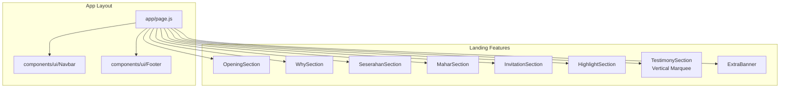
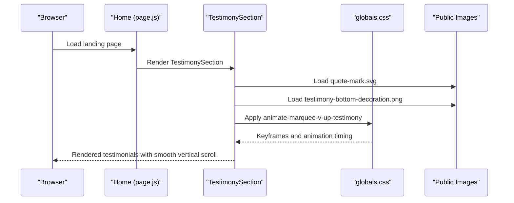
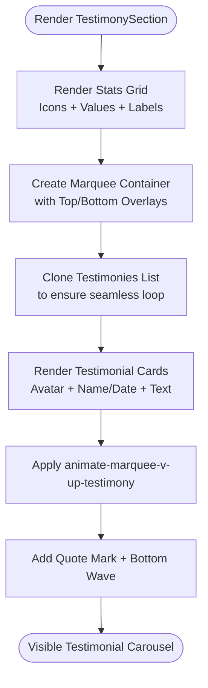
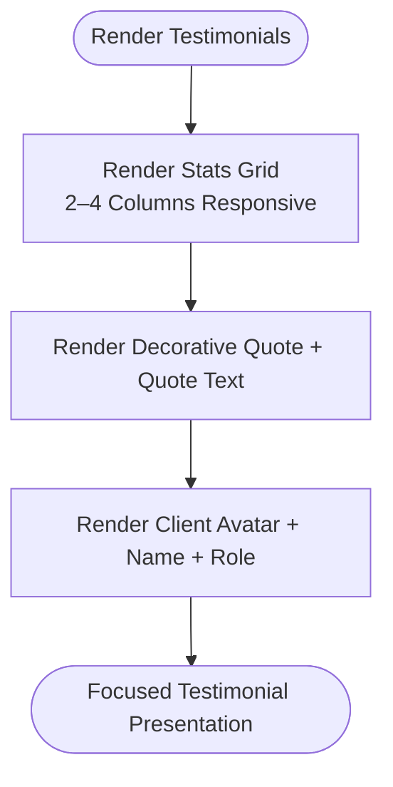
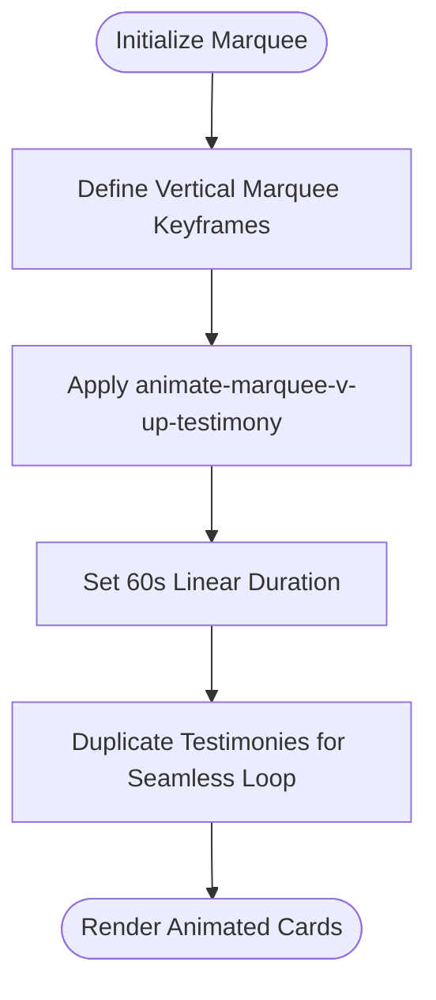
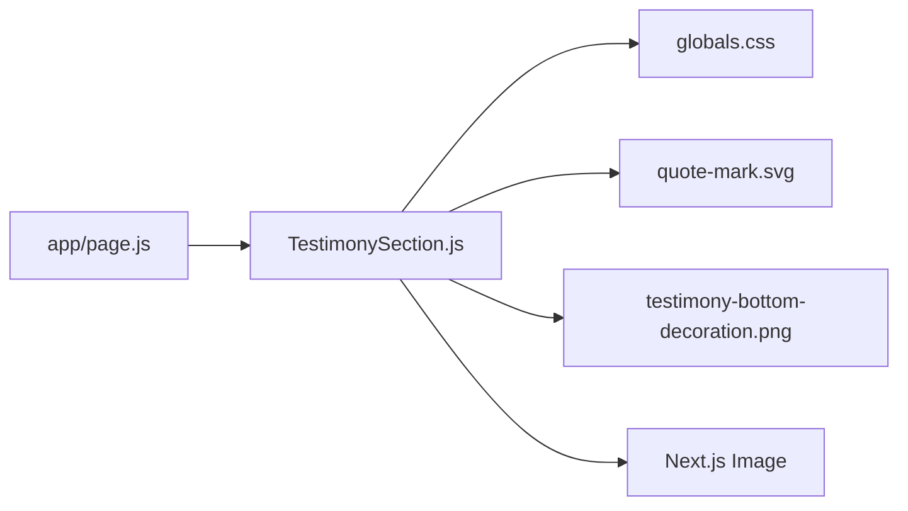

# Testimonial System

<cite>
**Referenced Files in This Document**
- [TestimonySection.js](file://components/features/landing/TestimonySection.js)
- [Testimonials.js](file://components/features/home/Testimonials.js)
- [page.js](file://app/page.js)
- [globals.css](file://app/globals.css)
- [quote-mark.svg](file://public/images/testimonies/quote-mark.svg)
- [testimony-bottom-decoration.png](file://public/images/testimonies/testimony-bottom-decoration.png)
- [conversation-2.md](file://conversation-2.md)
</cite>

## Table of Contents
1. [Introduction](#introduction)
2. [Project Structure](#project-structure)
3. [Core Components](#core-components)
4. [Architecture Overview](#architecture-overview)
5. [Detailed Component Analysis](#detailed-component-analysis)
6. [Dependency Analysis](#dependency-analysis)
7. [Performance Considerations](#performance-considerations)
8. [Troubleshooting Guide](#troubleshooting-guide)
9. [Conclusion](#conclusion)

## Introduction
This document explains the testimonial system used to present client feedback and social proof on the landing page. It covers the testimonial carousel implementation, rating display logic, client feedback presentation, and social proof integration. It also documents state management for testimonials, automatic rotation controls, and responsive design patterns. Practical guidance is included for adding new testimonials, managing client photos, and implementing interactive elements such as ratings and reviews.

## Project Structure
The testimonial system is implemented as two primary components:
- A dedicated testimonial section that renders a vertical marquee of client testimonials with statistics and decorative elements.
- A simplified testimonials showcase that displays a highlighted testimonial quote and a stats grid.

These components are integrated into the main landing page layout.

**Diagram sources**
- [page.js:14-41](file://app/page.js#L14-L41)
- [TestimonySection.js:60-182](file://components/features/landing/TestimonySection.js#L60-L182)

**Section sources**
- [page.js:14-41](file://app/page.js#L14-L41)

## Core Components
- TestimonySection: Implements a vertical marquee of testimonials with statistics, decorative overlays, and premium styling.
- Testimonials: Provides a focused testimonial quote and a stats grid for quick social proof.

Key responsibilities:
- Render testimonial cards with client avatar, name/date, and feedback text.
- Provide animated vertical scrolling for testimonials.
- Display achievement statistics with icons.
- Integrate seamlessly into the landing page layout.

**Section sources**
- [TestimonySection.js:6-183](file://components/features/landing/TestimonySection.js#L6-L183)
- [Testimonials.js:1-40](file://components/features/home/Testimonials.js#L1-L40)

## Architecture Overview
The testimonial system relies on:
- Component composition: TestimonySection is rendered inside the main Home page.
- CSS animations: A dedicated vertical marquee animation class drives continuous scrolling.
- Static assets: SVG quote mark and decorative PNG enhance visual presentation.
- Responsive design: Tailwind-based layout adapts to mobile and desktop screens.

**Diagram sources**
- [page.js:14-41](file://app/page.js#L14-L41)
- [TestimonySection.js:60-182](file://components/features/landing/TestimonySection.js#L60-L182)
- [globals.css:112-117](file://app/globals.css#L112-L117)

## Detailed Component Analysis

### TestimonySection: Vertical Marquee Testimonials
This component presents a continuous vertical scroll of client testimonials alongside achievement statistics and decorative elements.

- Data model:
  - Statistics: Array of objects with icon, value, and label.
  - Testimonies: Array of objects with name, date, image path, and text.
- Rendering:
  - Left column: Premium statistics with custom SVG icons and gradient text.
  - Right column: Vertical marquee container with overlay gradients for smooth blending.
  - Testimonial cards: Each card includes client avatar, name/date, and feedback text.
- Animation:
  - Uses a dedicated CSS class that applies a vertical marquee keyframe with a 60-second duration for readability.
- Decorative elements:
  - Quote mark icon positioned above the section title.
  - Bottom wave decoration asset for premium feel.

**Diagram sources**
- [TestimonySection.js:60-182](file://components/features/landing/TestimonySection.js#L60-L182)
- [globals.css:112-117](file://app/globals.css#L112-L117)

**Section sources**
- [TestimonySection.js:6-183](file://components/features/landing/TestimonySection.js#L6-L183)
- [globals.css:88-117](file://app/globals.css#L88-L117)
- [quote-mark.svg](file://public/images/testimonies/quote-mark.svg)
- [testimony-bottom-decoration.png](file://public/images/testimonies/testimony-bottom-decoration.png)

### Testimonials: Focused Testimonial Showcase
This component highlights a single testimonial quote with a decorative quote mark and a stats grid below.

- Data model:
  - Stats: Array of objects with label and value.
- Rendering:
  - Centralized testimonial quote with serif typography and italic emphasis.
  - Client avatar placeholder and metadata (name and role).
  - Stats grid with four columns on medium screens and two columns on small screens.

**Diagram sources**
- [Testimonials.js:10-37](file://components/features/home/Testimonials.js#L10-L37)

**Section sources**
- [Testimonials.js:1-40](file://components/features/home/Testimonials.js#L1-L40)

### Rating Display Logic
- Current implementation: No explicit star ratings or numerical scores are shown in the testimonial components.
- Recommended approach: Add a rating component within each testimonial card (e.g., five stars with dynamic coloring) and integrate it into the testimonies array. This would require:
  - Extending the testimonies data model to include a rating property.
  - Creating a reusable star rating component.
  - Updating the testimonial card rendering to display the rating.

[No sources needed since this section proposes a future enhancement]

### Client Feedback Presentation
- Testimonial cards include:
  - Client avatar (image).
  - Name and date.
  - Feedback text with readable line height and spacing.
- Styling emphasizes premium feel with gold accents and subtle borders.

**Section sources**
- [TestimonySection.js:144-168](file://components/features/landing/TestimonySection.js#L144-L168)

### Social Proof Integration
- Achievement statistics are displayed prominently on the left side of the TestimonySection.
- The stats grid reinforces trust and perceived quality through measurable outcomes.

**Section sources**
- [TestimonySection.js:87-135](file://components/features/landing/TestimonySection.js#L87-L135)

### State Management for Testimonials
- Current state: Static arrays defined within the components.
- Recommendations:
  - Move testimonies and stats to a centralized configuration file or CMS-backed data source.
  - Use React state hooks for dynamic updates (e.g., filtering by service category).
  - Implement pagination or lazy loading for large testimonial sets.

**Section sources**
- [TestimonySection.js:15-58](file://components/features/landing/TestimonySection.js#L15-L58)
- [Testimonials.js:2-7](file://components/features/home/Testimonials.js#L2-L7)

### Automatic Rotation Controls
- Implementation: CSS keyframes and animation classes drive continuous vertical scrolling.
- Timing: 60 seconds duration to ensure readability during motion.
- Seamless looping: Duplicate testimonies list to prevent abrupt jumps at loop boundaries.

**Diagram sources**
- [globals.css:88-117](file://app/globals.css#L88-L117)
- [TestimonySection.js:144-168](file://components/features/landing/TestimonySection.js#L144-L168)

**Section sources**
- [globals.css:88-117](file://app/globals.css#L88-L117)
- [TestimonySection.js:144-168](file://components/features/landing/TestimonySection.js#L144-L168)

### Responsive Design Patterns
- Mobile-first layout with responsive breakpoints:
  - TestimonySection switches from a single column to a two-column layout on larger screens.
  - Stats grid adjusts from two to four columns depending on screen size.
- Typography scaling ensures readability across devices.
- Overlay gradients and rounded containers maintain visual consistency.

**Section sources**
- [TestimonySection.js:65-136](file://components/features/landing/TestimonySection.js#L65-L136)
- [Testimonials.js:10-20](file://components/features/home/Testimonials.js#L10-L20)

### Adding New Testimonials
Steps to add a new testimonial:
1. Place the client photo in the designated images directory.
2. Extend the testimonials array with a new entry containing:
   - name: Client’s full name.
   - date: Event or testimonial date.
   - img: Path to the client photo.
   - text: Feedback content.
3. Verify the image path and ensure the asset is served correctly.
4. Confirm the marquee animation continues seamlessly after adding the new item.

**Section sources**
- [TestimonySection.js:15-58](file://components/features/landing/TestimonySection.js#L15-L58)

### Managing Client Photos
- Store images under the public images directory used by the testimonials.
- Ensure consistent sizing and aspect ratios for avatars.
- Use Next.js Image component for optimal performance and responsiveness.

**Section sources**
- [TestimonySection.js:157-159](file://components/features/landing/TestimonySection.js#L157-L159)

### Implementing Interactive Elements (Ratings and Reviews)
Proposed enhancements:
- Add a rating component (e.g., five stars) to each testimonial card.
- Allow users to filter testimonials by rating or service category.
- Integrate with a CMS or external API for dynamic content updates.

[No sources needed since this section proposes a future enhancement]

## Dependency Analysis
The testimonial system depends on:
- Component composition: TestimonySection is rendered by the Home page.
- CSS animations: globals.css defines marquee keyframes and animation classes.
- Static assets: SVG and PNG assets for decorative elements.
- Next.js Image: Used for client avatars and decorative images.

**Diagram sources**
- [page.js:14-41](file://app/page.js#L14-L41)
- [TestimonySection.js:60-182](file://components/features/landing/TestimonySection.js#L60-L182)
- [globals.css:112-117](file://app/globals.css#L112-L117)

**Section sources**
- [page.js:14-41](file://app/page.js#L14-L41)
- [TestimonySection.js:60-182](file://components/features/landing/TestimonySection.js#L60-L182)
- [globals.css:112-117](file://app/globals.css#L112-L117)

## Performance Considerations
- Animation performance: The marquee uses transform-based keyframes and will-change to optimize GPU acceleration.
- Asset optimization: Next.js Image handles responsive sizing and compression for avatars and decorations.
- Minimize reflows: Static arrays and pure rendering reduce unnecessary re-renders.
- Lazy loading: Consider lazy-loading testimonials if the list grows significantly.

[No sources needed since this section provides general guidance]

## Troubleshooting Guide
Common issues and resolutions:
- Testimonial images not loading:
  - Verify the image paths in the testimonials array match the actual file locations.
  - Ensure the images are placed under the public images directory.
- Marquee animation not smooth:
  - Confirm the animate-marquee-v-up-testimony class is applied to the container.
  - Check that the keyframes are defined in globals.css.
- Quote mark or decorative assets missing:
  - Ensure the assets are present in the public images directory and referenced correctly.
- Layout shifts on mobile:
  - Adjust responsive breakpoints and ensure consistent aspect ratios for images.

**Section sources**
- [TestimonySection.js:15-58](file://components/features/landing/TestimonySection.js#L15-L58)
- [globals.css:112-117](file://app/globals.css#L112-L117)
- [quote-mark.svg](file://public/images/testimonies/quote-mark.svg)
- [testimony-bottom-decoration.png](file://public/images/testimonies/testimony-bottom-decoration.png)

## Conclusion
The testimonial system delivers a visually compelling presentation of client feedback and social proof. The vertical marquee animation, premium styling, and responsive design combine to reinforce trust and brand quality. Future enhancements could include explicit rating displays, dynamic filtering, and centralized content management to support scalable growth.