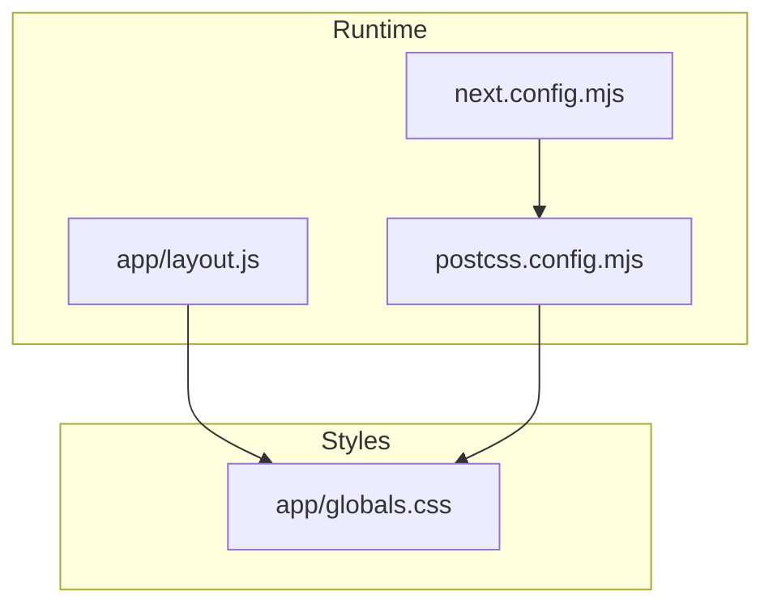
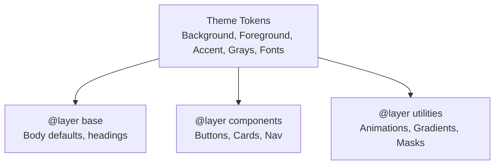
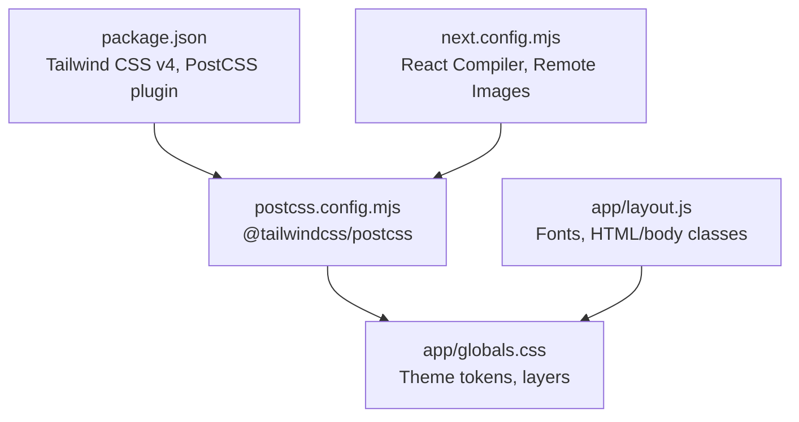

# Styling & Theming Strategy

<cite>
**Referenced Files in This Document**
- [app/globals.css](file://app/globals.css)
- [app/layout.js](file://app/layout.js)
- [postcss.config.mjs](file://postcss.config.mjs)
- [package.json](file://package.json)
- [next.config.mjs](file://next.config.mjs)
- [components/ui/Navbar.js](file://components/ui/Navbar.js)
- [components/ui/Footer.js](file://components/ui/Footer.js)
- [components/features/home/ServiceShowcase.js](file://components/features/home/ServiceShowcase.js)
- [components/features/home/ExtrasGrid.js](file://components/features/home/ExtrasGrid.js)
- [components/features/landing/OpeningSection.js](file://components/features/landing/OpeningSection.js)
- [components/features/landing/WhySection.js](file://components/features/landing/WhySection.js)
- [components/features/home/Testimonials.js](file://components/features/home/Testimonials.js)
</cite>

## Table of Contents
1. [Introduction](#introduction)
2. [Project Structure](#project-structure)
3. [Core Components](#core-components)
4. [Architecture Overview](#architecture-overview)
5. [Detailed Component Analysis](#detailed-component-analysis)
6. [Dependency Analysis](#dependency-analysis)
7. [Performance Considerations](#performance-considerations)
8. [Troubleshooting Guide](#troubleshooting-guide)
9. [Conclusion](#conclusion)
10. [Appendices](#appendices)

## Introduction
This document defines the styling and theming strategy for the Momento Client Frontend. It explains the Tailwind CSS v4 implementation, the theme system configuration, and how design tokens are organized. It documents the gold-themed aesthetic, the typography hierarchy across three distinct font families, color palette management, and responsive design principles. It also covers the global styling approach, component-level styling patterns, customization options, and best practices for maintaining visual consistency and extending the theme system.

## Project Structure
The styling system is built around a single global stylesheet that defines design tokens and reusable utilities, and a minimal runtime configuration that wires Tailwind CSS v4 into the Next.js build pipeline.

- Global styles define:
  - Theme tokens (colors, fonts)
  - Base layer styles (typography, body defaults)
  - Components layer utilities (buttons, cards, links)
  - Utilities layer (animations, gradients, masks)
- Runtime configuration:
  - PostCSS plugin for Tailwind CSS v4
  - Next.js configuration enabling React Compiler and remote image optimization

**Diagram sources**
- [app/layout.js:1-35](file://app/layout.js#L1-L35)
- [postcss.config.mjs:1-8](file://postcss.config.mjs#L1-L8)
- [next.config.mjs:1-16](file://next.config.mjs#L1-L16)
- [app/globals.css:1-118](file://app/globals.css#L1-L118)

**Section sources**
- [app/layout.js:1-35](file://app/layout.js#L1-L35)
- [postcss.config.mjs:1-8](file://postcss.config.mjs#L1-L8)
- [next.config.mjs:1-16](file://next.config.mjs#L1-L16)
- [app/globals.css:1-118](file://app/globals.css#L1-L118)

## Core Components
The styling system centers on a small set of reusable design tokens and utility classes that enforce a consistent gold-themed aesthetic across components.

- Theme tokens
  - Background and foreground colors
  - Accent colors (gold palette)
  - Card and navbar backgrounds
  - Gray palette for text and borders
- Typography tokens
  - Serif (Cinzel) for headings
  - Sans (Inter) for body copy
  - Navigation font (Montserrat) for navigation
- Layered styles
  - Base layer sets global defaults and heading fonts
  - Components layer defines button variants, cards, and nav links
  - Utilities layer defines animations, gradients, and masks

Key patterns:
- Use of CSS custom properties for theme tokens
- Tailwind’s @layer directives to organize styles
- Utility-first composition with component-specific classes

**Section sources**
- [app/globals.css:3-16](file://app/globals.css#L3-L16)
- [app/globals.css:18-28](file://app/globals.css#L18-L28)
- [app/globals.css:30-55](file://app/globals.css#L30-L55)
- [app/globals.css:57-79](file://app/globals.css#L57-L79)

## Architecture Overview
The styling architecture is a layered approach:
- Tokens: Centralized in the global stylesheet
- Base: Establishes typography and body defaults
- Components: Reusable UI patterns (buttons, cards, nav)
- Utilities: Animations, gradients, and masks
- Fonts: Loaded via Next.js font optimization and exposed as CSS variables

**Diagram sources**
- [app/globals.css:3-16](file://app/globals.css#L3-L16)
- [app/globals.css:18-28](file://app/globals.css#L18-L28)
- [app/globals.css:30-55](file://app/globals.css#L30-L55)
- [app/globals.css:57-79](file://app/globals.css#L57-L79)

**Section sources**
- [app/globals.css:1-118](file://app/globals.css#L1-L118)

## Detailed Component Analysis

### Global Styles and Theme Tokens
- Theme tokens define the gold aesthetic and neutral palette. They are consumed by:
  - Body background and text color
  - Accent colors for highlights and buttons
  - Card and navbar backgrounds
  - Grayscale for secondary text and borders
- Typography tokens bind Google Fonts to CSS variables for consistent usage across components.

Implementation highlights:
- CSS custom properties for tokens
- Font variables applied at the HTML and body level
- Headings explicitly mapped to the serif font

**Section sources**
- [app/globals.css:3-16](file://app/globals.css#L3-L16)
- [app/layout.js:1-35](file://app/layout.js#L1-L35)

### Buttons and Interactive Elements
- Gold gradient button variant with hover and active states
- Outlined gold button variant with uppercase tracking
- Navigation link styling with gold hover and tracking
- Text highlight using a gold gradient text effect

Patterns:
- Compose utility classes for spacing, transitions, and shadows
- Use accent tokens consistently for hover and active states
- Maintain consistent sizing and typography across buttons

**Section sources**
- [app/globals.css:31-38](file://app/globals.css#L31-L38)
- [app/globals.css:40-42](file://app/globals.css#L40-L42)
- [app/globals.css:51-54](file://app/globals.css#L51-L54)

### Navigation Bar
- Fixed positioning with scroll-aware background
- Gold-accented active underline
- Responsive layout with mobile toggle
- Consistent use of navigation font and tracking

Styling approach:
- Conditional background classes based on scroll state
- Active state underline using a gradient
- Consistent gold border and text on action button

**Section sources**
- [components/ui/Navbar.js:17-86](file://components/ui/Navbar.js#L17-L86)

### Footer
- Dark background with gold accents
- Grid-based layout for links
- Consistent typography and spacing

Styling approach:
- Use of gold for headings and link highlights
- Responsive layout with stacked columns on smaller screens

**Section sources**
- [components/ui/Footer.js:3-51](file://components/ui/Footer.js#L3-L51)

### Service Showcase
- Feature cards with glass-like backgrounds and hover effects
- Image overlays with gradient and scale transitions
- Gold accent text and button styling

Styling approach:
- Compose utility classes for aspect ratio, overflow, and transitions
- Use accent tokens for highlights and hover states
- Maintain consistent spacing and typography

**Section sources**
- [components/features/home/ServiceShowcase.js:30-77](file://components/features/home/ServiceShowcase.js#L30-L77)

### Extras Grid
- Responsive grid of feature items
- Hover effects with scaling and border accents
- Gold gradient text for titles

Styling approach:
- Use of grid and gap utilities for responsive layout
- Consistent hover states across items
- Typography tokens for headings and labels

**Section sources**
- [components/features/home/ExtrasGrid.js:12-38](file://components/features/home/ExtrasGrid.js#L12-L38)

### Opening Section (Hero)
- Hero button with precise dimensions and gold gradient
- Animated headline with typewriter effect
- Decorative elements with gold accents

Styling approach:
- Fixed button dimensions for pixel-perfect alignment
- Gold gradient text and button with shadow
- Consistent use of typography tokens for headings and subheadings

**Section sources**
- [components/features/landing/OpeningSection.js:6-99](file://components/features/landing/OpeningSection.js#L6-L99)

### Why Section (Feature Cards)
- Feature cards with fixed dimensions and consistent layout
- Gold gradient background for the section
- Responsive grid with locked card sizes

Styling approach:
- Explicit width and height classes to lock card dimensions
- Consistent typography and spacing across cards
- Use of utility classes for responsive behavior

**Section sources**
- [components/features/landing/WhySection.js:5-53](file://components/features/landing/WhySection.js#L5-L53)

### Testimonials
- Stats grid with gold accents
- Quote block with decorative SVG
- Avatar and metadata styling

Styling approach:
- Use of accent tokens for stats and decorative elements
- Consistent typography and spacing for readability

**Section sources**
- [components/features/home/Testimonials.js:1-40](file://components/features/home/Testimonials.js#L1-L40)

## Dependency Analysis
The styling system depends on:
- Tailwind CSS v4 via the PostCSS plugin
- Next.js font optimization for typography
- Runtime configuration enabling React Compiler and remote image optimization

**Diagram sources**
- [package.json:17-23](file://package.json#L17-L23)
- [next.config.mjs:1-16](file://next.config.mjs#L1-L16)
- [postcss.config.mjs:1-8](file://postcss.config.mjs#L1-L8)
- [app/layout.js:1-35](file://app/layout.js#L1-L35)
- [app/globals.css:1-118](file://app/globals.css#L1-L118)

**Section sources**
- [package.json:17-23](file://package.json#L17-L23)
- [next.config.mjs:1-16](file://next.config.mjs#L1-L16)
- [postcss.config.mjs:1-8](file://postcss.config.mjs#L1-L8)
- [app/layout.js:1-35](file://app/layout.js#L1-L35)
- [app/globals.css:1-118](file://app/globals.css#L1-L118)

## Performance Considerations
- Keep theme tokens centralized to minimize CSS duplication
- Prefer utility classes for common patterns to reduce custom CSS
- Use Tailwind’s JIT features (enabled by default in v4) to scope styles efficiently
- Avoid excessive nesting; favor flat compositions for maintainability
- Use Next.js image optimization for hero and feature imagery to reduce payload

## Troubleshooting Guide
Common issues and resolutions:
- Typography not applied: Ensure font variables are attached to the HTML element and body classes are present
- Gold accents missing: Verify accent tokens are used consistently across components
- Buttons misaligned: Confirm fixed dimensions and tracking classes are applied as intended
- Hover states inconsistent: Use component variants defined in the components layer for predictable behavior
- Animations not smooth: Ensure transitions and transforms leverage hardware acceleration where possible

**Section sources**
- [app/layout.js:25-35](file://app/layout.js#L25-L35)
- [app/globals.css:31-38](file://app/globals.css#L31-L38)
- [components/ui/Navbar.js:71-76](file://components/ui/Navbar.js#L71-L76)

## Conclusion
The Momento Client Frontend employs a clean, token-driven styling strategy with Tailwind CSS v4. The gold-themed aesthetic is enforced through centralized theme tokens, consistent typography across three font families, and reusable component utilities. By adhering to the layered approach and utility-first patterns, teams can maintain visual consistency while extending the system with confidence.

## Appendices

### Design Token Reference
- Background and foreground colors
- Accent colors (gold palette)
- Card and navbar backgrounds
- Gray palette for text and borders
- Typography tokens for serif, sans, and navigation fonts

**Section sources**
- [app/globals.css:3-16](file://app/globals.css#L3-L16)

### Typography Hierarchy
- Serif (Cinzel) for headings
- Sans (Inter) for body copy
- Navigation font (Montserrat) for navigation links

**Section sources**
- [app/globals.css:13-15](file://app/globals.css#L13-L15)
- [app/layout.js:4-18](file://app/layout.js#L4-L18)

### Responsive Design Principles
- Use grid and flex utilities for responsive layouts
- Lock critical component dimensions with explicit width and height classes
- Apply consistent spacing and typography scales across breakpoints

**Section sources**
- [components/features/landing/WhySection.js:8-30](file://components/features/landing/WhySection.js#L8-L30)
- [components/features/home/ServiceShowcase.js:34-40](file://components/features/home/ServiceShowcase.js#L34-L40)

### Customization Guidelines
- Extend the theme by adding new tokens in the tokens section
- Add new component variants in the components layer
- Introduce new utilities in the utilities layer for animations and effects
- Maintain consistent naming conventions for tokens and utilities

**Section sources**
- [app/globals.css:3-16](file://app/globals.css#L3-L16)
- [app/globals.css:30-55](file://app/globals.css#L30-L55)
- [app/globals.css:57-79](file://app/globals.css#L57-L79)