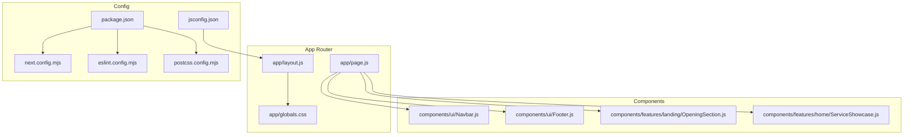
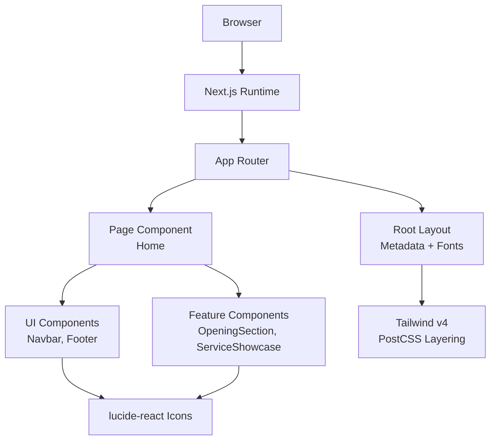
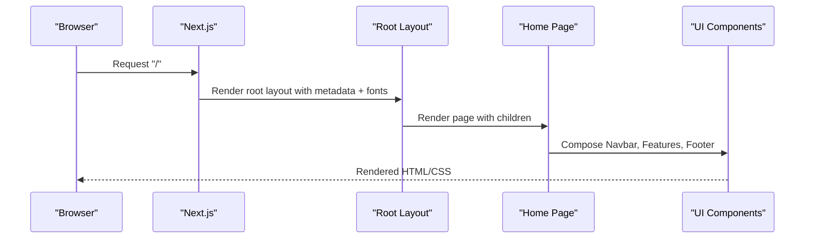
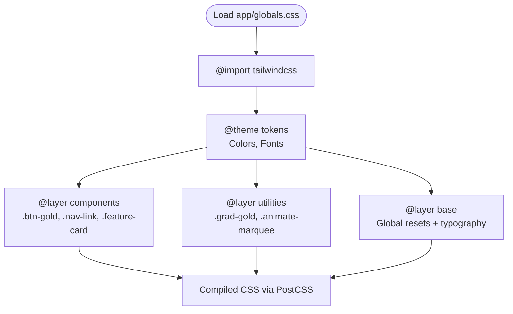
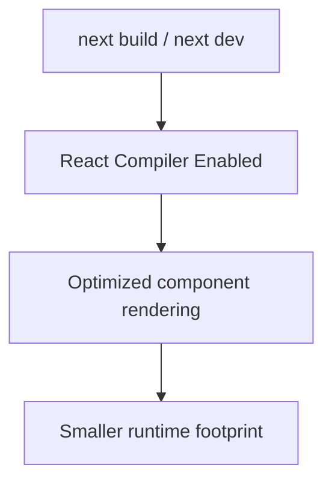
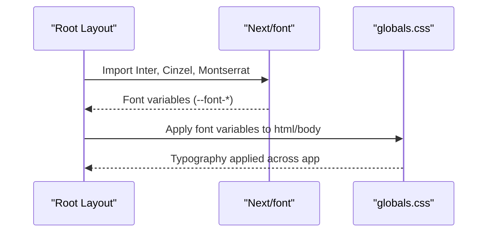
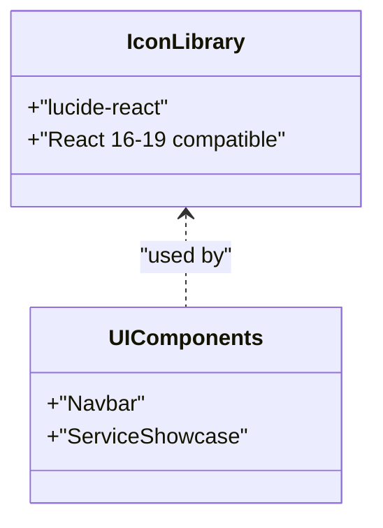
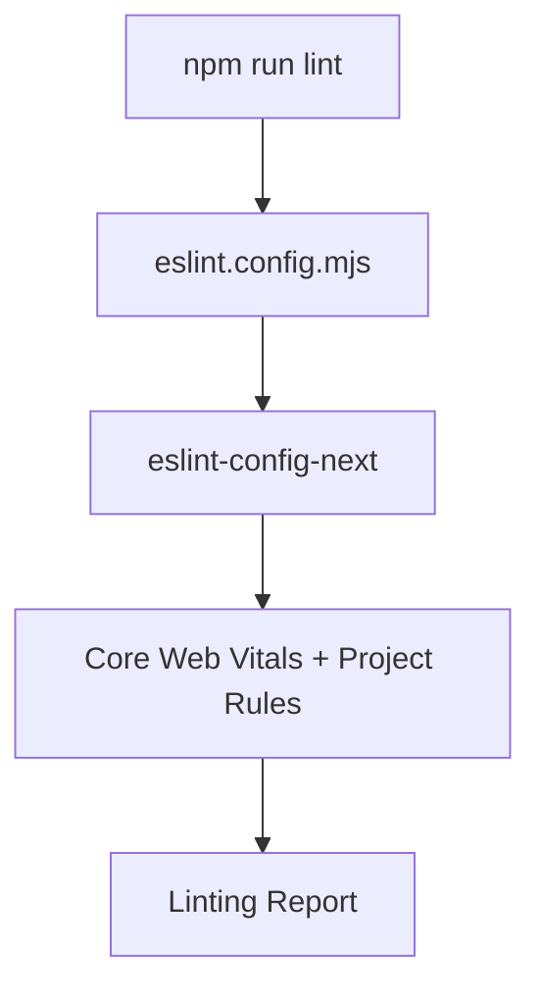
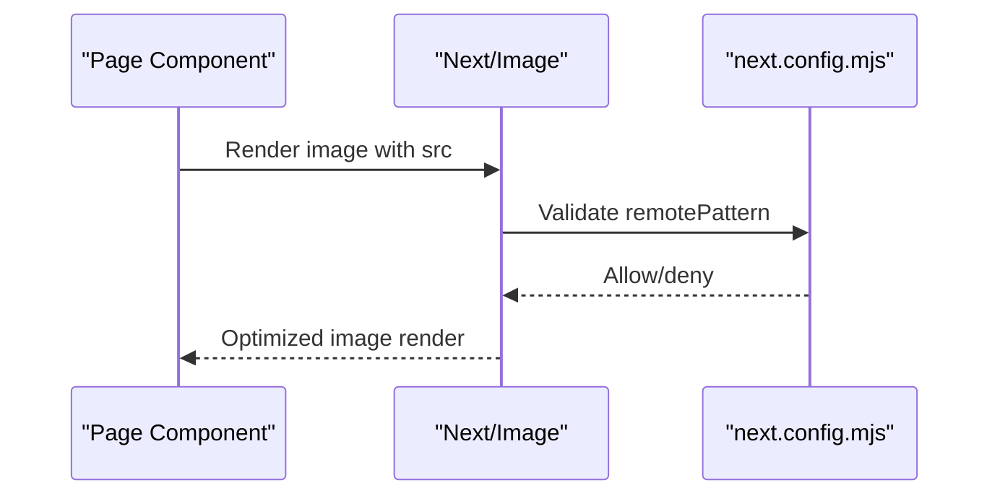
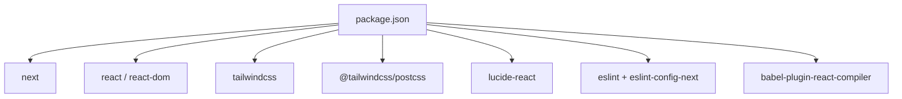

# Technology Stack & Dependencies

<cite>
**Referenced Files in This Document**
- [package.json](file://package.json)
- [next.config.mjs](file://next.config.mjs)
- [eslint.config.mjs](file://eslint.config.mjs)
- [postcss.config.mjs](file://postcss.config.mjs)
- [jsconfig.json](file://jsconfig.json)
- [app/layout.js](file://app/layout.js)
- [app/page.js](file://app/page.js)
- [app/globals.css](file://app/globals.css)
- [components/ui/Navbar.js](file://components/ui/Navbar.js)
- [components/ui/Footer.js](file://components/ui/Footer.js)
- [components/features/landing/OpeningSection.js](file://components/features/landing/OpeningSection.js)
- [components/features/home/ServiceShowcase.js](file://components/features/home/ServiceShowcase.js)
- [README.md](file://README.md)
</cite>

## Table of Contents
1. [Introduction](#introduction)
2. [Project Structure](#project-structure)
3. [Core Components](#core-components)
4. [Architecture Overview](#architecture-overview)
5. [Detailed Component Analysis](#detailed-component-analysis)
6. [Dependency Analysis](#dependency-analysis)
7. [Performance Considerations](#performance-considerations)
8. [Troubleshooting Guide](#troubleshooting-guide)
9. [Conclusion](#conclusion)

## Introduction
This document provides comprehensive technology stack documentation for the Momento Client Frontend. It covers the core technologies (Next.js 16 with App Router, React 19, and Tailwind CSS v4), major dependencies (lucide-react, Google Fonts integration via Next/font, and React Compiler), build configuration, ESLint setup, and PostCSS configuration. It also explains version compatibility, performance implications, and the rationale behind the tech stack choices, along with development tools, optimization strategies, and integration patterns used throughout the project.

## Project Structure
The frontend follows Next.js App Router conventions with a clear separation of concerns:
- app/: Application shell, metadata, global styles, and page components
- components/: Reusable UI components organized by feature and shared UI
- public/: Static assets (images, icons)
- Configuration files at the repository root manage build, linting, fonts, and styling

**Diagram sources**
- [app/layout.js:1-35](file://app/layout.js#L1-L35)
- [app/page.js:1-42](file://app/page.js#L1-L42)
- [app/globals.css:1-118](file://app/globals.css#L1-L118)
- [components/ui/Navbar.js:1-86](file://components/ui/Navbar.js#L1-L86)
- [components/ui/Footer.js:1-51](file://components/ui/Footer.js#L1-L51)
- [components/features/landing/OpeningSection.js:1-100](file://components/features/landing/OpeningSection.js#L1-L100)
- [components/features/home/ServiceShowcase.js:1-77](file://components/features/home/ServiceShowcase.js#L1-L77)
- [package.json:1-25](file://package.json#L1-L25)
- [next.config.mjs:1-16](file://next.config.mjs#L1-L16)
- [eslint.config.mjs:1-17](file://eslint.config.mjs#L1-L17)
- [postcss.config.mjs:1-8](file://postcss.config.mjs#L1-L8)
- [jsconfig.json:1-8](file://jsconfig.json#L1-L8)

**Section sources**
- [README.md:1-37](file://README.md#L1-L37)
- [package.json:1-25](file://package.json#L1-L25)
- [next.config.mjs:1-16](file://next.config.mjs#L1-L16)
- [eslint.config.mjs:1-17](file://eslint.config.mjs#L1-L17)
- [postcss.config.mjs:1-8](file://postcss.config.mjs#L1-L8)
- [jsconfig.json:1-8](file://jsconfig.json#L1-L8)

## Core Components
- Next.js 16 with App Router: Provides file-system routing, metadata, and optimized rendering. The project leverages the App Router’s route handlers, metadata, and automatic font optimization.
- React 19: Latest React runtime with concurrent features and performance improvements. The project uses React 19.x for both client and server components.
- Tailwind CSS v4: Utility-first CSS framework with v4 alpha features. The project integrates Tailwind via PostCSS and defines theme tokens and layer-specific styles.
- lucide-react: Premium iconography library enabling expressive UI elements with minimal bundle overhead.
- Google Fonts via Next/font: Automatic optimization and self-hosting of fonts for improved Core Web Vitals.
- React Compiler: Enabled via Next.js configuration to optimize component rendering and reduce runtime overhead.

Key integration highlights:
- Global fonts are configured in the root layout and applied across the app.
- Tailwind layers (base, components, utilities) define consistent design tokens and reusable utilities.
- Next.js image optimization and remote pattern configuration enable secure external image loading.

**Section sources**
- [app/layout.js:1-35](file://app/layout.js#L1-L35)
- [app/globals.css:1-118](file://app/globals.css#L1-L118)
- [next.config.mjs:1-16](file://next.config.mjs#L1-L16)
- [package.json:11-23](file://package.json#L11-L23)

## Architecture Overview
The frontend architecture centers around the App Router, with a focus on:
- Metadata-driven layout and global styling
- Component composition with shared UI and feature modules
- Optimized asset delivery and font loading
- Build-time and runtime optimizations

**Diagram sources**
- [app/layout.js:1-35](file://app/layout.js#L1-L35)
- [app/page.js:1-42](file://app/page.js#L1-L42)
- [components/ui/Navbar.js:1-86](file://components/ui/Navbar.js#L1-L86)
- [components/ui/Footer.js:1-51](file://components/ui/Footer.js#L1-L51)
- [components/features/landing/OpeningSection.js:1-100](file://components/features/landing/OpeningSection.js#L1-L100)
- [components/features/home/ServiceShowcase.js:1-77](file://components/features/home/ServiceShowcase.js#L1-L77)
- [app/globals.css:1-118](file://app/globals.css#L1-L118)
- [package.json:11-23](file://package.json#L11-L23)

## Detailed Component Analysis

### Next.js App Router and Global Styles
- Root layout configures metadata, font variables, and global CSS layers.
- The page composes UI and feature components, applying design tokens and utilities.

**Diagram sources**
- [app/layout.js:1-35](file://app/layout.js#L1-L35)
- [app/page.js:1-42](file://app/page.js#L1-L42)
- [components/ui/Navbar.js:1-86](file://components/ui/Navbar.js#L1-L86)
- [components/ui/Footer.js:1-51](file://components/ui/Footer.js#L1-L51)

**Section sources**
- [app/layout.js:1-35](file://app/layout.js#L1-L35)
- [app/page.js:1-42](file://app/page.js#L1-L42)
- [app/globals.css:1-118](file://app/globals.css#L1-L118)

### Tailwind CSS v4 Integration and Design Tokens
- Theme tokens define brand colors, typography families, and component defaults.
- Layered CSS ensures consistent base styles, reusable components, and utility helpers.
- Utilities include gradients, animations, and responsive layouts.

**Diagram sources**
- [app/globals.css:1-118](file://app/globals.css#L1-L118)
- [postcss.config.mjs:1-8](file://postcss.config.mjs#L1-L8)

**Section sources**
- [app/globals.css:1-118](file://app/globals.css#L1-L118)
- [postcss.config.mjs:1-8](file://postcss.config.mjs#L1-L8)

### React Compiler and Build Optimization
- React Compiler is enabled in Next.js configuration to optimize component compilation and runtime performance.
- The babel plugin is declared in devDependencies for potential local compilation scenarios.

**Diagram sources**
- [next.config.mjs:4-4](file://next.config.mjs#L4-L4)
- [package.json:19-19](file://package.json#L19-L19)

**Section sources**
- [next.config.mjs:1-16](file://next.config.mjs#L1-L16)
- [package.json:17-23](file://package.json#L17-L23)

### Google Fonts Integration (Next/font)
- Inter, Cinzel, and Montserrat are configured as font variables and applied globally.
- This improves Core Web Vitals by leveraging Next.js font optimization and variable font support.

**Diagram sources**
- [app/layout.js:1-35](file://app/layout.js#L1-L35)
- [app/globals.css:13-15](file://app/globals.css#L13-L15)

**Section sources**
- [app/layout.js:1-35](file://app/layout.js#L1-L35)
- [app/globals.css:13-15](file://app/globals.css#L13-L15)

### Iconography with lucide-react
- lucide-react is integrated for premium, consistent iconography across UI components.
- The library supports React 16–19, ensuring compatibility with the project’s React 19 runtime.

**Diagram sources**
- [package.json:12-12](file://package.json#L12-L12)
- [components/ui/Navbar.js:1-86](file://components/ui/Navbar.js#L1-L86)
- [components/features/home/ServiceShowcase.js:1-77](file://components/features/home/ServiceShowcase.js#L1-L77)

**Section sources**
- [package.json:11-23](file://package.json#L11-L23)
- [components/ui/Navbar.js:1-86](file://components/ui/Navbar.js#L1-L86)
- [components/features/home/ServiceShowcase.js:1-77](file://components/features/home/ServiceShowcase.js#L1-L77)

### ESLint and Code Quality
- ESLint is configured with eslint-config-next and overrides default ignores to enforce quality and performance standards aligned with Core Web Vitals.

**Diagram sources**
- [eslint.config.mjs:1-17](file://eslint.config.mjs#L1-L17)
- [package.json:20-21](file://package.json#L20-L21)

**Section sources**
- [eslint.config.mjs:1-17](file://eslint.config.mjs#L1-L17)
- [package.json:5-10](file://package.json#L5-L10)

### Asset Optimization and Remote Images
- Remote image patterns are configured to allow images from specific hosts, enabling dynamic image loading while maintaining security.
- Next/image is used across components for optimized image rendering.

**Diagram sources**
- [next.config.mjs:5-12](file://next.config.mjs#L5-L12)
- [components/features/landing/OpeningSection.js:42-53](file://components/features/landing/OpeningSection.js#L42-L53)
- [components/features/home/ServiceShowcase.js:43-53](file://components/features/home/ServiceShowcase.js#L43-L53)

**Section sources**
- [next.config.mjs:1-16](file://next.config.mjs#L1-L16)
- [components/features/landing/OpeningSection.js:1-100](file://components/features/landing/OpeningSection.js#L1-L100)
- [components/features/home/ServiceShowcase.js:1-77](file://components/features/home/ServiceShowcase.js#L1-L77)

## Dependency Analysis
The project’s dependency graph emphasizes a modern, performance-focused stack with clear boundaries between runtime and build-time tools.

**Diagram sources**
- [package.json:11-23](file://package.json#L11-L23)

**Section sources**
- [package.json:1-25](file://package.json#L1-L25)

## Performance Considerations
- React 19: Improves concurrent rendering and reduces re-renders through built-in optimizations.
- React Compiler: Reduces runtime work by optimizing component compilation during builds.
- Next.js App Router: Enables efficient data fetching, static generation, and ISR where applicable.
- Next/font: Self-hosted, variable fonts improve Core Web Vitals by reducing layout shifts and network overhead.
- Tailwind v4: Utility-first CSS minimizes CSS payload and enables atomic styling for rapid iteration.
- Image optimization: Next/image and remote patterns ensure fast, secure image delivery.
- ESLint + Core Web Vitals: Enforces performance-friendly patterns and accessibility standards.

[No sources needed since this section provides general guidance]

## Troubleshooting Guide
- React Compiler not active: Ensure the flag is enabled in Next.js configuration and that the babel plugin is installed locally if needed.
- Missing icons: Verify lucide-react installation and import paths in components.
- ESLint errors: Review eslint.config.mjs overrides and ensure ignored paths are intentional.
- Remote image errors: Confirm remotePatterns allow the intended hostnames and protocols.
- Tailwind utilities missing: Ensure PostCSS plugin is present and Tailwind directives are included in global CSS.

**Section sources**
- [next.config.mjs:1-16](file://next.config.mjs#L1-L16)
- [package.json:17-23](file://package.json#L17-L23)
- [eslint.config.mjs:1-17](file://eslint.config.mjs#L1-L17)
- [postcss.config.mjs:1-8](file://postcss.config.mjs#L1-L8)

## Conclusion
The Momento Client Frontend leverages a modern, performance-oriented stack centered on Next.js 16 with App Router, React 19, and Tailwind CSS v4. The integration of lucide-react, Next/font, and React Compiler aligns with best practices for developer experience, maintainability, and user performance. The configuration files demonstrate a clean separation of concerns, strong optimization strategies, and scalable patterns suitable for iterative feature development and production deployments.