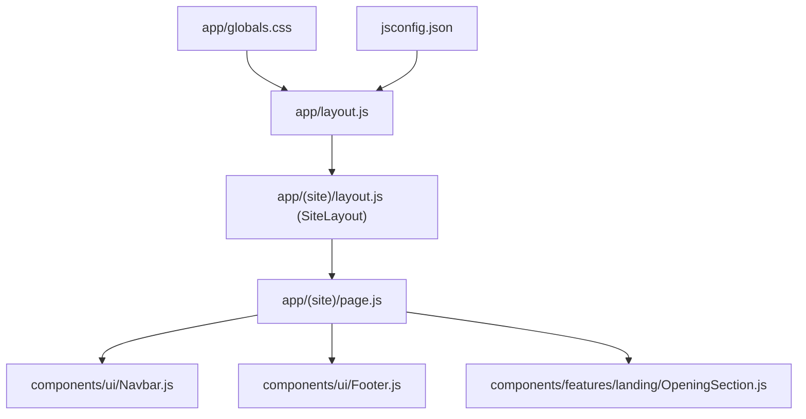
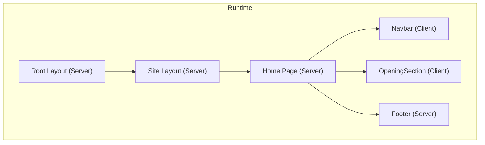
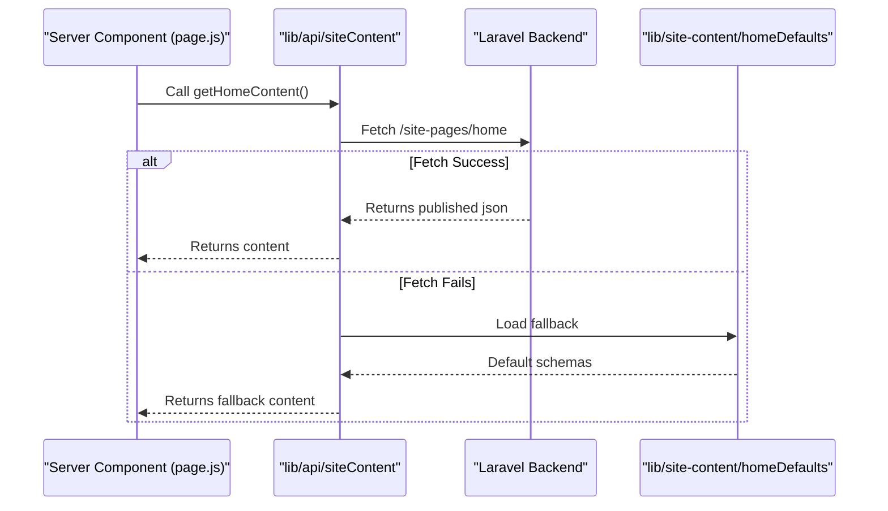
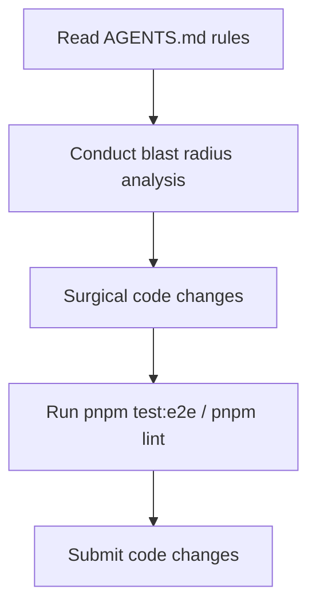

# Development Guidelines & Best Practices

<cite>
**Referenced Files in This Document**
- [package.json](file://package.json)
- [eslint.config.mjs](file://eslint.config.mjs)
- [next.config.mjs](file://next.config.mjs)
- [postcss.config.mjs](file://postcss.config.mjs)
- [jsconfig.json](file://jsconfig.json)
- [README.md](file://README.md)
- [app/layout.js](file://app/layout.js)
- [app/page.js](file://app/page.js)
- [app/globals.css](file://app/globals.css)
- [components/ui/Navbar.js](file://components/ui/Navbar.js)
- [components/ui/Footer.js](file://components/ui/Footer.js)
- [components/features/home/ServiceShowcase.js](file://components/features/home/ServiceShowcase.js)
- [components/features/landing/OpeningSection.js](file://components/features/landing/OpeningSection.js)
- [AGENTS.md](file://AGENTS.md)
- [CLAUDE.md](file://CLAUDE.md)
- [DOCS_OVERVIEW.md](file://DOCS_OVERVIEW.md)
</cite>

## Table of Contents
1. [Introduction](#introduction)
2. [Project Structure](#project-structure)
3. [Core Components](#core-components)
4. [Architecture Overview](#architecture-overview)
5. [Detailed Component Analysis](#detailed-component-analysis)
6. [Dependency Analysis](#dependency-analysis)
7. [Performance Considerations](#performance-considerations)
8. [Testing Strategies](#testing-strategies)
9. [Code Review & Contribution Workflows](#code-review--contribution-workflows)
10. [Troubleshooting Guide](#troubleshooting-guide)
11. [Conclusion](#conclusion)
12. [Appendices](#appendices)

## Introduction
This document defines development guidelines and best practices for the Momento Client Frontend. It consolidates code organization standards, component development patterns, architectural principles, tooling configurations (ESLint, TypeScript/JavaScript, PostCSS/Tailwind), state management approaches, performance optimization strategies, testing practices, and contribution workflows. The guidance is grounded in the project’s current setup and established repository standards.

## Project Structure
The project follows Next.js App Router route group conventions:
- **`app/`**: Route groups `(site)` and `(invitation)`.
- **`components/`**: Divided into shared `ui/` primitives and domain `features/landing/` sections.
- **`lib/`**: Contains API clients (`lib/api/`) and default fallback schemas (`lib/site-content/`).
- **`tests/e2e/`**: Contains Playwright test suites (e.g. `yuugure.spec.js`).

**Diagram & Section sources**
- [app/layout.js:1-58](file://app/layout.js#L1-L58)
- [app/(site)/layout.js:1-30](file://app/(site)/layout.js#L1-L30)
- [app/(site)/page.js:1-50](file://app/(site)/page.js#L1-L50)
- [components/ui/Navbar.js:1-86](file://components/ui/Navbar.js#L1-L86)
- [components/ui/Footer.js:1-51](file://components/ui/Footer.js#L1-L51)
- [components/features/landing/OpeningSection.js:1-100](file://components/features/landing/OpeningSection.js#L1-L100)
- [app/globals.css:1-394](file://app/globals.css#L1-L394)
- [jsconfig.json:1-8](file://jsconfig.json#L1-L8)

## Core Components
- Shared UI controls (Navbar, Footer, ExtraBanner, ImageViewer) are housed inside `components/ui/`.
- Domain feature sections live under `components/features/<module>/`.
- Server Components are utilized by default (including the Home Page which fetches content). Client Components (`use client`) are scoped only to interactive wrappers (typewriter animations, mobile overlays).

## Architecture Overview
The styling is defined inside `@theme` in `app/globals.css`, and static schemas (e.g., `lib/site-content/homeDefaults.js`) provide fallback content.

## Detailed Component Analysis

### Client-Side Typing Animation (OpeningSection)
Encapsulates typewriter effects with local state hooks and lifecycle hooks for frame timing.

**Section sources**
- [components/features/landing/OpeningSection.js:1-100](file://components/features/landing/OpeningSection.js#L1-L100)

### Data Fetching Patterns (lib/api/)
Server Components invoke backend API client functions:
- `lib/api/siteContent.js` -> `getHomeContent()` retrieves published landing data.
- `lib/api/invitations.js` -> queries dynamic themes based on slug.
- Data fetching handles error boundaries with fallback defaults loaded from `lib/site-content/`.

## Dependency Analysis
- **PostCSS compilation**: Binds `@tailwindcss/postcss` with Tailwind CSS v4.
- **Playwright Test Runner**: Registered in `package.json` for E2E validation.

**Section sources**
- [package.json:1-27](file://package.json#L1-L27)
- [next.config.mjs:1-24](file://next.config.mjs#L1-L24)
- [eslint.config.mjs:1-17](file://eslint.config.mjs#L1-L17)
- [postcss.config.mjs:1-8](file://postcss.config.mjs#L1-L8)
- [jsconfig.json:1-8](file://jsconfig.json#L1-L8)

## Performance Considerations
- **Dynamic revalidation**: Uses `revalidatePath('/')` server-side when CMS edits are published.
- **Variable Font scaling**: Variable weight parameters configured within layout preloads Cinzel/Montserrat fonts.

## Testing Strategies (Playwright E2E)
E2E browser tests are integrated using **Playwright**:
- **Config**: `playwright.config.js` sets browser matrix and base testing variables.
- **Scripts**: `scripts/start-e2e.sh` starts the backend/frontend servers and triggers test scripts. Runs via `pnpm run test:e2e` or `npm run test:e2e`.
- **Theme E2E suites**: Dynamic invitation themes (e.g. Botan, Yuugure) have full E2E suites under `tests/e2e/`.

## Code Review & Contribution Workflows
- **Surgical Precision**: Only modify line ranges targeting specific items.
- **Blast Radius Analysis**: Validate styling impact against route group layouts before merging.
- **Zero Git**: Never execute git actions within CLI scripts.
- **AGENTS.md rules**: Consolidates guidelines globally.

**Section sources**
- [AGENTS.md:1-82](file://AGENTS.md#L1-L82)

## Troubleshooting Guide
- **E2E tests hanging**: Make sure the backend endpoint is active and `.env.local` API url matches.
- **Dynamic images blocked**: Register host protocols under `remotePatterns` in `next.config.mjs`.

**Section sources**
- [eslint.config.mjs:1-17](file://eslint.config.mjs#L1-L17)
- [next.config.mjs:1-24](file://next.config.mjs#L1-L24)
- [postcss.config.mjs:1-8](file://postcss.config.mjs#L1-L8)
- [jsconfig.json:1-8](file://jsconfig.json#L1-L8)

## Conclusion
Development guidelines prioritize layout routing, decoupled server components with fallback defaults, robust Playwright E2E tests, and modular styling to achieve production stability.

## Appendices

### A. Playwright Testing Config
Playwright tests are configured in `playwright.config.js` and E2E start scripts are written in `scripts/start-e2e.sh`.

### B. Path Aliasing
Configured inside `jsconfig.json` to resolve `@/*` paths to the project root.

**Section sources**
- [jsconfig.json:1-8](file://jsconfig.json#L1-L8)

### C. Component Naming Guidelines
- Shared UI Primitives: `components/ui/*`
- Invitation dynamic templates: `components/features/invitations/*`
- Public features: `components/features/landing/*` / `components/features/pricing/*`

**Section sources**
- [components/ui/Navbar.js:1-86](file://components/ui/Navbar.js#L1-L86)
- [components/ui/Footer.js:1-51](file://components/ui/Footer.js#L1-L51)
- [components/features/landing/OpeningSection.js:1-100](file://components/features/landing/OpeningSection.js#L1-L100)
- [components/ui/ExtraBanner.js:1-64](file://components/ui/ExtraBanner.js#L1-L64)