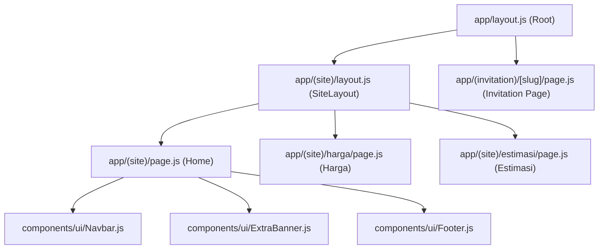
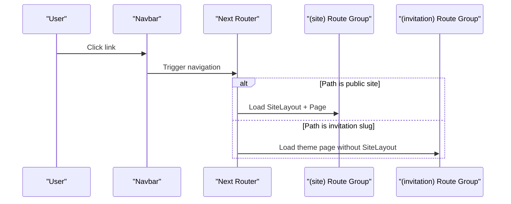
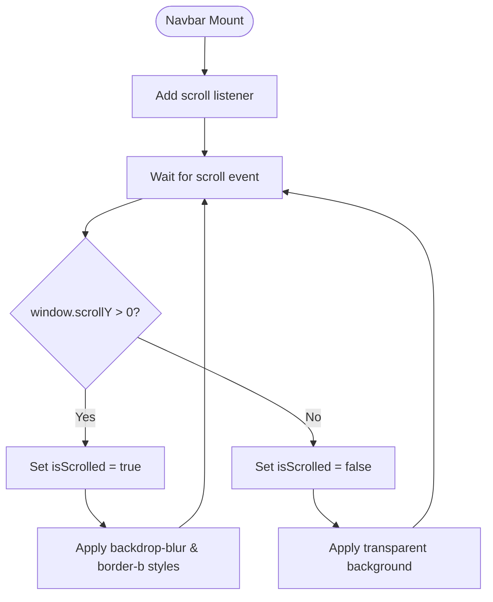

# Navigation & Routing

<cite>
**Referenced Files in This Document**
- [app/layout.js](file://app/layout.js)
- [app/page.js](file://app/page.js)
- [components/ui/Navbar.js](file://components/ui/Navbar.js)
- [components/ui/Footer.js](file://components/ui/Footer.js)
- [components/features/landing/OpeningSection.js](file://components/features/landing/OpeningSection.js)
- [components/features/landing/WhySection.js](file://components/features/landing/WhySection.js)
- [components/features/landing/SeserahanSection.js](file://components/features/landing/SeserahanSection.js)
- [components/features/landing/MaharSection.js](file://components/features/landing/MaharSection.js)
- [components/features/landing/InvitationSection.js](file://components/features/landing/InvitationSection.js)
- [next.config.mjs](file://next.config.mjs)
- [package.json](file://package.json)
- [app/globals.css](file://app/globals.css)
</cite>

## Table of Contents
1. [Introduction](#introduction)
2. [Project Structure](#project-structure)
3. [Core Components](#core-components)
4. [Architecture Overview](#architecture-overview)
5. [Detailed Component Analysis](#detailed-component-analysis)
6. [Dependency Analysis](#dependency-analysis)
7. [Performance Considerations](#performance-considerations)
8. [Troubleshooting Guide](#troubleshooting-guide)
9. [Conclusion](#conclusion)
10. [Appendices](#appendices)

## Introduction
This document explains the Next.js App Router-based navigation and routing implementation for the project. It focuses on the root layout configuration, page composition, and the navigation bar’s scroll-aware behavior. It also documents the navigation data structure, active state management, responsive behavior, and how to extend routes and customize navigation. Finally, it covers performance and SEO considerations for the current routing strategy.

## Project Structure
The application follows the Next.js App Router route group convention to separate main site pages from theme-specific dynamic invitations:
- **`app/layout.js`**: Global HTML wrapper, fonts, and OpenGraph/SEO configurations.
- **`app/(site)/` Group**: Uses `layout.js` (SiteLayout) which injects the scroll-aware Navbar, Footer, and Floating WhatsApp button.
  - `page.js`: Homepage composition.
  - `harga/page.js`: Catalog of packages and service details.
  - `estimasi/page.js`: Interactive cost calculator.
  - `info-produk/page.js` & `customer/page.js`: Additional public info pages.
- **`app/(invitation)/` Group**: Dynamically resolves invitations using `[slug]/page.js` and `[slug]/not-found.js` under custom CSS contexts.
- **`app/api/revalidate/route.js`**: Server endpoint for on-demand caching revalidation.
- **`next.config.mjs`**: Configures React Compiler, dynamic revalidation hooks, and 3 image remote patterns.

**Diagram & Section sources**
- [app/layout.js:1-58](file://app/layout.js#L1-L58)
- [app/(site)/layout.js:1-30](file://app/(site)/layout.js#L1-L30)
- [app/(site)/page.js:1-50](file://app/(site)/page.js#L1-L50)
- [components/ui/Navbar.js:1-86](file://components/ui/Navbar.js#L1-L86)
- [components/ui/Footer.js:1-51](file://components/ui/Footer.js#L1-L51)
- [components/ui/ExtraBanner.js:1-64](file://components/ui/ExtraBanner.js#L1-L64)
- [next.config.mjs:1-24](file://next.config.mjs#L1-L24)
- [app/globals.css:1-394](file://app/globals.css#L1-L394)
- [package.json:1-27](file://package.json#L1-L27)

## Core Components
- **Root Layout**: Configures base html language (`id_ID`), typography properties (Cinzel, Montserrat, Inter), and global OpenGraph metadata.
- **Site Layout (`app/(site)/layout.js`)**: Wraps public pages with the Navbar, Footer, and the Floating WhatsApp UI widget.
- **Navigation Bar**: Scroll-aware, fixed position navigation that transitions design states based on window offset.
- **Invitation Router**: Dynamic theme loader that resolves route queries via slugs against Laravel API endpoints.

**Section sources**
- [app/layout.js:1-58](file://app/layout.js#L1-L58)
- [app/(site)/layout.js:1-30](file://app/(site)/layout.js#L1-L30)
- [components/ui/Navbar.js:1-86](file://components/ui/Navbar.js#L1-L86)

## Architecture Overview
Routing resolves route groups concurrently:
1. Paths matching `/` or `/harga` resolve within the `(site)` layout context.
2. Paths matching `/[slug]` resolve inside the `(invitation)` context without standard layouts.
3. Cache revalidation endpoints are exposed under `/api/revalidate`.

## Detailed Component Analysis

### Site Layout (app/(site)/layout.js)
Injects the `Navbar` at the top, the `Footer` at the bottom, and mounts `FloatingWhatsApp` for persistent client communication. Caches are managed on-demand.

**Section sources**
- [app/(site)/layout.js:1-30](file://app/(site)/layout.js#L1-L30)

### Home Page (app/(site)/page.js)
Renders the primary landing sections, passing dynamic content received from `getHomeContent()` (data fetching layer) down to the section components.

**Section sources**
- [app/(site)/page.js:1-50](file://app/(site)/page.js#L1-L50)

### Navigation Bar (components/ui/Navbar.js)
Manages the desktop/mobile anchor scroll links and transitions:
- Anchors: `#seserahan`, `#mahar`, `#undangan`, `#extras`, `#harga`.
- Scrolled State: Tracks `window.scrollY > 0` to apply translucent backdrop blurs and borders (`scrolled` styles).
- Action Button: Desktop CTA points to `/estimasi` (Estimasi Harga page).

**Section sources**
- [components/ui/Navbar.js:1-86](file://components/ui/Navbar.js#L1-L86)

### Dynamic Invitation Routes (app/(invitation)/[slug]/page.js)
Queries invitation themes dynamically from Laravel Backend via `lib/api/invitations.js`. Loads theme-specific components dynamically (e.g., `BotanTheme`, `YuugureTheme`) based on database configs.

## Dependency Analysis
- **Image Domains**: Configured in `next.config.mjs` with remotePatterns for:
  - `images.unsplash.com` (landing demo images)
  - `*.public.blob.vercel-storage.com` (Vercel Blob Storage uploads)
  - `firebasestorage.googleapis.com` (Firebase dynamic invitation assets)

**Section sources**
- [next.config.mjs:1-24](file://next.config.mjs#L1-L24)
- [package.json:1-27](file://package.json#L1-L27)

## Performance & SEO Considerations
- **On-Demand Revalidation**: The proxy api `/api/revalidate` uses `revalidatePath('/')` to purge cached HTML layouts on-demand whenever the CMS publishes updates.
- **Link Prefetching**: Uses Next.js default prefetching for smooth client-side transitions to `/harga` and `/estimasi`.

## Troubleshooting Guide
- **Anchor links mismatch**: Ensure target sections have matching IDs (e.g. `id="mahar"`).
- **Images not showing**: Verify that remote domain patterns are registered in `next.config.mjs`.

## Conclusion
The navigation setup separates public routes from dynamic invitations, using Next.js App Router features, on-demand revalidation hooks, and remote image patterns to deliver a premium user flow.

## Appendices

### Adding New Public Routes
1. Create page folder under `app/(site)/<route-name>/page.js`.
2. Add route segment to navbar config in `components/ui/Navbar.js`.

### Customizing Invitation Themes
Invitation pages resolve themes dynamically based on layout files under `components/features/invitations/themes/`. Added themes should be registered in the theme loader component.