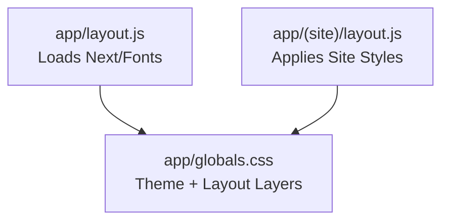
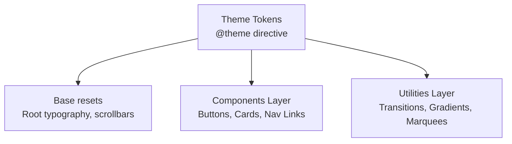

# Styling & Theming Strategy

<cite>
**Referenced Files in This Document**
- [app/globals.css](file://app/globals.css)
- [app/layout.js](file://app/layout.js)
- [postcss.config.mjs](file://postcss.config.mjs)
- [package.json](file://package.json)
- [next.config.mjs](file://next.config.mjs)
- [components/ui/Navbar.js](file://components/ui/Navbar.js)
- [components/ui/Footer.js](file://components/ui/Footer.js)
- [components/features/home/ServiceShowcase.js](file://components/features/home/ServiceShowcase.js)
- [components/features/home/ExtrasGrid.js](file://components/features/home/ExtrasGrid.js)
- [components/features/landing/OpeningSection.js](file://components/features/landing/OpeningSection.js)
- [components/features/landing/WhySection.js](file://components/features/landing/WhySection.js)
- [components/features/home/Testimonials.js](file://components/features/home/Testimonials.js)
</cite>

## Table of Contents
1. [Introduction](#introduction)
2. [Project Structure](#project-structure)
3. [Core Components](#core-components)
4. [Architecture Overview](#architecture-overview)
5. [Detailed Component Analysis](#detailed-component-analysis)
6. [Dependency Analysis](#dependency-analysis)
7. [Performance Considerations](#performance-considerations)
8. [Troubleshooting Guide](#troubleshooting-guide)
9. [Conclusion](#conclusion)
10. [Appendices](#appendices)

## Introduction
This document defines the styling and theming strategy for the Momento Client Frontend. It explains the Tailwind CSS v4 implementation, the theme system configuration, and how design tokens are organized. It documents the gold-themed aesthetic, the typography hierarchy across three distinct font families, color palette management, and responsive design principles. It also covers the global styling approach, component-level styling patterns, customization options, and best practices for maintaining visual consistency and extending the theme system.

### Project Structure
The styling system uses a centralized global stylesheet integrated via Tailwind CSS v4 and Next.js App Router layout wrappers.

- **Global Styles (`app/globals.css`)**: Centralizes the v4 theme tokens, responsive base resets, scrollbar designs, custom animations (like Testimony marquee), and transitions for Pricing/Estimation pages.
- **Root Layout (`app/layout.js`)**: Loads variable serif (Cinzel), sans (Inter), and sans-serif (Montserrat) fonts dynamically via `next/font/google` and injects them as global CSS variables.
- **Site Layout (`app/(site)/layout.js`)**: Holds shared layouts including Navbar scroll indicators.

**Diagram & Section sources**
- [app/layout.js:1-58](file://app/layout.js#L1-L58)
- [app/(site)/layout.js:1-30](file://app/(site)/layout.js#L1-L30)
- [app/globals.css:1-394](file://app/globals.css#L1-L394)
- [postcss.config.mjs:1-8](file://postcss.config.mjs#L1-L8)
- [next.config.mjs:1-24](file://next.config.mjs#L1-L24)

## Core Components
- **Tailwind v4 Theme configuration (`@theme`)**: Declares custom colors (gold accents like `#d4af37`), fonts (Cinzel, Montserrat, Inter), and keyframe animations.
- **Base resets**: Establishes fluid root font sizes and scroll settings.
- **Transitions and Utilities**: Custom timing curves for the pricing categories selection slides and estimation calculator modals.

**Section sources**
- [app/globals.css:1-394](file://app/globals.css#L1-394)

## Architecture Overview
The styling architecture isolates concerns using Tailwind layers and custom utilities:

## Detailed Component Analysis

### Global Styles and Theme Tokens (app/globals.css)
The global stylesheet defines:
- **Responsive Root Font-size** (lines 3-11): Modifies rem unit scaling based on viewport size.
- **Custom Scrollbar Styling** (lines 259-300): Premium translucent styling matching the dark aesthetic.
- **Testimony Marquee Animation** (lines 252-257): Vertical marquee movement classes (`animate-marquee-v-up-testimony`).
- **Pricing & Estimation Transitions** (lines 302-393): Custom accordion fades and transform overrides for pricing tab selections.
- **`border-grad-gold` utility** (lines 171-180): Custom border gradient implementation.

**Section sources**
- [app/globals.css:1-394](file://app/globals.css#L1-L394)
- [app/layout.js:1-58](file://app/layout.js#L1-L58)

### Navigation Styling (components/ui/Navbar.js)
The navbar uses:
- Translucent scrolled state backgrounds (`backdrop-blur`).
- Nav links styled using `font-nav-squish` and tracking settings.

### Buttons & Call-to-Actions (components/ui/ExtraBanner.js)
Uses custom gold gradient shadows, uppercase font scaling, and spacing variables to match Figma fidelity.

## Dependency Analysis
- **PostCSS compiler**: Configured via `postcss.config.mjs` using `@tailwindcss/postcss` to compile globals.

**Section sources**
- [package.json:1-27](file://package.json#L1-L27)
- [postcss.config.mjs:1-8](file://postcss.config.mjs#L1-L8)
- [app/globals.css:1-394](file://app/globals.css#L1-L394)

## Performance Considerations
- **Tailwind JIT**: Compiles only class tokens matching actual usage to minimize payload bloat.
- **Variable Fonts**: Variable Google fonts configured in layout reduce font asset requests.

## Troubleshooting Guide
- **Animations stuttering**: Ensure CSS transforms use hardware-accelerated properties (like `translate3d`).
- **Gradients not matching**: Check that variables in `@theme` declaration inside `globals.css` are not overridden.

## Conclusion
The theming strategy couples Tailwind v4's utility design with targeted custom styles inside `globals.css` (394 lines) to enforce a high-fidelity, premium dark-gold aesthetic.

## Appendices

### Key Tailwind v4 Customizations (`globals.css`)
Custom variables defined inside `@theme`:
- `--font-serif`: Cinzel
- `--font-sans`: Inter
- `--font-nav`: Montserrat
- `--color-accent`: `#d4af37` (gold)
- `--color-accent-light`: `#cf953c` (gold gradient stop)
- `--color-background`: `#0a0a0a`
- `--color-card`: `#141414`

### Responsive Framework Breakpoints
Uses Tailwind default desktop-first or mobile-first screen breakpoints, configured natively in the CSS build process.